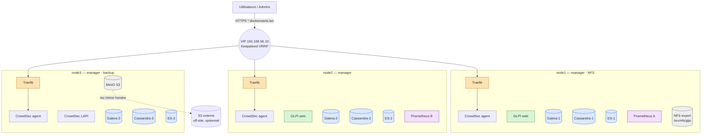
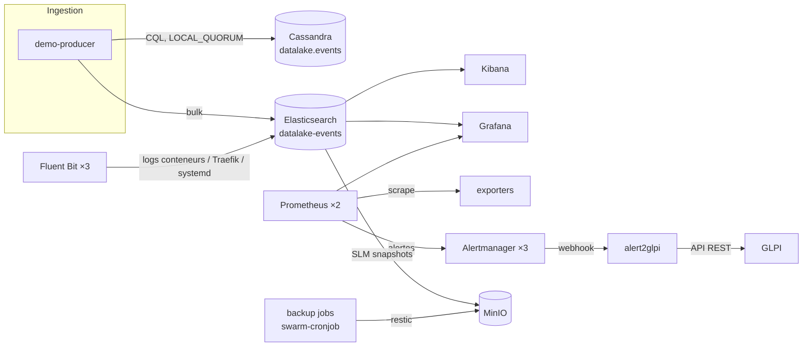

# Cahier des charges — Dockerwarts N°1

> Infrastructure dockerisée hautement disponible pour un projet big data : ticketing, historisation, monitoring, datalake, pare-feu, PRA.
>
> **Statut** : version 1.0 — document de référence pour le développement. Toute décision d'architecture ou de technologie est prise ici ; l'agent de développement n'a pas à en prendre d'autres. Un écart doit être motivé et consigné dans un ADR (`docs/adr/`).

---

## Table des matières

1. [Contexte et objectifs](#1-contexte-et-objectifs)
2. [Exigences](#2-exigences)
3. [Hypothèses et périmètre](#3-hypothèses-et-périmètre)
4. [Décisions d'architecture](#4-décisions-darchitecture)
5. [Topologie et réseaux](#5-topologie-et-réseaux)
6. [Sécurité et pare-feu](#6-sécurité-et-pare-feu)
7. [Spécification des composants](#7-spécification-des-composants)
8. [Haute disponibilité](#8-haute-disponibilité)
9. [Sauvegardes et PRA](#9-sauvegardes-et-pra)
10. [Structure du dépôt et conventions](#10-structure-du-dépôt-et-conventions)
11. [Outillage : Makefile, scripts, tests, CI](#11-outillage--makefile-scripts-tests-ci)
12. [Livrables documentaires](#12-livrables-documentaires)
13. [Phases de développement et critères d'acceptation](#13-phases-de-développement-et-critères-dacceptation)
14. [Annexes](#14-annexes)

---

## 1. Contexte et objectifs

### 1.1 Énoncé du workshop

« Monter une infrastructure dockerisée complète pouvant supporter un projet big data comprenant :
- un outil de ticketing (ex : GLPI) ;
- un outil d'historisation de données (ex : ElasticSearch) ;
- un outil de monitoring (ex : Grafana) ;
- un datalake (ex : Cassandra) ;
- un pare-feu (applicatif ou non, pertinence du choix laissée à l'apprenant) ;
- des mesures de haute disponibilité ;
- la rédaction d'un document expliquant en détail les mesures de sauvegarde et de reprise d'activité en cas de défaillance du système (PRA complet).

L'entièreté des configurations et de l'architecture doit être documentée. Le choix des technologies est libre mais doit être cohérent et crédible dans un environnement professionnel. Il en va de même pour le monitoring : il doit être clair et permettre la surveillance de votre infrastructure ; le choix des charts et le format des informations sont à votre discrétion. »

### 1.2 Objectifs du projet

1. Livrer une plateforme **reproductible** (infrastructure as code, une commande pour tout monter).
2. **Haute disponibilité** réelle et démontrée : perte de n'importe quel nœud sans interruption de service utilisateur.
3. **Observabilité** complète : métriques, logs, alertes, et boucle fermée alerte → ticket GLPI.
4. **Sécurité** en profondeur avec un pare-feu applicatif crédible.
5. **PRA** complet, chiffré (RPO/RTO), avec sauvegardes automatiques et restaurations **testées**.
6. **Documentation** exhaustive : chaque fichier de configuration est expliqué.

### 1.3 Critères d'évaluation visés

Le barème valorise la crédibilité professionnelle, la clarté du monitoring et la qualité de la documentation. Le projet doit donc être **démontrable** (scripts de test HA et PRA avec résultats consignés) et **lisible** (schémas, tableaux, runbooks).

---

## 2. Exigences

### 2.1 Exigences fonctionnelles

| ID | Exigence | Composant |
|---|---|---|
| F1 | Outil de ticketing accessible en HTTPS, multi-utilisateurs, API REST activée | GLPI |
| F2 | Historisation des logs de tous les conteneurs, du reverse proxy et du système, consultables et recherchables | Elasticsearch, Fluent Bit, Kibana |
| F3 | Historisation de données métier (événements du datalake) avec rétention gérée | Elasticsearch (ILM) |
| F4 | Supervision de l'infrastructure : nœuds, conteneurs, services, bases de données, reverse proxy, sécurité, sauvegardes | Prometheus, exporters, Grafana |
| F5 | Alerting sur incidents avec **création automatique d'un ticket GLPI** et clôture à la résolution | Alertmanager, alert2glpi |
| F6 | Datalake distribué capable de stocker des volumes importants d'événements | Cassandra |
| F7 | Pare-feu réseau et applicatif : filtrage des ports, protection contre les attaques HTTP (brute force, scans, CVE connues), bannissement automatique | iptables, Traefik, CrowdSec |
| F8 | Sauvegardes automatiques, chiffrées, à rétention définie, et restauration scriptée de chaque composant | MinIO, restic, SLM ES, nodetool |
| F9 | Démonstration du flux big data : production d'événements → datalake → historisation → visualisation | demo-producer, dashboard « Datalake » |

### 2.2 Exigences non fonctionnelles

| ID | Exigence | Cible |
|---|---|---|
| N1 | Tolérance à la perte d'un nœud complet sans interruption de service utilisateur | RTO < 60 s pour tout service, < 5 s pour le point d'entrée |
| N2 | Aucune perte de données validées sur perte d'un nœud | RPO = 0 pour Galera, Cassandra, Elasticsearch |
| N3 | Reconstruction complète depuis git + sauvegardes | RTO ≤ 4 h, RPO ≤ 24 h |
| N4 | Reproductibilité : déploiement depuis zéro par une suite de commandes `make` | oui |
| N5 | Aucun secret dans le dépôt git | Docker secrets, `.env` ignoré |
| N6 | Images pinnées (tag + digest), conteneurs non root et sans privilèges quand l'image le permet | oui |
| N7 | Documentation en français, code et configurations en anglais | oui |
| N8 | Fonctionne sur 3 VM de 4 vCPU / 6 Go (profil `full`) ou 4 Go (profil `lite`) | oui |
| N9 | CI de qualité : lint (YAML, Ansible, Dockerfile, shell), validation des stacks et des règles Prometheus | GitHub Actions |

---

## 3. Hypothèses et périmètre

### 3.1 Environnement cible

- **3 nœuds Ubuntu Server 24.04 LTS**, tous managers Docker Swarm. Par défaut : VM locales VirtualBox créées par Vagrant. L'Ansible est agnostique : 3 VM cloud (Scaleway, OVH, Hetzner…) fonctionnent à l'identique en modifiant l'inventaire.
- Réseau de laboratoire (host-only VirtualBox) : `192.168.56.0/24`.

| Hôte | IP | Rôle Swarm | Rôles supplémentaires |
|---|---|---|---|
| node1 | 192.168.56.11 | manager | NFS server, Keepalived priorité 150 |
| node2 | 192.168.56.12 | manager | Keepalived priorité 100 |
| node3 | 192.168.56.13 | manager | MinIO, CrowdSec LAPI, Keepalived priorité 50 |
| **VIP** | **192.168.56.10** | — | adresse flottante Keepalived, unique point d'entrée |

- Domaine : `dockerwarts.lan` (pas `.local`, réservé à mDNS). Résolution par `/etc/hosts` côté client (`192.168.56.10 glpi.dockerwarts.lan grafana.dockerwarts.lan …`) ; le script `scripts/hosts-entries.sh` imprime la ligne à ajouter.
- Dimensionnement : 4 vCPU, 6 Go RAM (`PROFILE=full`) ou 4 Go (`PROFILE=lite` : heaps JVM réduits), 40 Go disque par nœud. Variables `NODE_MEM`, `NODE_CPU` dans le Vagrantfile.

### 3.2 Mode single-node (développement)

Un poste de développement peut déployer les mêmes stacks sur un Swarm mono-nœud via `make single` (override `stacks/overrides/single-node.yml` : replicas à 1, contraintes de placement supprimées, un seul membre par cluster stateful). Ce mode **n'est pas HA** et sert uniquement à itérer vite ; il doit rester fonctionnel.

### 3.3 Hors périmètre

- Multi-site / multi-datacenter (documenté en piste d'évolution du PRA).
- Authentification centralisée (LDAP/SSO) : GLPI et Grafana utilisent leurs comptes locaux.
- Stockage distribué (Ceph/GlusterFS) : le NFS est un SPOF assumé (voir ADR-0006).

---

## 4. Décisions d'architecture

Résumé exécutif ; chaque ligne est détaillée en §7 et, pour les choix structurants, justifiée dans un ADR.

| Besoin | Choix | Justification | ADR |
|---|---|---|---|
| Orchestrateur | **Docker Swarm**, 3 managers | HA native (replicas, reschedule, overlay chiffrable, secrets/configs) tout en restant « infra dockerisée » ; k8s serait disproportionné pour 3 nœuds | 0001 |
| Provisioning | **Vagrant** + **Ansible** | IaC reproductible, Ansible source de vérité pour l'hôte (Docker, pare-feu, NFS, Keepalived, Swarm, labels) | 0002 |
| Point d'entrée | **Traefik v3** global en `mode: host` + **Keepalived** sur l'hôte | VIP unique bascule < 5 s ; l'IP client réelle est conservée (indispensable pour CrowdSec et les logs) | 0003 |
| Pare-feu | 4 couches : iptables (`DOCKER-USER`), middlewares Traefik, **CrowdSec** + bouncer, segmentation overlay `internal` | Défense en profondeur ; CrowdSec est le pare-feu applicatif (IPS comportemental, bannissement automatique) | 0004 |
| Ticketing | **GLPI 10.0.x** image officielle, 2 replicas web + cron | Standard ITSM, image officielle maintenue, API REST | — |
| Base SQL | **MariaDB 11.4 Galera** ×3 (image officielle) + **HAProxy** `db-proxy` | Réplication synchrone multi-master (RPO 0) ; HAProxy impose un writer unique (pas de conflits de certification) ; réutilisé par Grafana | 0005 |
| Historisation | **Elasticsearch 8.x** ×3 + **Kibana** + **Fluent Bit** | Recherche full-text, ILM, snapshots S3 natifs ; Fluent Bit léger en mode global | 0007 |
| Monitoring | **Prometheus 3** ×2 + **Alertmanager** ×3 + **Grafana 12** ×2 | Stack de référence ; logs consultés dans Grafana via la datasource Elasticsearch (pas de Loki, pas de doublon) | 0007 |
| Alerte → ticket | **alert2glpi** (service maison Python) | Boucle incident complète et démontrable | 0009 |
| Datalake | **Cassandra 5.0** ×3, RF=3 | Choix de l'énoncé ; HA native | — |
| Sauvegardes | **MinIO** (S3) + **restic** ; SLM Elasticsearch ; `nodetool snapshot` ; `mariadb-dump` ; **swarm-cronjob** ; miroir off-site `mc mirror` | Outils standard, chiffrement, dédup, rétention ; règle 3-2-1 | 0008 |
| Stockage partagé | **NFS** sur node1 pour les fichiers GLPI uniquement | Seul besoin de FS partagé ; SPOF assumé et couvert par le PRA | 0006 |
| Secrets / TLS | Docker secrets + configs ; CA interne + wildcard ; ACME DNS-01 documenté | Rien dans git ; TLS partout côté client | — |
| CI | GitHub Actions lint + validation | Qualité minimale sans cluster en CI | — |

---

## 5. Topologie et réseaux

### 5.1 Schéma général



Services **flottants** (placement libre, reschedulés par Swarm sur perte de nœud) : Grafana ×2, Alertmanager ×3, Kibana ×1, db-proxy ×2, alert2glpi ×1, glpi-cron ×1, exporters ES/MariaDB/blackbox, swarm-cronjob ×1, backup-metrics ×1, demo-producer ×1.
Services **globaux** (une tâche par nœud) : Traefik, CrowdSec agent, Fluent Bit, node-exporter, cAdvisor, docker-socket-proxy.

### 5.2 Flux de données



### 5.3 Placement des services stateful

Les labels de nœud sont posés par le rôle Ansible `node-labels` ; chaque membre d'un cluster stateful est un **service Swarm distinct** contraint à son nœud, avec un **volume local** nommé. Aucune base de données n'est jamais placée sur NFS.

| Nœud | Labels Swarm | Services pinnés |
|---|---|---|
| node1 | `cassandra=1 es=1 galera=1 prometheus=a nfs=true` | cassandra-1, es-1, galera-1, prometheus (tâche A) |
| node2 | `cassandra=2 es=2 galera=2 prometheus=b` | cassandra-2, es-2, galera-2, prometheus (tâche B) |
| node3 | `cassandra=3 es=3 galera=3 minio=true crowdsec_lapi=true` | cassandra-3, es-3, galera-3, minio, crowdsec-lapi |

### 5.4 Réseaux overlay

| Réseau | `internal` | Chiffré (IPsec) | Membres |
|---|---|---|---|
| `edge` | non | non | traefik, glpi-web, grafana, kibana, prometheus, alertmanager, minio (console), whoami |
| `data` | oui | **oui** | galera-1/2/3, db-proxy, cassandra-1/2/3, es-1/2/3, kibana, glpi-web, glpi-cron, grafana, fluent-bit, jobs de backup, exporters DB, demo-producer, alert2glpi, crowdsec-lapi (si DB MariaDB) |
| `monitoring` | oui | non | prometheus, alertmanager, grafana, tous les exporters, blackbox, alert2glpi, backup-metrics |
| `mgmt` | oui | non | docker-socket-proxy, traefik, prometheus, swarm-cronjob |
| `crowdsec` | oui | non | crowdsec-lapi, crowdsec-agent, traefik |

Règles : un service n'est attaché qu'aux réseaux dont il a besoin ; **aucun port** autre que 80/443 n'est publié sur les hôtes ; le chiffrement du réseau `data` est activable/désactivable par variable (`DATA_NETWORK_ENCRYPTED`, défaut `true`) pour mesurer son coût.

### 5.5 Points d'accès (via la VIP)

| URL | Service | Protection Traefik |
|---|---|---|
| `https://glpi.dockerwarts.lan` | GLPI | TLS, rate-limit, sticky, headers |
| `https://grafana.dockerwarts.lan` | Grafana | TLS, rate-limit, headers (auth Grafana) |
| `https://kibana.dockerwarts.lan` | Kibana | + `admin-allowlist` |
| `https://prometheus.dockerwarts.lan` | Prometheus | + `admin-allowlist` + basic-auth |
| `https://alertmanager.dockerwarts.lan` | Alertmanager | + `admin-allowlist` + basic-auth |
| `https://traefik.dockerwarts.lan` | Dashboard Traefik | + `admin-allowlist` + basic-auth |
| `https://minio.dockerwarts.lan` | Console MinIO | + `admin-allowlist` |
| `https://whoami.dockerwarts.lan` | Service de validation | + `admin-allowlist` |

---

## 6. Sécurité et pare-feu

Réponse à l'exigence « pare-feu, applicatif ou non » : **les deux, en couches**. La couche hôte n'est pas dockerisée parce qu'un pare-feu réseau doit se situer sous le moteur de conteneurs ; les couches 2 à 4 sont entièrement dockerisées.

### 6.1 Couche 1 — pare-feu hôte (rôle Ansible `firewall`)

- `iptables` (backend nftables d'Ubuntu 24.04), règles persistées par `netfilter-persistent`. Politiques par défaut : `INPUT DROP`, `FORWARD DROP` (Docker gère ses propres chaînes), `OUTPUT ACCEPT`.
- Règles `INPUT` :

| Port / proto | Source | Usage |
|---|---|---|
| 22/tcp | `ADMIN_CIDR` | SSH administration |
| 80, 443/tcp | any | Traefik (published `mode: host`) |
| 2377/tcp | `CLUSTER_CIDR` | Swarm Raft |
| 7946/tcp+udp | `CLUSTER_CIDR` | Swarm gossip |
| 4789/udp | `CLUSTER_CIDR` | VXLAN overlay |
| ESP (proto 50) | `CLUSTER_CIDR` | overlay chiffré |
| 2049/tcp, 111/tcp+udp | `CLUSTER_CIDR` | NFS (node1 seulement) |
| VRRP (proto 112) | `CLUSTER_CIDR` (multicast 224.0.0.18) | Keepalived |
| 5000/tcp | `CLUSTER_CIDR` | registry interne (node3 seulement) |
| ICMP echo | any | diagnostics |
| established/related | — | retours de connexion |

- Chaîne **`DOCKER-USER`** (évaluée avant les règles de Docker) : n'autorise vers les ports publiés que 80/443 depuis l'extérieur ; refuse tout accès direct aux plages overlay (`10.0.0.0/8` par défaut) depuis les interfaces externes. Ceci ferme le contournement classique où Docker ouvre lui-même des ports publiés dans `FORWARD`.
- Durcissement hôte : SSH par clé uniquement, `PermitRootLogin no`, `unattended-upgrades`, `fail2ban` (jail sshd), sysctl (`vm.max_map_count=262144` pour ES, `net.ipv4.ip_nonlocal_bind=1` pour Keepalived, `fs.inotify.*` pour Fluent Bit).

### 6.2 Couche 2 — Traefik (edge)

- Entrypoints `web` (80, redirection permanente vers 443) et `websecure` (443). TLS 1.2 minimum, suites modernes, HSTS.
- Certificat wildcard `*.dockerwarts.lan` émis par la CA interne (`scripts/gen-certs.sh`, openssl), chargé par le provider `file` ; documentation d'une bascule vers ACME DNS-01 pour un vrai domaine.
- Middlewares déclarés dans `config/traefik/dynamic.yml` :
  - `security-headers` : HSTS, `X-Content-Type-Options`, `X-Frame-Options=SAMEORIGIN`, `Referrer-Policy`, suppression `Server`.
  - `rate-limit` : 100 req/s en moyenne, burst 50, par IP source.
  - `admin-allowlist` : `ipAllowList` sur `ADMIN_CIDR`.
  - `basic-auth` : htpasswd stocké en secret Docker.
  - `crowdsec` : plugin bouncer (couche 3).
- Provider Swarm connecté à **docker-socket-proxy** (`tecnativa/docker-socket-proxy`, variables `SERVICES=1 TASKS=1 NETWORKS=1 NODES=1`, tout le reste à `0`, en lecture seule). Aucun conteneur ne monte `/var/run/docker.sock` directement. `exposedByDefault=false` : un service n'est publié que s'il porte les labels Traefik.
- Access log au format JSON dans `/var/log/traefik/access.log` (bind mount hôte, rotation par `logrotate` via Ansible) — consommé par CrowdSec et Fluent Bit.

### 6.3 Couche 3 — CrowdSec (pare-feu applicatif / IPS)

- **LAPI** (`crowdsecurity/crowdsec`) : 1 replica pinné node3, base SQLite sur volume local (option MariaDB documentée), port 8080 sur le réseau `crowdsec` uniquement.
- **Agents** : service global, chaque agent lit le log Traefik de son nœud (`/var/log/traefik/access.log`) et `/var/log/auth.log` de l'hôte, et envoie ses alertes à la LAPI. Enregistrement automatique par `AGENT_USERNAME/AGENT_PASSWORD` en secrets.
- Collections : `crowdsecurity/traefik`, `crowdsecurity/http-cve`, `crowdsecurity/base-http-scenarios`, `crowdsecurity/sshd`, `crowdsecurity/linux`.
- **Bouncer** : plugin Traefik `crowdsec-bouncer-traefik-plugin` en mode `stream` (cache local des décisions → tolère l'indisponibilité de la LAPI). Clé bouncer en secret.
- Métriques `:6060/metrics` scrappées par Prometheus ; dashboard Grafana « Sécurité ».
- Test d'acceptation : `cscli decisions add -i <ip>` → la requête depuis cette IP reçoit 403 ; scénario brute-force GLPI (10 échecs de login) → bannissement automatique.

### 6.4 Couche 4 — segmentation et durcissement des conteneurs

- Réseaux `internal` pour tout ce qui n'est pas exposé ; chiffrement IPsec du réseau `data`.
- Pour chaque service : `security_opt: [no-new-privileges:true]`, `cap_drop: [ALL]` + `cap_add` minimal, `read_only: true` + `tmpfs` quand l'image le permet, `user:` non root quand l'image le permet, `resources.limits` systématiques.
- Images pinnées **tag + digest** (`image: traefik:v3.x@sha256:…`), listées dans `docs/04-composants/versions.md`. Scan `trivy` des images maison en CI.
- Secrets Docker uniquement (liste en annexe A). Rotation documentée dans `docs/08-exploitation.md`.

### 6.5 Matrice de flux

À produire dans `docs/03-reseau-securite.md` : tableau **source → destination → port/proto → réseau → justification** couvrant tous les flux inter-services et hôte, dérivé des stacks. Un test `tests/smoke/network-isolation.sh` vérifie qu'un conteneur du réseau `edge` ne joint pas `galera-1:3306` et qu'aucun port de base de données ne répond sur les IP des hôtes.

---

## 7. Spécification des composants

Chaque sous-section donne : image, topologie Swarm, configuration clé, secrets, supervision, sauvegarde. Les versions exactes (tag + digest) sont figées par l'agent de développement au moment de l'implémentation (dernière version patch de la mineure indiquée) et consignées dans `docs/04-composants/versions.md`.

### 7.1 Edge — Traefik, Keepalived, CrowdSec (`stacks/edge.yml`)

**Traefik v3.x**
- `mode: global`, `ports: [{target: 80, published: 80, mode: host}, {target: 443, published: 443, mode: host}]`.
- Healthcheck `traefik healthcheck --ping`. Dashboard sur `traefik.dockerwarts.lan`.
- Métriques Prometheus activées (`--metrics.prometheus`, labels par service et entrypoint).
- Volumes : `/var/log/traefik` (bind hôte), certs via secrets, config dynamique via `configs`.
- Réseaux : `edge`, `mgmt`, `crowdsec`.

**Keepalived** (installé sur l'hôte par Ansible, rôle `keepalived`)
- Une instance VRRP `VI_1`, `virtual_router_id 51`, interface host-only, VIP `192.168.56.10/24`, priorités 150/100/50, authentification par mot de passe (secret Ansible Vault ou variable d'inventaire), `nopreempt` désactivé (retour au nœud prioritaire).
- `vrrp_script chk_traefik` : `curl -sf -o /dev/null http://127.0.0.1/ping` toutes les 2 s, `fall 2`, `rise 2`, `weight -60` → un nœud sans Traefik sain perd la VIP.
- Justification du choix « hôte » vs conteneur : voir ADR-0003.

**CrowdSec** — voir §6.3. Services `crowdsec-lapi` (pinné, volumes `crowdsec_data`, `crowdsec_config`) et `crowdsec-agent` (global, binds RO des logs).

**whoami** (`traefik/whoami`) : service de validation TLS/routing/VIP, conservé derrière `admin-allowlist`.

### 7.2 Base SQL — MariaDB Galera + HAProxy (`stacks/data.yml`)

- Image officielle `mariadb:11.4` (Galera est intégré à MariaDB). Trois services `galera-1`, `galera-2`, `galera-3`, un par nœud, volumes locaux `galera_data_N`.
- Config `config/galera/galera.cnf` (montée en `configs`) :
  - `wsrep_on=ON`, `wsrep_provider=/usr/lib/galera/libgalera_smm.so`, `wsrep_cluster_name=dockerwarts`, `wsrep_cluster_address=gcomm://galera-1,galera-2,galera-3`, `wsrep_node_name` et `wsrep_node_address` par service (variables d'environnement + entrypoint wrapper), `wsrep_sst_method=mariabackup` avec utilisateur SST dédié, `binlog_format=ROW`, `innodb_autoinc_lock_mode=2`, `default_storage_engine=InnoDB`, `character_set_server=utf8mb4`.
- **Bootstrap** : `scripts/galera-bootstrap.sh` déploie d'abord `galera-1` avec `--wsrep-new-cluster`, attend `wsrep_ready=ON`, puis déploie `galera-2/3`, puis redéploie `galera-1` sans le flag. Procédure de re-bootstrap après arrêt total (`grastate.dat`, `safe_to_bootstrap: 1`) documentée et scriptée (`scripts/galera-recover.sh`).
- Init SQL (`configs`, exécuté au premier démarrage) : bases `glpi`, `grafana` ; utilisateurs `glpi`, `grafana`, `haproxy` (sans mot de passe, `USAGE` seulement, pour le health check), `exporter`, `backup` (lecture + `LOCK TABLES`), `sst`. Mots de passe via `_FILE` / secrets.
- **db-proxy** : `haproxy:2.9`, 2 replicas, `listen mariadb :3306`, `mode tcp`, `option mysql-check user haproxy`, `server galera-1 … check`, `server galera-2 … check backup`, `server galera-3 … check backup` → un seul writer actif à la fois, bascule automatique. Page de stats sur le réseau `monitoring` (`/stats;csv`) — optionnel.
- Supervision : `prom/mysqld-exporter` (multi-target : `/probe?target=galera-N:3306`), règles `GaleraClusterSizeLt3`, `GaleraNotSynced`, `MariaDBDown`.
- Sauvegarde : dump logique quotidien (voir §9). Volumes non sauvegardés (Galera restaure par SST).
- Consommateurs : GLPI, Grafana (HA), alert2glpi (aucun état : non), CrowdSec LAPI (optionnel).

### 7.3 Datalake — Cassandra (`stacks/data.yml`)

- Image maison `images/cassandra/Dockerfile` : `FROM cassandra:5.0`, ajout de `jmx_prometheus_javaagent.jar` et `config/cassandra/jmx-exporter.yml`, `JVM_OPTS` pour l'agent (`:7070`), utilisateur `cassandra` non root conservé.
- Services `cassandra-1/2/3`, un par nœud, volumes locaux `cassandra_data_N`. Variables : `CASSANDRA_CLUSTER_NAME=dockerwarts`, `CASSANDRA_SEEDS=cassandra-1,cassandra-2`, `CASSANDRA_ENDPOINT_SNITCH=GossipingPropertyFileSnitch`, `CASSANDRA_DC=dc1`, `CASSANDRA_RACK=rackN`, `CASSANDRA_BROADCAST_ADDRESS` = nom du service, `MAX_HEAP_SIZE=1G` / `HEAP_NEWSIZE=256M` (profil lite : 768M/192M).
- JMX activé sur `7199` avec authentification (fichiers `jmxremote.password/access` en secrets), accessible sur le réseau `data` uniquement → permet `nodetool` distant depuis les jobs de sauvegarde.
- Authentification CQL : `PasswordAuthenticator`, superuser par défaut remplacé au premier démarrage par `scripts/cassandra-init.sh` (crée `admin`, `datalake_app`, `backup`), keyspace `datalake` avec `NetworkTopologyStrategy {'dc1': 3}`, table `events (site text, sensor_id text, day date, ts timestamp, temperature double, humidity double, PRIMARY KEY ((site, sensor_id, day), ts)) WITH CLUSTERING ORDER BY (ts DESC)` et TTL par défaut 90 jours.
- Healthcheck : `nodetool status | grep -q "^UN"`. `stop_grace_period: 2m` (drain propre).
- Supervision : dashboard Cassandra (JMX), règles `CassandraNodeDown`, `CassandraPendingCompactions`, `CassandraDiskUsage`.
- Sauvegarde : snapshot quotidien par nœud (voir §9). Maintenance : `nodetool repair -pr` hebdomadaire par job swarm-cronjob (`maint-cassandra-repair`).

### 7.4 Historisation — Elasticsearch, Kibana, Fluent Bit (`stacks/data.yml`)

**Elasticsearch 8.x** (image officielle `docker.elastic.co/elasticsearch/elasticsearch`)
- Services `es-1/2/3`, un par nœud, volumes locaux `es_data_N`, rôles `master,data,ingest` sur les trois nœuds.
- `cluster.name=dockerwarts`, `discovery.seed_hosts=es-1,es-2,es-3`, `cluster.initial_master_nodes=es-1,es-2,es-3` (retiré après le premier bootstrap), `network.publish_host` = nom du service.
- Sécurité : `xpack.security.enabled=true`, **TLS transport obligatoire** (certificats générés par `scripts/gen-es-certs.sh` avec `elasticsearch-certutil`, CA + un cert par nœud, en secrets), HTTP **sans TLS** limité au réseau `data` interne et chiffré (choix justifié dans ADR-0007 ; option HTTPS documentée). Mots de passe `elastic`, `kibana_system`, utilisateurs applicatifs `fluentbit` (rôle écriture data streams), `grafana` (lecture), `datalake_app`, `exporter` — créés par `scripts/es-init.sh` via l'API.
- `ES_JAVA_OPTS=-Xms1g -Xmx1g` (lite : 512m), `bootstrap.memory_lock=true`, `ulimits memlock -1`, `vm.max_map_count` posé par Ansible.
- **Index et cycle de vie** (`scripts/es-init.sh`, idempotent, exécuté par un job Swarm `es-init`) :
  - politique ILM `dockerwarts-logs` : hot (rollover 10 Go ou 1 j) → warm à 7 j (forcemerge 1 segment, `number_of_replicas: 1` conservé) → delete à 90 j ;
  - politique `dockerwarts-datalake` : hot → delete à 365 j ;
  - index templates + data streams : `logs-docker`, `logs-traefik`, `logs-system`, `datalake-events` ; `number_of_shards: 1`, `number_of_replicas: 1`.
- **Snapshots** : repository `s3` natif (`repository-s3` intégré) vers MinIO (`endpoint`, `path_style_access`, credentials dans le keystore alimenté depuis les secrets au démarrage), bucket `es-snapshots`. **SLM** `daily-snapshots` à 01:00, rétention 30 jours / minimum 7 / maximum 50.
- Supervision : `prometheuscommunity/elasticsearch-exporter`, règles `ESClusterRed`, `ESClusterYellow` (> 10 min), `ESDiskWatermark`, `ESJVMHeapHigh`, `ESSnapshotFailed`.

**Kibana** (même mineure qu'ES) : 1 replica flottant, `kibana.dockerwarts.lan`, `ELASTICSEARCH_HOSTS=http://es-1:9200,http://es-2:9200,http://es-3:9200`, compte `kibana_system`, `xpack.encryptedSavedObjects.encryptionKey` en secret. Data views provisionnées par `es-init` (API saved objects) : `logs-*`, `datalake-events`.

**Fluent Bit 3.x** (`fluent/fluent-bit`) : service global.
- Inputs : `tail` sur `/var/lib/docker/containers/*/*-json.log` (parser `docker`, `DB` sur volume local pour la reprise), `tail` sur `/var/log/traefik/access.log` (parser `json`), `systemd` (unités `docker.service`, `keepalived.service`, `ssh.service`).
- Filtres : enrichissement du nom de service / tâche / nœud Swarm à partir du fichier `config.v2.json` du conteneur (filtre `lua` fourni dans `config/fluent-bit/docker-metadata.lua`) ; `modify` pour ajouter `node.name` (`{{.Node.Hostname}}` via env Swarm) ; multiline pour les stack traces Java (Cassandra, ES).
- Output `es` : data streams (`logs-docker`, `logs-traefik`, `logs-system`), `Suppress_Type_Name On`, `Retry_Limit False`, buffer sur disque (`storage.type filesystem`), auth `fluentbit`.
- Métriques `:2020/api/v1/metrics/prometheus`. Règle `FluentBitOutputErrors`.

### 7.5 Ticketing — GLPI (`stacks/apps.yml`)

- Image officielle `glpi/glpi:10.0.x`. Deux services :
  - `glpi-web` : 2 replicas, `max_replicas_per_node: 1`, `update_config order: start-first`.
  - `glpi-cron` : 1 replica, même image, commande exécutant `php bin/console glpi:cron` en boucle (ou variable native de l'image si disponible) → un seul exécuteur de tâches automatiques.
- Base : `db-proxy:3306`, base `glpi`, utilisateur `glpi` (secret). Variables `GLPI_DB_*` / `_FILE` selon l'image ; `TZ=Europe/Paris`.
- **Stockage partagé** : volumes NFS déclarés dans la stack (`driver_opts: {type: nfs, o: "addr=192.168.56.11,rw,nfsvers=4,soft", device: ":/srv/nfs/glpi/<dir>"}`) pour `files/`, `config/`, `plugins/`, `marketplace/`. Export géré par le rôle Ansible `nfs-server` (node1) ; les clients NFS sont installés par `nfs-client` sur tous les nœuds.
- **Initialisation** (`scripts/glpi-init.sh`, exécuté via un service one-shot `glpi-init`) : `php bin/console db:install` (idempotent : vérifie l'existence des tables), changement des mots de passe des comptes par défaut (`glpi`, `tech`, `normal`, `post-only`) depuis les secrets, activation de l'API REST (`use_rest_api`), création de l'utilisateur `alertmanager` (profil Technicien), génération de l'**app-token** et du **user-token** stockés en secrets `glpi_app_token` / `glpi_user_token` pour alert2glpi, création de la catégorie ITIL « Infrastructure ». Paramétrage `X-Forwarded-For` (proxy de confiance = réseau `edge`).
- Traefik : `Host(glpi.dockerwarts.lan)`, sticky cookie `glpi_srv` (secure, httponly), `rate-limit`, `security-headers`.
- Supervision : blackbox HTTP (`https://glpi.dockerwarts.lan/` via la VIP, statut 200 et corps contenant `GLPI`), règle `GLPIDown`, `GLPISlow` (> 2 s p95).
- Sauvegarde : base (dump Galera) + fichiers NFS (restic). Le duo dump + `files/` permet une restauration complète.

### 7.6 Monitoring — Prometheus, Alertmanager, Grafana, exporters (`stacks/monitoring.yml`)

**Prometheus 3.x**
- 2 replicas, `max_replicas_per_node: 1`, contrainte `node.labels.prometheus != ""` (nœuds `a`/`b`), volume local `prometheus_data` (un par nœud) → deux instances **identiques** scrappant les mêmes cibles (pattern HA officiel ; Alertmanager déduplique).
- `--storage.tsdb.retention.time=30d`, `--storage.tsdb.retention.size=10GB`, `--web.enable-admin-api` (snapshots de sauvegarde), `--web.external-url=https://prometheus.dockerwarts.lan`.
- Découverte de services : `dockerswarm_sd_configs` (host `tcp://docker-socket-proxy:2375`, rôles `tasks` et `nodes`). Convention de labels sur les services Swarm : `prometheus.job`, `prometheus.port`, `prometheus.path` (défaut `/metrics`) ; relabeling générique dans `config/prometheus/prometheus.yml` (job, instance = nom de tâche, `node` = hostname Swarm). Cibles statiques pour les endpoints hors Swarm (Keepalived/VIP via blackbox).
- Règles dans `config/prometheus/rules/*.yml`, validées par `promtool check rules` en CI. Liste minimale en annexe B.
- Traefik : `prometheus.dockerwarts.lan` + `admin-allowlist` + `basic-auth`. Datasource Grafana pointée sur le service `prometheus:9090` (load-balancé entre les deux tâches ; légères différences d'échantillonnage acceptées).

**Alertmanager 0.28**
- 3 replicas, `--cluster.listen-address=0.0.0.0:9094`, `--cluster.peer=tasks.alertmanager:9094` (DNS Swarm) ; les deux Prometheus envoient à `tasks.alertmanager` (toutes les instances).
- Routage (`config/alertmanager/alertmanager.yml`) : récepteur par défaut `glpi` (webhook `http://alert2glpi:8080/alert`, `send_resolved: true`) ; `group_by: [alertname, node, service]`, `group_wait 30s`, `group_interval 5m`, `repeat_interval 4h` ; récepteur optionnel `email`/`slack` activé par variables. Inhibitions : `NodeDown` inhibe toutes les alertes portant le même `node` ; `severity=critical` inhibe `warning` de même `alertname`.
- Traefik : `alertmanager.dockerwarts.lan` + allowlist + basic-auth.

**Grafana 12**
- 2 replicas, `GF_DATABASE_TYPE=mysql`, `GF_DATABASE_HOST=db-proxy:3306`, base `grafana` (sessions et état en base → HA), `GF_SECURITY_ADMIN_PASSWORD__FILE`, `GF_SERVER_ROOT_URL=https://grafana.dockerwarts.lan`, `GF_ANALYTICS_REPORTING_ENABLED=false`.
- Provisioning as code (`config/grafana/provisioning/`) : datasources **Prometheus** (défaut), **Elasticsearch** ×2 (`logs-*` avec champ `@timestamp` ; `datalake-events`), **Alertmanager** ; dashboards depuis `config/grafana/dashboards/*.json` (dossier « Dockerwarts ») ; paramètres d'organisation (fuseau `Europe/Paris`, thème).
- Dashboards livrés (JSON commités, adaptés des dashboards communautaires cités, variables `node`/`service`, unités correctes, seuils colorés) :

| # | Dashboard | Contenu principal | Base communautaire |
|---|---|---|---|
| 1 | Vue d'ensemble | état des 3 nœuds, VIP joignable, services replicas désirés/actuels, alertes actives par sévérité, disponibilité GLPI/Grafana/Kibana, âge des sauvegardes | maison |
| 2 | Nœuds | CPU, RAM, disque, réseau, load, par nœud | Node Exporter Full (1860) |
| 3 | Conteneurs | CPU/RAM/IO par service Swarm, redémarrages | cAdvisor (14282) |
| 4 | Traefik | RPS, latences p50/p95/p99, codes HTTP, par router/service, TLS | Traefik (17346) |
| 5 | Sécurité | décisions CrowdSec, IP bannies, scénarios déclenchés, 401/403/404/429 Traefik, tentatives SSH | CrowdSec (maison) |
| 6 | Elasticsearch | santé cluster, shards, JVM heap, indexation/s, latence recherche, disque | ES exporter (14191) |
| 7 | Cassandra | nœuds UN/DN, latences R/W, compactions en attente, hints, disque, GC | JMX (maison) |
| 8 | MariaDB Galera | `wsrep_cluster_size`, état local, flow control, QPS, connexions, InnoDB | MySQL (13106) + Galera |
| 9 | Disponibilité & certificats | uptime et temps de réponse blackbox, expiration TLS | Blackbox (7587) |
| 10 | Sauvegardes | dernier succès par job, durée, taille, âge, snapshots ES SLM, MinIO capacité | maison |
| 11 | Logs | erreurs par service (ES), volume de logs, top messages, panneau Logs Grafana | maison |
| 12 | Datalake | événements/s ingérés, par site/capteur, températures moyennes (ES), latences Cassandra | maison |

**alert2glpi** (`images/alert2glpi/`) — service maison.
- Python 3.12, FastAPI + httpx, image `python:3.12-slim` non root, healthcheck `/healthz`, 1 replica flottant, réseaux `monitoring` + `data`.
- `POST /alert` reçoit le webhook Alertmanager (v4). Pour chaque alerte :
  - **firing** : recherche d'un ticket ouvert dont le titre contient `[AM:<fingerprint>]` (API `search/Ticket`) ; s'il n'existe pas, création (`POST /Ticket`) : titre `[<severity>] <alertname> — <node|service> [AM:<fp>]`, contenu = résumé, description, labels, lien Grafana (`annotations.dashboard`), lien runbook (`annotations.runbook`) ; priorité mappée (`critical` → 5 très haute, `warning` → 3 moyenne, `info` → 2 basse), catégorie « Infrastructure », type Incident, demandeur = utilisateur `alertmanager`.
  - **resolved** : ajout d'un suivi « Résolu automatiquement à <date> » et passage au statut Résolu (5).
- Configuration par variables/secrets : `GLPI_URL`, `GLPI_APP_TOKEN_FILE`, `GLPI_USER_TOKEN_FILE`, `GRAFANA_URL`. Tests unitaires `pytest` avec API mockée (`respx`), exécutés en CI.
- Métriques `/metrics` : tickets créés/résolus, erreurs API.

**Exporters et cibles**

| Cible | Exporter / endpoint | Mode |
|---|---|---|
| Hôtes | `prom/node-exporter` (`/host` proc/sys/rootfs, collecteur textfile) | global |
| Conteneurs | `gcr.io/cadvisor/cadvisor` | global |
| Traefik | `/metrics` natif :8082 | global |
| CrowdSec LAPI | `:6060/metrics` | 1 |
| Elasticsearch | `elasticsearch-exporter` | 1 |
| Cassandra | JMX exporter in-JVM `:7070` | par nœud |
| MariaDB | `mysqld-exporter` multi-target | 1 |
| HAProxy | `/metrics` natif (frontend stats) | 2 |
| MinIO | `/minio/v2/metrics/cluster` (bearer token) | 1 |
| Fluent Bit | `:2020` | global |
| Alertmanager, Prometheus, Grafana, alert2glpi, swarm-cronjob | `/metrics` natifs | — |
| GLPI, Kibana, Grafana, MinIO console, VIP, db-proxy | `blackbox-exporter` (http_2xx via VIP, tcp_connect, icmp) | 1 |
| Sauvegardes | `backup-metrics` (nginx statique servant un fichier `.prom`) | 1 |

### 7.7 Sauvegardes — MinIO, restic, swarm-cronjob (`stacks/backup.yml`)

Voir §9 pour la stratégie ; ici la spécification technique.

- **MinIO** : 1 replica pinné `node.labels.minio==true`, volume local `minio_data`, `MINIO_ROOT_USER/PASSWORD` en secrets, console derrière Traefik (`admin-allowlist`), API S3 sur le réseau `data`. Job d'init `minio-init` (`mc`) : buckets `restic`, `es-snapshots`, `mirror` ; utilisateurs `restic`, `elasticsearch`, `mirror` avec politiques restreintes à leur bucket ; versioning activé sur `restic`. Métriques via token Prometheus. **Alternative validée** si l'image MinIO n'est plus maintenue : **Garage** (`dxflrs/garage`), même API S3.
- **swarm-cronjob** (`crazymax/swarm-cronjob`) : 1 replica sur un manager, connecté à `docker-socket-proxy` (variante avec `SERVICES=1 TASKS=1 POST=1` — c'est le **seul** service avec droit d'écriture sur l'API Docker, isolé sur un second socket-proxy `docker-socket-proxy-rw` restreint aux managers). Déclenche les services labellisés `swarm.cronjob.enable=true`, `swarm.cronjob.schedule=<cron>`, `swarm.cronjob.skip-running=true`, déployés avec `replicas: 0` et `restart_policy: none`.
- **backup-runner** (`images/backup-runner/`) : `alpine:3` + `restic`, `mariadb-client`, `curl`, `jq`, `mc`, `openjdk-jre` + `nodetool` (extrait de l'image Cassandra en multi-stage), scripts `scripts/backup/*.sh`. Variables communes : `RESTIC_REPOSITORY=s3:http://minio:9000/restic`, `RESTIC_PASSWORD_FILE`, `AWS_ACCESS_KEY_ID_FILE`… Chaque script termine par l'écriture atomique de `backup_last_success_timestamp{job="…"}`, `backup_last_duration_seconds`, `backup_last_size_bytes`, `backup_last_status` dans `/metrics/backup.prom` (volume partagé `backup_metrics`, NFS ou volume du nœud unique du service `backup-metrics` — choix : les jobs et `backup-metrics` écrivent/lisent sur le NFS `/srv/nfs/backup-metrics`).
- **backup-metrics** : `nginx:alpine` servant `/metrics` depuis ce fichier ; label `prometheus.job=backup`.

### 7.8 Démo big data — demo-producer (`stacks/demo.yml`, optionnel)

- `images/demo-producer/` : Python 3.12, `cassandra-driver`, `elasticsearch` client. Génère `RATE` événements/s (défaut 20) pour `SENSORS` capteurs (défaut 50) répartis sur 3 sites : `{site, sensor_id, ts, temperature, humidity}` avec dérive réaliste. Écrit en batch dans Cassandra (`LOCAL_QUORUM`, idempotent) et en bulk dans le data stream `datalake-events`.
- Sert de charge de fond pour les dashboards et les tests HA (la production ne doit pas s'interrompre lors de la perte d'un nœud ; le compteur d'erreurs exposé sur `/metrics` doit rester à zéro).

---

## 8. Haute disponibilité

### 8.1 Matrice de défaillance

| Composant | Mécanisme HA | Perte d'un nœud | Perte d'un conteneur |
|---|---|---|---|
| Point d'entrée (VIP) | Keepalived VRRP + check Traefik | bascule < 5 s | VIP retirée du nœud si Traefik KO |
| Traefik | global, stateless | 2 restants | redémarrage auto |
| CrowdSec | agents globaux, bouncer en cache stream, LAPI reschedulée | protection maintenue | idem |
| GLPI web | 2 replicas sticky, 1 par nœud | 1 restant, reschedule ~30 s | idem |
| GLPI cron | 1 replica flottant | reschedule ~30 s | idem |
| MariaDB | Galera 3 nœuds synchrone + HAProxy | quorum 2/3, RPO 0, bascule writer < 5 s | rejoint par IST/SST |
| Cassandra | RF=3, LOCAL_QUORUM | lectures/écritures OK, hints puis repair | idem |
| Elasticsearch | 3 masters éligibles, replicas 1 | yellow → green, RPO 0 | idem |
| Prometheus | 2 instances identiques | 1 restante | restart, données locales conservées |
| Alertmanager | cluster gossip ×3 | 2 restants | idem |
| Grafana | 2 replicas, état en Galera | 1 restant | idem |
| Kibana, db-proxy ×2, alert2glpi, swarm-cronjob, exporters | stateless, reschedule Swarm | RTO 30–60 s | idem |
| Swarm control plane | 3 managers Raft | quorum 2/3 | — |
| Fluent Bit | global, buffer disque | logs du nœud perdu arrêtés, aucun autre impact | reprise depuis la DB de position |
| **NFS (fichiers GLPI)** | **SPOF assumé** | GLPI dégradé (documents) — procédure PRA, RTO 30 min | — |
| **MinIO** | **SPOF assumé** (dépôt de sauvegarde) | sauvegardes suspendues ; miroir off-site intact | — |

### 8.2 Tests HA (`tests/chaos/`)

Tous scriptés, exécutables par `make chaos`, résultats consignés dans `docs/06-haute-disponibilite.md` (tableau : scénario, commande, comportement attendu, observé, durée d'indisponibilité mesurée, ticket GLPI créé o/n).

1. `kill-service.sh <service>` : `docker service update --force` / kill d'une tâche → smoke test doit rester vert.
2. `drain-node.sh <node>` : `docker node update --availability drain` → smoke vert, `nodetool status`, `_cluster/health`, `wsrep_cluster_size` vérifiés ; puis `active` et re-vérification.
3. `kill-node.sh <node>` : `vagrant halt -f` → mesure de la bascule VIP (boucle `curl` 1 s), smoke vert, **ticket GLPI `NodeDown` créé automatiquement** ; `vagrant up` → retour à la normale, ticket résolu.
4. `kill-node.sh node1` spécifiquement : vérifie le comportement dégradé GLPI (NFS) et documente le RTO de la procédure de bascule NFS.
5. Charge continue : `demo-producer` actif pendant les tests, compteur d'erreurs à zéro pour Cassandra/ES.

`tests/smoke/smoke.sh` (`make smoke`) : via la VIP, pour chaque URL attendue : code HTTP, certificat valide (CA interne), contenu attendu ; état des clusters (Galera size 3, Cassandra 3 UN, ES green) ; Prometheus : toutes les cibles `up`, aucune alerte `critical` active ; sauvegardes : âge < 26 h (ignoré avant la première exécution).

---

## 9. Sauvegardes et PRA

### 9.1 Stratégie de sauvegarde

Principes : **3-2-1** (3 copies : données vivantes, MinIO, miroir off-site ; 2 supports ; 1 hors site), chiffrement (restic AES-256, clé en secret), déduplication, rétention automatique, **vérification** (métriques + alerte `BackupTooOld` > 26 h et `BackupFailed`), **restauration testée** (`make dr-drill`).

| Job | Planning (UTC) | Méthode | Dépôt | Rétention |
|---|---|---|---|---|
| `backup-es` | 01:00 | SLM natif ES (`daily-snapshots`) vers repository S3 ; job `check-es-snapshot` vérifie `SUCCESS` et publie la métrique | `es-snapshots` | 30 j (SLM) |
| `backup-galera` | 02:00 | `mariadb-dump --single-transaction --routines --events --all-databases` via `galera-1` → `gzip` → `restic backup --stdin --stdin-filename galera.sql.gz` | `restic` | 7 j / 4 sem / 6 mois |
| `backup-glpi-files` | 02:30 | `restic backup /data` (montage NFS GLPI en RO) | `restic` | idem |
| `backup-cassandra-1/2/3` | 03:00 | `nodetool -h cassandra-N -u … snapshot -t daily datalake` (JMX) → `cqlsh DESCRIBE KEYSPACE` → `restic backup` du répertoire `snapshots/daily` (volume `cassandra_data_N` monté RO, job pinné sur le même nœud) → `nodetool clearsnapshot -t daily` | `restic` | idem |
| `backup-prometheus` | dim. 04:00 | `POST /api/v1/admin/tsdb/snapshot` sur l'instance A → restic du snapshot | `restic` | 4 sem |
| `backup-crowdsec` | 04:30 | restic du volume `crowdsec_data` (job pinné node3) | `restic` | 7 j |
| `backup-configs` | 05:00 | `docker service inspect` de tous les services, `docker config`/`secret ls`, `docker node ls` → JSON ; + état ILM/SLM ES → restic | `restic` | 7 j / 4 sem |
| `restic-forget` | 06:00 | `restic forget --keep-daily 7 --keep-weekly 4 --keep-monthly 6 --prune` ; `restic check` hebdomadaire (dim.) | `restic` | — |
| `offsite-mirror` | toutes les heures | `mc mirror --overwrite --remove minio/restic offsite/dockerwarts-restic` et idem `es-snapshots`, si `OFFSITE_S3_*` définis | S3 externe | selon dépôt |
| `maint-cassandra-repair` | dim. 05:00 | `nodetool repair -pr` séquentiel sur chaque nœud | — | — |

Non sauvegardés (justifié) : volumes Galera (SST reconstruit), volumes ES (snapshots), données MinIO elles-mêmes (miroir off-site), Grafana (état en Galera + dashboards en git), Kibana (saved objects re-provisionnés par `es-init`).

### 9.2 Restaurations scriptées (`scripts/restore/`)

| Script | Restaure | Méthode |
|---|---|---|
| `restore-galera.sh [snapshot]` | toutes les bases | `restic dump` → import via `galera-1` ; option `--fresh` pour re-bootstrap un cluster vide avant import |
| `restore-glpi-files.sh [snapshot]` | NFS GLPI | `restic restore` vers `/srv/nfs/glpi` (arrêt `glpi-web/cron` pendant l'opération) |
| `restore-cassandra.sh <node> [snapshot]` | keyspace `datalake` | `restic restore` → schéma (`cqlsh -f`) → `sstableloader` (restauration vers un cluster vivant, topologie indépendante) ; variante « même topologie » par copie dans `data/<ks>/<table>` + `nodetool refresh` |
| `restore-es.sh <snapshot> [--rename]` | indices/data streams | `_snapshot/…/_restore` avec `rename_pattern` (`restored-$1`) puis bascule d'alias, ou restauration en place après fermeture |
| `restore-prometheus.sh` | TSDB instance A | arrêt, `restic restore`, redémarrage |
| `restore-crowdsec.sh` | LAPI | idem |
| `restore-all.sh` | cluster complet | ordre : Galera → GLPI files → Cassandra → ES → CrowdSec → Prometheus ; checklist de validation (smoke) |

### 9.3 Exercice de reprise automatisé — `make dr-drill`

Sans toucher aux données de production : restaure le dernier dump Galera dans une base `glpi_restore` et compare `COUNT(*)` de `glpi_tickets` ; restaure le dernier snapshot ES en `restored-logs-*` et compare le nombre de documents ; restaure le snapshot Cassandra dans un keyspace `datalake_restore` et compare `COUNT(*)` sur une partition ; restaure les fichiers GLPI dans un répertoire temporaire et vérifie une somme de contrôle ; nettoie tout. Produit un rapport Markdown (date, durée par étape, résultats) ajouté au **journal de tests** de `docs/07-PRA.md`.

### 9.4 Objectifs RPO / RTO

| Composant | RPO perte d'un nœud | RPO perte totale | RTO perte d'un nœud | RTO perte totale |
|---|---|---|---|---|
| Point d'entrée / Traefik | — | — | < 5 s | 15 min (après Ansible) |
| GLPI — base | 0 | 24 h | 30 s | 1 h |
| GLPI — fichiers (NFS) | 24 h (si node1) | 24 h | 30 min | 1 h |
| Cassandra | 0 | 24 h | 0 | 2 h |
| Elasticsearch | 0 | 24 h | 1 min | 2 h |
| Monitoring | 0 | 7 j (métriques), 0 (config en git) | 1 min | 30 min |
| CrowdSec | 0 | 24 h (décisions) | 1 min | 15 min |
| **Cluster complet** | — | **24 h** | — | **4 h** |

### 9.5 Contenu obligatoire de `docs/07-PRA.md`

1. Périmètre, définitions (RPO, RTO, PDMA), rôles et contacts (fictifs), déclenchement du plan.
2. Inventaire des actifs et classification (critique / important / secondaire) avec dépendances.
3. Objectifs RPO/RTO (§9.4) et leur justification.
4. Stratégie de sauvegarde (§9.1) : quoi, comment, où, quand, rétention, chiffrement, 3-2-1, vérification automatique, alertes.
5. Scénarios de sinistre avec **procédure pas-à-pas, commandes exactes, durée estimée, validation** :
   - panne d'un conteneur / d'un service ;
   - panne temporaire d'un nœud ; perte définitive d'un nœud et **remplacement** (`ansible-playbook node-replace.yml --limit nodeX`, `docker node rm`, re-join, labels, resync Galera SST / Cassandra `replace_address` / ES réallocation) ;
   - perte du nœud NFS (node1) : bascule de l'export sur un autre nœud depuis la sauvegarde restic, mise à jour de la variable `NFS_SERVER`, redéploiement `apps` ;
   - perte du nœud MinIO : redéploiement sur un autre nœud, re-synchronisation depuis le miroir off-site ;
   - corruption logique (suppression accidentelle de tickets, index ES) : restauration datée ciblée ;
   - compromission / ransomware : isolement (pare-feu), révocation et rotation de tous les secrets, reconstruction depuis git + off-site, analyse via logs ES et CrowdSec ;
   - perte du datacenter / des 3 VM : reconstruction complète (§9.6) ;
   - perte de quorum Swarm (2 managers perdus) : `docker swarm init --force-new-cluster` ;
   - arrêt total Galera : identification du nœud le plus avancé (`grastate.dat`, `seqno`), `safe_to_bootstrap`, `scripts/galera-recover.sh` ;
   - cluster ES rouge, Cassandra sans quorum : procédures dédiées.
6. Plan de reprise complet et ordre de redémarrage : hôtes → Swarm → `edge` → `data` (Galera, puis Cassandra, puis ES) → `apps` → `monitoring` → `backup` ; checklist de validation (smoke, dashboards, ticket de test).
7. Tests du PRA : `make dr-drill`, tests chaos, fréquence recommandée (mensuelle), **journal de tests avec les résultats réels** obtenus pendant le développement.
8. Améliorations futures : stockage distribué (Ceph/GlusterFS), MinIO distribué ou S3 managé, second site (ES CCR, Cassandra multi-DC, Galera geo), sauvegardes PITR (binlogs MariaDB, incrémentaux Cassandra).

### 9.6 Reconstruction complète depuis zéro (procédure de référence)

```bash
git clone <repo> && cp .env.example .env                 # 1. code et paramètres
make vms provision                                       # 2. hôtes + Swarm (Ansible)
make secrets certs                                       # 3. secrets (depuis coffre) + certificats (CA sauvegardée hors site)
make deploy-edge deploy-data                             # 4. reverse proxy + clusters de données vides
scripts/restore/restore-all.sh --from offsite            # 5. restauration (Galera, GLPI files, Cassandra, ES, CrowdSec)
make deploy-apps deploy-monitoring deploy-backup         # 6. applications, supervision, sauvegardes
make smoke                                               # 7. validation
```

---

## 10. Structure du dépôt et conventions

### 10.1 Arborescence

```
.
├── README.md
├── Makefile
├── Vagrantfile                     # 3 VM Ubuntu 24.04, host-only 192.168.56.0/24, NODE_MEM/NODE_CPU
├── .env.example                    # DOMAIN, VIP, ADMIN_CIDR, CLUSTER_CIDR, PROFILE, NFS_SERVER, OFFSITE_S3_*, SMTP_* (opt.)
├── .gitignore
├── .github/workflows/ci.yml
├── ansible/
│   ├── ansible.cfg
│   ├── requirements.yml            # collections community.docker, community.general, ansible.posix
│   ├── inventory/hosts.yml.example
│   ├── group_vars/all.yml          # variables partagées (CIDR, VIP, labels, versions docker)
│   ├── playbooks/site.yml          # provisioning complet
│   ├── playbooks/node-replace.yml  # remplacement d'un nœud (PRA)
│   └── roles/
│       ├── common/                 # paquets, timezone, sysctl, fail2ban, unattended-upgrades, logrotate
│       ├── docker/                 # Docker Engine (dépôt officiel), daemon.json (log-driver json-file, rotation, metrics)
│       ├── firewall/               # iptables + DOCKER-USER, netfilter-persistent
│       ├── nfs-server/             # node1 : exports /srv/nfs/{glpi,backup-metrics}
│       ├── nfs-client/             # nfs-common
│       ├── keepalived/             # VIP, check Traefik
│       ├── swarm/                  # init / join managers, réseaux overlay
│       └── node-labels/            # labels de placement
├── stacks/
│   ├── registry.yml
│   ├── edge.yml
│   ├── data.yml
│   ├── apps.yml
│   ├── monitoring.yml
│   ├── backup.yml
│   ├── demo.yml
│   └── overrides/single-node.yml
├── config/
│   ├── traefik/{traefik.yml,dynamic.yml}
│   ├── crowdsec/{acquis.yaml,profiles.yaml}
│   ├── galera/{galera.cnf,init.sql}
│   ├── haproxy/haproxy.cfg
│   ├── cassandra/{jmx-exporter.yml,init.cql}
│   ├── elasticsearch/{elasticsearch.yml,ilm/*.json,templates/*.json,slm.json}
│   ├── kibana/kibana.yml
│   ├── fluent-bit/{fluent-bit.conf,parsers.conf,docker-metadata.lua}
│   ├── glpi/                       # paramètres d'init
│   ├── prometheus/{prometheus.yml,rules/*.yml}
│   ├── alertmanager/alertmanager.yml
│   ├── blackbox/blackbox.yml
│   ├── grafana/{grafana.ini,provisioning/**,dashboards/*.json}
│   └── minio/policies/*.json
├── images/
│   ├── cassandra/Dockerfile
│   ├── alert2glpi/{Dockerfile,app/,tests/,requirements.txt}
│   ├── backup-runner/{Dockerfile}
│   └── demo-producer/{Dockerfile,app/}
├── scripts/
│   ├── gen-certs.sh  gen-es-certs.sh  init-secrets.sh  hosts-entries.sh
│   ├── deploy.sh  galera-bootstrap.sh  galera-recover.sh
│   ├── es-init.sh  cassandra-init.sh  glpi-init.sh  minio-init.sh
│   ├── backup/*.sh                 # un script par job
│   └── restore/*.sh                # un script par composant + restore-all.sh
├── tests/
│   ├── smoke/{smoke.sh,network-isolation.sh}
│   ├── chaos/{kill-service.sh,drain-node.sh,kill-node.sh}
│   └── dr/dr-drill.sh
└── docs/
    ├── 00-cahier-des-charges.md    # ce document
    ├── BRIEF_OPUS.md
    ├── 01-architecture.md
    ├── 02-installation.md
    ├── 03-reseau-securite.md
    ├── 04-composants/{traefik,keepalived,crowdsec,galera,cassandra,elasticsearch,kibana,fluent-bit,glpi,prometheus,alertmanager,grafana,alert2glpi,minio,backup,versions}.md
    ├── 05-monitoring.md
    ├── 06-haute-disponibilite.md
    ├── 07-PRA.md
    ├── 08-exploitation.md
    ├── adr/*.md
    └── images/*.png
```

### 10.2 Conventions techniques

- **Stacks** : format Compose v3.8+ pour Swarm ; variables d'environnement substituées via `docker stack deploy` après `set -a; source .env` (fait par `scripts/deploy.sh`) ; chaque stack déployable seule ; nommage `<stack>_<service>`.
- Pour chaque service : `deploy.resources.limits` (et `reservations`), `healthcheck`, `deploy.update_config: {parallelism: 1, order: start-first, failure_action: rollback}`, `deploy.restart_policy: {condition: on-failure, delay: 5s}`, `logging: json-file {max-size: 10m, max-file: 3}`, labels `prometheus.*` si des métriques sont exposées.
- **Images** : tag + digest pour les images publiques. Les images maison (`dockerwarts/cassandra`, `dockerwarts/alert2glpi`, `dockerwarts/backup-runner`, `dockerwarts/demo-producer`) sont construites par `make build` sur le poste d'administration et poussées dans un **registry privé interne** : service `registry:2` (stack `stacks/registry.yml`, 1 replica pinné node3, volume local, port 5000 publié en `mode: host`), déclaré `insecure-registries` dans `daemon.json` par Ansible et joignable uniquement depuis `CLUSTER_CIDR` (règle pare-feu hôte). Les stacks référencent `${REGISTRY}/dockerwarts/<name>:<version>`. Justification : un registry unique garantit que les 3 nœuds exécutent exactement la même image (même digest), ce que ne permettrait pas une construction locale par nœud ; le HTTP sans TLS est acceptable sur un réseau privé filtré et l'option TLS est documentée.
- **Secrets** : créés par `scripts/init-secrets.sh` depuis `secrets/*.txt` (générés aléatoirement s'ils n'existent pas, dossier ignoré par git) ; nommage `dw_<composant>_<usage>` ; liste en annexe A. Les configs Swarm sont versionnées par suffixe de hash (`name: traefik_dynamic-${CONFIG_HASH}`) pour permettre les mises à jour.
- **Scripts shell** : `#!/usr/bin/env bash`, `set -Eeuo pipefail`, fonctions `log`/`die`, idempotents, `shellcheck` propre.
- **Python** : 3.12, `ruff` (lint + format), `pytest`, dépendances épinglées.
- **Ansible** : `ansible-lint` profil `production`, rôles idempotents (`--check` sans changement au second passage), pas de `shell:` quand un module existe.
- **Commits** : Conventional Commits (`feat(edge): …`, `docs(pra): …`), une phase = une ou plusieurs PR.
- **Langue** : documentation en français ; code, noms de variables, commentaires de configuration en anglais.

---

## 11. Outillage : Makefile, scripts, tests, CI

### 11.1 Cibles Makefile

| Cible | Action |
|---|---|
| `make vms` / `make destroy` | `vagrant up` / `vagrant destroy -f` |
| `make provision` | `ansible-playbook playbooks/site.yml` (Docker, pare-feu, NFS, Keepalived, Swarm, réseaux, labels) |
| `make secrets` | génère/charge `secrets/` et crée les Docker secrets manquants |
| `make certs` | CA interne + wildcard + certs ES (secrets) |
| `make build` | déploie `registry.yml` si absent, construit et pousse les images maison dans le registry local |
| `make deploy` | `deploy-edge deploy-data deploy-apps deploy-monitoring deploy-backup` dans l'ordre, avec attentes de santé entre stacks |
| `make deploy-<stack>` | déploiement unitaire ; `make deploy-demo` optionnel |
| `make status` | `docker service ls`, nœuds, santé des clusters |
| `make smoke` | `tests/smoke/smoke.sh` |
| `make chaos` | `tests/chaos/*` séquentiels avec rapport |
| `make backup-now` | déclenche tous les jobs de sauvegarde immédiatement |
| `make restore-<composant>` | wrapper des scripts de restauration |
| `make dr-drill` | exercice de reprise automatisé |
| `make lint` | yamllint, ansible-lint, hadolint, shellcheck, ruff, promtool, `docker stack config` |
| `make single` | Swarm mono-nœud local + déploiement avec override |
| `make hosts` | affiche la ligne `/etc/hosts` à ajouter |

### 11.2 Tests

- `tests/smoke/` : bout en bout via la VIP (§8.2) ; `network-isolation.sh` (§6.5).
- `tests/chaos/` : §8.2.
- `tests/dr/` : §9.3.
- `images/alert2glpi/tests/` : unitaires pytest.
- Chaque script de test produit un rapport Markdown dans `reports/` (ignoré par git sauf ceux copiés dans la documentation).

### 11.3 CI (`.github/workflows/ci.yml`)

Jobs : `lint` (yamllint, ansible-lint, hadolint, shellcheck, ruff), `validate` (`docker stack config -c stacks/*.yml` avec un `.env` d'exemple, `promtool check rules`, `promtool check config`, `amtool check-config`), `test-python` (pytest alert2glpi), `build-scan` (build des images maison + `trivy` HIGH/CRITICAL). Pas d'exécution du cluster en CI.

---

## 12. Livrables documentaires

Tous en français, Markdown, schémas Mermaid, captures d'écran réelles dans `docs/images/`.

| Fichier | Contenu attendu |
|---|---|
| `docs/01-architecture.md` | vue d'ensemble, schémas (topologie, flux de données, réseaux), rôle de chaque service, choix technologiques justifiés (renvoi aux ADR), dimensionnement |
| `docs/02-installation.md` | prérequis (VirtualBox, Vagrant, Ansible, make), pas-à-pas complet, variables `.env`, DNS/hosts, mode single-node, dépannage |
| `docs/03-reseau-securite.md` | 4 couches de pare-feu, règles iptables expliquées, matrice de flux, middlewares Traefik, CrowdSec (collections, scénarios, test de bannissement), TLS, secrets, durcissement conteneurs |
| `docs/04-composants/<x>.md` | pour **chaque** composant : rôle, image et version, topologie Swarm, **chaque fichier de configuration commenté section par section**, variables, secrets, supervision, sauvegarde, points d'attention |
| `docs/05-monitoring.md` | architecture de supervision, liste des métriques clés, **capture de chaque dashboard** avec explication des panneaux, règles d'alerte (tableau : nom, condition, sévérité, action), boucle alerte → ticket GLPI démontrée (captures) |
| `docs/06-haute-disponibilite.md` | matrice de défaillance, mécanismes, **résultats des tests chaos** (tableau, durées mesurées) |
| `docs/07-PRA.md` | §9.5 |
| `docs/08-exploitation.md` | runbooks : ajouter/remplacer un nœud, mettre à jour une image, rotation des secrets et certificats, purge/rollover ES, repair Cassandra, ajouter un service derrière Traefik, débloquer une IP CrowdSec, consulter les logs, capacité et alertes de disque |
| `docs/adr/` | ADR existants complétés si un choix évolue |

---

## 13. Phases de développement et critères d'acceptation

Les phases sont séquentielles ; une phase est terminée quand **tous** ses critères sont vérifiés et que sa documentation (`docs/04-composants/…` concernée) est écrite.

| # | Phase | Livrables | Critères d'acceptation |
|---|---|---|---|
| 0 | Socle | Makefile, Vagrantfile, `.env.example`, Ansible complet, CI lint | `make vms provision` sans erreur ; second `provision` idempotent (0 changed) ; `docker node ls` : 3 managers Ready ; VIP répond au ping ; `iptables -S DOCKER-USER` conforme ; réseaux overlay créés ; CI verte |
| 1 | Edge | `registry.yml`, `edge.yml` (socket-proxy, Traefik, CrowdSec, whoami), certs, secrets, `make build` | `https://whoami.dockerwarts.lan` via la VIP, certificat valide (CA), IP client réelle dans la réponse ; `cscli decisions add` → 403 ; `vagrant halt node1` → bascule VIP mesurée < 5 s |
| 2 | Data | `data.yml` (Galera + db-proxy, Cassandra, ES + Kibana, Fluent Bit), scripts d'init | `wsrep_cluster_size=3` ; `nodetool status` 3 UN, keyspace `datalake` ; `_cluster/health` green, ILM/SLM/templates en place ; logs Traefik et conteneurs visibles dans Kibana |
| 3 | Apps | `apps.yml` (GLPI web ×2, cron, init), NFS | connexion GLPI via la VIP ; session stable (sticky) ; document joint persistant après `docker service update --force glpi-web` ; API REST répond avec les tokens générés |
| 4 | Monitoring | `monitoring.yml`, exporters, règles, 12 dashboards, alert2glpi + tests | 100 % des cibles `up` ; dashboards chargés sans panneau vide ; `docker service scale apps_glpi-web=0` → alerte `GLPIDown` → **ticket GLPI créé** ; retour à 2 → ticket résolu ; `NodeDown` inhibe les alertes du nœud |
| 5 | Backup | `backup.yml`, images backup-runner, scripts backup/restore, `dr-drill` | `make backup-now` : tous les jobs verts, métriques visibles dans le dashboard Sauvegardes ; `make dr-drill` vert avec rapport ; alerte `BackupTooOld` déclenchée en simulant une métrique ancienne ; snapshot ES SLM listé |
| 6 | HA & tests | smoke, chaos, single-node, demo-producer | `make chaos` : chaque nœud tué à tour de rôle, smoke vert, tickets créés/résolus, demo-producer sans erreur ; `make single` opérationnel sur un poste |
| 7 | Documentation | `docs/01`→`08`, ADR à jour, captures | relecture : chaque fichier de `config/` est expliqué dans `docs/04-composants/` ; PRA contient le journal de tests réel ; README à jour |

**Definition of Done globale** : `make vms provision secrets certs build deploy smoke chaos dr-drill` s'enchaîne sans intervention manuelle sur un poste neuf ; la documentation permet à un tiers de reproduire et d'exploiter la plateforme.

---

## 14. Annexes

### Annexe A — Secrets Docker

| Nom | Usage |
|---|---|
| `dw_tls_cert`, `dw_tls_key`, `dw_ca_cert` | wildcard Traefik, CA interne |
| `dw_traefik_htpasswd` | basic-auth interfaces d'administration |
| `dw_crowdsec_bouncer_key`, `dw_crowdsec_agent_password` | CrowdSec |
| `dw_mariadb_root_password`, `dw_mariadb_glpi_password`, `dw_mariadb_grafana_password`, `dw_mariadb_sst_password`, `dw_mariadb_exporter_password`, `dw_mariadb_backup_password` | MariaDB Galera |
| `dw_cassandra_admin_password`, `dw_cassandra_app_password`, `dw_cassandra_backup_password`, `dw_cassandra_jmx_password`, `dw_cassandra_jmx_access` | Cassandra |
| `dw_es_ca`, `dw_es_cert_1/2/3`, `dw_es_key_1/2/3`, `dw_es_elastic_password`, `dw_es_kibana_password`, `dw_es_fluentbit_password`, `dw_es_grafana_password`, `dw_es_app_password`, `dw_es_exporter_password`, `dw_kibana_encryption_key` | Elasticsearch / Kibana |
| `dw_glpi_admin_password`, `dw_glpi_app_token`, `dw_glpi_user_token` | GLPI / alert2glpi |
| `dw_grafana_admin_password`, `dw_grafana_secret_key` | Grafana |
| `dw_minio_root_user`, `dw_minio_root_password`, `dw_minio_restic_key`, `dw_minio_restic_secret`, `dw_minio_es_key`, `dw_minio_es_secret`, `dw_minio_prometheus_token` | MinIO |
| `dw_restic_password` | chiffrement des sauvegardes |
| `dw_offsite_s3_key`, `dw_offsite_s3_secret` | miroir off-site (optionnel) |
| `dw_keepalived_password` | variable Ansible (hôte), pas un secret Docker |

### Annexe B — Règles d'alerte minimales

| Alerte | Condition (résumé) | Sévérité |
|---|---|---|
| `NodeDown` | `up{job="node"} == 0` 1 min | critical |
| `NodeDiskFull` | espace disque < 20 % (warning) / < 10 % (critical) | warning/critical |
| `NodeMemoryPressure` | mémoire disponible < 10 % 5 min | warning |
| `NodeHighLoad` | load5 > 2 × vCPU 10 min | warning |
| `SwarmServiceReplicasMismatch` | replicas actuels < désirés 2 min (métriques socket-proxy / cAdvisor) | warning |
| `ContainerRestarting` | redémarrages > 3 en 10 min | warning |
| `TraefikDown` | cible Traefik absente sur un nœud | critical |
| `TraefikHigh5xx` | 5xx > 5 % 5 min | warning |
| `VipUnreachable` | blackbox ICMP VIP KO 30 s | critical |
| `CertificateExpiringSoon` | expiration < 14 j | warning |
| `GLPIDown`, `GrafanaDown`, `KibanaDown`, `MinIODown` | blackbox HTTP KO 1 min | critical / warning |
| `GaleraClusterSizeLt3` | `wsrep_cluster_size < 3` 2 min | warning (critical si < 2) |
| `GaleraNotSynced` | `wsrep_local_state != 4` | critical |
| `CassandraNodeDown` | cible JMX absente 2 min | critical |
| `CassandraPendingCompactions` | > 100 pendant 15 min | warning |
| `ESClusterRed` | statut rouge 1 min | critical |
| `ESClusterYellow` | statut jaune 10 min | warning |
| `ESDiskWatermark` | disque > 85 % | warning |
| `ESSnapshotFailed` | dernier snapshot SLM en échec | warning |
| `FluentBitOutputErrors` | erreurs de sortie > 0 5 min | warning |
| `CrowdSecLapiDown` | cible absente 2 min | warning |
| `BackupTooOld` | `time() - backup_last_success_timestamp > 26h` | warning |
| `BackupFailed` | `backup_last_status != 0` | critical |
| `PrometheusTargetMissing` | cible attendue absente | warning |
| `AlertmanagerClusterDegraded` | membres < 3 | warning |

### Annexe C — Traçabilité énoncé → solution

| Exigence de l'énoncé | Section CDC | Composants | Preuve attendue |
|---|---|---|---|
| Ticketing (GLPI) | 7.5 | GLPI, Galera, NFS | connexion, tickets automatiques |
| Historisation (ElasticSearch) | 7.4 | ES, Kibana, Fluent Bit | logs et événements consultables, ILM |
| Monitoring (Grafana) | 7.6 | Prometheus, Alertmanager, Grafana, exporters | 12 dashboards, alertes |
| Datalake (Cassandra) | 7.3 | Cassandra | keyspace RF=3, demo-producer |
| Pare-feu | 6 | iptables, Traefik, CrowdSec, overlay | matrice de flux, test de bannissement |
| Haute disponibilité | 8 | Swarm, Keepalived, clusters | résultats chaos |
| Sauvegarde & PRA complet | 9 | MinIO, restic, SLM, scripts | `dr-drill`, `docs/07-PRA.md` |
| Documentation exhaustive | 12 | — | `docs/` |

### Annexe D — Variables `.env.example`

```dotenv
DOMAIN=dockerwarts.lan
VIP=192.168.56.10
NODE1_IP=192.168.56.11
NODE2_IP=192.168.56.12
NODE3_IP=192.168.56.13
CLUSTER_CIDR=192.168.56.0/24
ADMIN_CIDR=192.168.56.1/32          # poste d'administration (hôte VirtualBox)
PROFILE=full                        # full | lite (heaps JVM réduits)
DATA_NETWORK_ENCRYPTED=true
NFS_SERVER=192.168.56.11
REGISTRY=192.168.56.13:5000
TZ=Europe/Paris
# Off-site (optionnel)
OFFSITE_S3_ENDPOINT=
OFFSITE_S3_BUCKET=
# Notifications supplémentaires (optionnel)
SMTP_HOST=
ALERT_EMAIL_TO=
```
