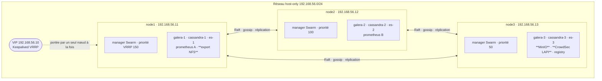
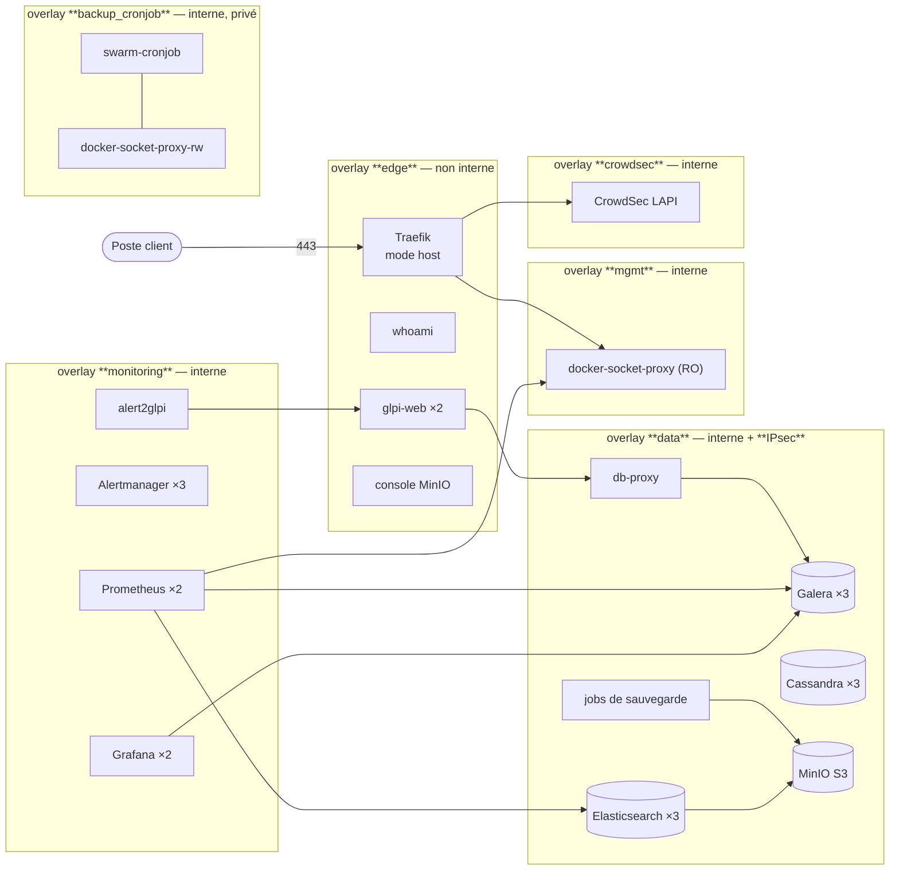
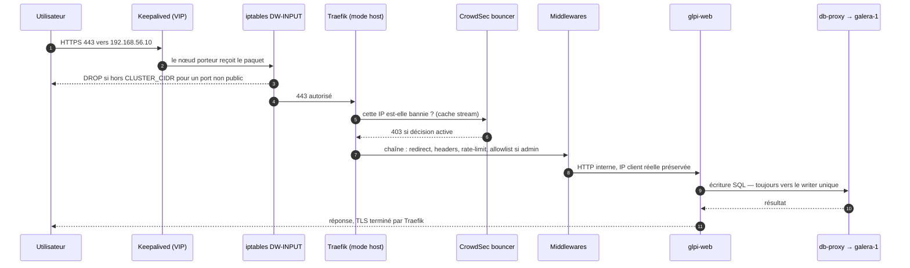
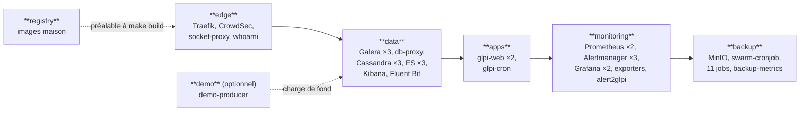
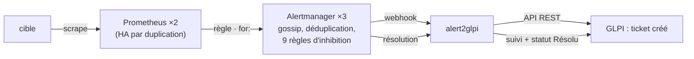

# Architecture

> **Objet** : vue d'ensemble de la plateforme Dockerwarts N°1 — ce qui tourne, où,
> pourquoi, et comment les morceaux se parlent.
> **Références** : CDC §3 à §8 ; les dix [ADR](adr/README.md).
> Pour installer : [`02-installation.md`](02-installation.md). Pour un composant
> en particulier : [`04-composants/`](04-composants/).

---

## 1. Ce que la plateforme fait

Une infrastructure dockerisée, hautement disponible, qui rend quatre services :

| Service | Pour qui | Où |
|---|---|---|
| **Ticketing GLPI** | les utilisateurs | `https://glpi.dockerwarts.lan` |
| **Historisation des logs** (Elasticsearch + Kibana) | l'exploitation | `https://kibana.dockerwarts.lan` |
| **Supervision** (Prometheus + Grafana + Alertmanager) | l'exploitation | `https://grafana.dockerwarts.lan` |
| **Datalake capteurs** (Cassandra) | les applications métier | interne, réseau `data` |

Autour, ce qui rend l'ensemble exploitable : un pare-feu à quatre couches, des
sauvegardes chiffrées et vérifiées, un plan de reprise testé, et une boucle qui
transforme une alerte en **ticket GLPI** sans intervention humaine.

## 2. Le socle : trois nœuds égaux

**Trois managers, pas de workers.** Trois est le plus petit nombre qui donne un
quorum Raft (2 sur 3) ; ajouter des workers ne changerait rien à la
disponibilité du plan de contrôle et ajouterait des machines à administrer
(ADR-0001).

**Les trois nœuds sont identiques**, à trois exceptions près, chacune assumée et
documentée :

| Singularité | Nœud | Conséquence | Traitée dans |
|---|---|---|---|
| Export NFS des fichiers GLPI | node1 | SPOF : GLPI dégradé si node1 tombe | [ADR-0006](adr/0006-nfs-spof-assume.md), [`07-PRA.md`](07-PRA.md) |
| MinIO (dépôt de sauvegarde) | node3 | SPOF : sauvegardes suspendues | [ADR-0008](adr/0008-minio-restic-sauvegardes.md) |
| CrowdSec LAPI | node3 | replanifié par Swarm ; le bouncer garde ses décisions en cache | [`04-composants/crowdsec.md`](04-composants/crowdsec.md) |

Le placement est déclaré par des **labels Swarm** (`ansible/roles/node-labels/`)
et les stacks s'y accrochent par `constraints`. Swarm n'ayant pas de
*StatefulSet*, chaque membre d'un cluster à état est un **service distinct**,
épinglé à son nœud, avec un volume **local**. Remplacer un nœud, c'est
réappliquer les labels : les services épinglés s'y replanifient tout seuls.

## 3. Les réseaux

| Réseau | `internal` | Chiffré | Qui y est | Pourquoi |
|---|---|---|---|---|
| `edge` | non | non | Traefik, whoami, glpi-web, console MinIO | le seul réseau avec une route vers l'extérieur ; c'est là qu'atterrit un attaquant qui compromet un service publié |
| `data` | **oui** | **IPsec** | bases, MinIO, jobs de sauvegarde | le chiffrement est ce qui rend acceptable le HTTP en clair entre nœuds Elasticsearch ([ADR-0007](adr/0007-elasticsearch-logs-sans-loki.md)) |
| `monitoring` | oui | non | Prometheus, Alertmanager, Grafana, exporters | trafic de métriques, sans donnée métier |
| `mgmt` | oui | non | proxy Docker en lecture seule, ses clients | isole l'API Docker de tout le reste |
| `crowdsec` | oui | non | LAPI, agents, bouncer | les décisions de bannissement ne transitent pas par `edge` |
| `backup_cronjob` | oui | non | swarm-cronjob **et** le proxy en écriture, rien d'autre | voir §6 |

Un réseau `internal` n'a **pas de passerelle par défaut** : un conteneur
compromis sur `data` ne peut pas exfiltrer vers Internet, quoi qu'il exécute.

## 4. Le chemin d'une requête

Deux points structurants :

- **Traefik est en `mode: host`**, pas derrière le maillage de routage Swarm. Le
  maillage fait du SNAT : l'IP réelle du client serait remplacée par une
  passerelle `10.20.x.x`, CrowdSec bannirait le maillage plutôt que l'attaquant,
  et les journaux d'accès deviendraient inexploitables ([ADR-0003](adr/0003-traefik-host-mode-keepalived.md)).
- **Toutes les écritures SQL passent par `db-proxy`** vers un writer unique.
  Galera est multi-maître, mais écrire sur les trois nœuds provoque des
  *deadlocks* de certification que l'application voit comme des erreurs
  aléatoires ([ADR-0005](adr/0005-mariadb-galera-haproxy.md)).

## 5. Les cinq stacks

Déployées dans cet ordre par `make deploy`, chacune attendue en bonne santé
avant la suivante — GLPI ne peut pas s'installer avant que Galera n'existe.

| Stack | Services | Fichier |
|---|---|---|
| `registry` | registre Docker interne | `stacks/registry.yml` |
| `edge` | Traefik, CrowdSec (LAPI + agents), proxy Docker RO, whoami | `stacks/edge.yml` |
| `data` | Galera ×3, db-proxy, Cassandra ×3, Elasticsearch ×3, Kibana, Fluent Bit | `stacks/data.yml` |
| `apps` | glpi-web ×2, glpi-cron | `stacks/apps.yml` |
| `monitoring` | Prometheus ×2, Alertmanager ×3, Grafana ×2, 5 exporters, alert2glpi | `stacks/monitoring.yml` |
| `backup` | MinIO, swarm-cronjob, proxy Docker RW, backup-metrics, 11 jobs | `stacks/backup.yml` |
| `demo` | demo-producer | `stacks/demo.yml` |

## 6. Le socket Docker : deux fenêtres, pas une porte

Monter `/var/run/docker.sock` dans un conteneur, c'est lui donner **root sur
l'hôte** : l'API Docker permet de créer un conteneur privilégié qui monte `/`.
Le CDC §6.4 l'interdit donc, avec exactement deux exceptions, et
`scripts/validate-stacks.sh` échoue si une troisième apparaît.

| Proxy | Écriture | Réseau | Clients | Liste blanche |
|---|---|---|---|---|
| `docker-socket-proxy` | **non** (`POST=0`) | `mgmt` | Traefik, Prometheus, jobs de sauvegarde | SERVICES, TASKS, NETWORKS, NODES, INFO, VERSION |
| `docker-socket-proxy-rw` | oui | `backup_cronjob` (privé) | **swarm-cronjob seul** | SERVICES, TASKS, POST |

Ce que `POST=1` accorde est réel : qui atteint le second proxy peut mettre à jour
n'importe quel service, et une mise à jour de service peut monter la racine de
l'hôte. C'est pour cela qu'**un seul** service l'atteint, sur un réseau que rien
d'autre ne rejoint — et que `tests/smoke/network-isolation.sh` le vérifie sur le
cluster vivant, pas seulement dans les fichiers.

## 7. Les données : quatre magasins, quatre rôles

| Magasin | Contenu | Réplication | Cohérence | Sauvegarde |
|---|---|---|---|---|
| **MariaDB Galera** | base GLPI, base Grafana | synchrone, 3 nœuds | RPO 0 | dump logique quotidien → restic |
| **Cassandra** | événements capteurs (datalake) | RF=3 | `LOCAL_QUORUM` | `nodetool snapshot` → restic, par nœud |
| **Elasticsearch** | logs + copie analytique du datalake | 1 replica par shard | RPO 0 | snapshots natifs (SLM) vers MinIO |
| **NFS (node1)** | pièces jointes, config et plugins GLPI | **aucune** | — | restic quotidien |

**Cassandra et Elasticsearch ne font pas double emploi.** La clé de partition
Cassandra `(site, sensor_id, day)` sert la question « la série d'un capteur, un
jour donné », en millisecondes, et **refuse** délibérément les questions
transverses. Celles-ci vont à Elasticsearch, indexé pour cela. Les deux magasins
sont complémentaires par conception ([ADR-0007](adr/0007-elasticsearch-logs-sans-loki.md)).

## 8. La boucle alerte → ticket

C'est la propriété qui distingue une plateforme supervisée d'une plateforme avec
des graphiques.

- **Deux Prometheus identiques** qui ne se parlent pas : rien à synchroniser,
  rien qui diverge, aucune élection à déboguer. La déduplication est faite en
  aval par le cluster Alertmanager.
- **`alert2glpi`** ([ADR-0009](adr/0009-alert2glpi.md)) déduplique par
  l'empreinte (`fingerprint`) Alertmanager glissée dans le titre du ticket :
  une alerte qui repasse en *firing* ré-ouvre **le même** ticket au lieu d'en
  créer un second.
- **Neuf règles d'inhibition** : un nœud perdu ne doit pas produire un ticket par
  service qu'il hébergeait, mais un seul, `NodeDown`.

## 9. Sauvegardes et reprise

3-2-1 : les données vivantes, le dépôt MinIO, et un miroir horaire hors site.
Chiffrement restic AES-256, rétention 7 j / 4 sem / 6 mois, vérification
d'intégrité hebdomadaire, et surtout : **une métrique par job**, surveillée par
`BackupTooOld` et `BackupFailed`.

Une sauvegarde qui s'arrête en silence est pire que pas de sauvegarde — elle
produit une confiance injustifiée. Le détail est dans
[`04-composants/backup.md`](04-composants/backup.md) et le plan complet dans
[`07-PRA.md`](07-PRA.md).

## 10. Dimensionnement

| Ressource | Par nœud | Total | Justification |
|---|---|---|---|
| vCPU | 4 | 12 | trois JVM (Cassandra, Elasticsearch) plus MariaDB par nœud |
| RAM | 6 Gio | 18 Gio | voir la répartition ci-dessous |
| Disque | 40 Gio | 120 Gio | volumes locaux, plus le dépôt MinIO sur node3 |

Répartition mémoire indicative sur un nœud (profil `full`) :

| Service | Limite | Réservation |
|---|---|---|
| Elasticsearch | 2 Gio | 1 Gio (heap 1 Gio) |
| Cassandra | 2 Gio | 1 Gio (heap 1 Gio) |
| MariaDB Galera | 1 Gio | 512 Mio |
| Prometheus | 2 Gio | 512 Mio (sur 2 nœuds) |
| GLPI web | 1 Gio | 256 Mio |
| Le reste (Traefik, CrowdSec, exporters, Grafana…) | < 1 Gio cumulé | |

Les limites ne sont pas décoratives : sans elles, un Elasticsearch qui gonfle
emporte Cassandra sur le même nœud, et la panne se présente comme une panne
Cassandra. `PROFILE=light` dans `.env` réduit les *heaps* JVM pour un poste plus
modeste.

## 11. Choix technologiques — le fil conducteur

Tous les choix structurants sont consignés en [ADR](adr/README.md). Le fil
commun tient en une phrase : **préférer un mécanisme qui tolère la panne à un
mécanisme qui bascule**, et quand une bascule est inévitable, la mesurer.

| # | Décision | En une ligne |
|---|---|---|
| [0001](adr/0001-docker-swarm.md) | Docker Swarm | l'orchestrateur que trois VM justifient ; Kubernetes serait plus d'infrastructure que d'application |
| [0002](adr/0002-vagrant-ansible.md) | Vagrant + Ansible | l'infrastructure est du code, reproductible et idempotent |
| [0003](adr/0003-traefik-host-mode-keepalived.md) | Traefik `mode: host` + Keepalived sur l'hôte | préserver l'IP client réelle, sans quoi CrowdSec et les logs perdent leur sens |
| [0004](adr/0004-pare-feu-quatre-couches-crowdsec.md) | Pare-feu à 4 couches | chaque couche traite ce qu'elle est seule à voir |
| [0005](adr/0005-mariadb-galera-haproxy.md) | Galera + writer unique | la HA sans les deadlocks de certification |
| [0006](adr/0006-nfs-spof-assume.md) | NFS, SPOF **assumé** | nommer un point de rupture vaut mieux que prétendre qu'il n'existe pas |
| [0007](adr/0007-elasticsearch-logs-sans-loki.md) | Elasticsearch, pas Loki ; HTTP interne sans TLS | un magasin de moins, et le chiffrement là où il est réellement obtenu |
| [0008](adr/0008-minio-restic-sauvegardes.md) | MinIO + restic + snapshots natifs | un outil universel, et les mécanismes natifs là où ils existent |
| [0009](adr/0009-alert2glpi.md) | `alert2glpi` maison | 300 lignes testées valent mieux qu'un plugin non maintenu |
| [0010](adr/0010-metriques-minio-public-reseau-interne.md) | Métriques MinIO en `public`, confinées | un secret qui expire en silence est pire qu'un réseau interne chiffré |

## 12. Où aller ensuite

| Question | Document |
|---|---|
| Comment j'installe tout ça ? | [`02-installation.md`](02-installation.md) |
| Comment c'est protégé ? | [`03-reseau-securite.md`](03-reseau-securite.md) |
| Comment marche le composant X ? | [`04-composants/`](04-composants/) |
| Que surveille-t-on, et comment ? | [`05-monitoring.md`](05-monitoring.md) |
| Qu'est-ce qui tombe si un nœud meurt ? | [`06-haute-disponibilite.md`](06-haute-disponibilite.md) |
| Comment je restaure ? | [`07-PRA.md`](07-PRA.md) |
| Comment j'exploite au quotidien ? | [`08-exploitation.md`](08-exploitation.md) |
