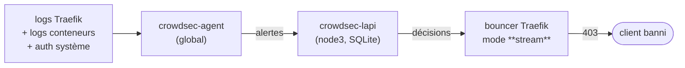

# Réseau et sécurité

> **Objet** : comment la plateforme est segmentée et protégée, couche par
> couche, et **ce qui vérifie que ça tient**.
> **Références** : CDC §5, §6 ; [ADR-0003](adr/0003-traefik-host-mode-keepalived.md),
> [ADR-0004](adr/0004-pare-feu-quatre-couches-crowdsec.md),
> [ADR-0007](adr/0007-elasticsearch-logs-sans-loki.md),
> [ADR-0010](adr/0010-metriques-minio-public-reseau-interne.md).

---

## 1. Le principe : quatre couches, chacune pour ce qu'elle seule voit

Une seule couche ne suffit jamais, et empiler des couches redondantes coûte sans
protéger. Chaque couche traite ici **ce que les autres ne peuvent pas voir**
([ADR-0004](adr/0004-pare-feu-quatre-couches-crowdsec.md)) :

| # | Couche | Ce qu'elle voit | Ce qu'elle ne voit pas |
|---|---|---|---|
| 1 | **iptables** (`DW-INPUT`, `DOCKER-USER`) | des paquets : IP source, port, protocole | ce qu'il y a dedans |
| 2 | **Middlewares Traefik** | des requêtes HTTP : URL, en-têtes, méthode | qui est un attaquant *au fil du temps* |
| 3 | **CrowdSec** | des **comportements** : 40 erreurs 401 en 30 s depuis la même IP | le contenu applicatif |
| 4 | **Segmentation overlay** | qui peut ouvrir une socket vers qui | rien du trafic autorisé |

La couche 4 est celle qui compte quand les trois premières ont échoué : un
attaquant qui exécute du code dans un conteneur de `edge` ne doit **pas** pouvoir
parler à `galera-1:3306`.

## 2. Couche 1 — iptables

Deux chaînes, et une seule règle dans chacune des chaînes natives : le script
`ansible/roles/firewall/templates/dockerwarts-firewall.sh.j2` possède `DW-INPUT`
et `DOCKER-USER` **et rien d'autre**, ce qui le rend rejouable sans conflit avec
Docker ni avec `netfilter-persistent`.

### 2.1 `DW-INPUT` — ce qui est adressé à l'hôte

Politique `INPUT DROP`, un seul saut vers `DW-INPUT`, et à la fin de la chaîne un
`LOG` limité puis `DROP`. La chaîne est **vidée et reconstruite** à chaque
exécution : idempotente par construction, plutôt que par une comparaison
fragile.

| Ordre | Règle | Pourquoi |
|---|---|---|
| 1 | `-i lo -j ACCEPT` | le trafic local ; sans lui, tout casse de façon obscure |
| 2 | `ESTABLISHED,RELATED → ACCEPT` | le suivi de connexion : les réponses passent |
| 3 | `INVALID → DROP` | les paquets hors état, avant tout le reste |
| 4 | ICMP `echo-request`, **limité à 10/s** | le diagnostic reste possible, l'inondation non |
| 5 | ICMP `destination-unreachable`, `time-exceeded` | les bloquer casse la découverte de MTU |
| 6 | SSH 22 depuis `ADMIN_CIDR` **et** `CLUSTER_CIDR` | Ansible passe par là |
| 7 | **80 et 443 depuis partout** | les deux seuls ports publics |
| 8 | Swarm : 2377/tcp, 7946/tcp+udp, 4789/udp, **ESP** — `CLUSTER_CIDR` seulement | 4789 est le VXLAN des overlays, ESP le trafic IPsec du réseau `data` : l'oublier casse le chiffrement sans message d'erreur |
| 9 | 9323/tcp depuis `CLUSTER_CIDR` | métriques du démon Docker, pour Prometheus |
| 10 | VRRP depuis `CLUSTER_CIDR` **et** vers `224.0.0.18` | Keepalived ; la règle multicast est nécessaire même en unicast |
| 11 | NFS 2049 et 111 depuis `CLUSTER_CIDR` — **node1 seulement** | l'export n'existe que là |
| 12 | 5000/tcp depuis `CLUSTER_CIDR` — **node3 seulement** | le registre interne |
| 13 | `LOG` limité à 2/min, puis `DROP` | tracer sans noyer le journal |

### 2.2 `DOCKER-USER` — ce qui est routé vers les conteneurs

C'est la chaîne qui compte le plus, et pour une raison technique précise :
**Docker insère ses propres règles `ACCEPT` dans `FORWARD`**, ce qui court-circuite
`INPUT`. Un port publié par erreur est joignable de l'extérieur même avec
`INPUT DROP`. `DOCKER-USER` est évaluée **avant** ces règles ; c'est le seul
filtre efficace sur ce trafic.

| Ordre | Règle | Pourquoi |
|---|---|---|
| 1 | `ESTABLISHED,RELATED → RETURN` | les réponses |
| 2 | source ∈ `CLUSTER_CIDR`, pool overlay, pool bridge → `RETURN` | le trafic interne au cluster |
| 3 | interface WAN, ports 80/443 → `RETURN` | ce que la plateforme publie |
| 4 | interface WAN vers un pool de conteneurs → **`DROP`** | tout le reste : un `ports:` ajouté par mégarde à une stack ne devient **pas** joignable de l'extérieur |
| 5 | `LOG` limité, puis la politique `FORWARD DROP` | |

**Vérifié pour de vrai** pendant le développement : le script a été appliqué,
l'idempotence prouvée par comparaison d'empreintes du jeu de règles après deux
exécutions, et les variantes node1 (NFS) / node3 (registre) confirmées.

## 3. Couche 2 — les middlewares Traefik

Neuf middlewares, composés en trois chaînes. Un routeur ne référence jamais un
middleware nu : il référence une chaîne, ce qui évite l'oubli d'un maillon.

| Middleware | Type | Ce qu'il fait |
|---|---|---|
| `security-headers` | `headers` | HSTS, `X-Frame-Options`, `X-Content-Type-Options`, `Referrer-Policy`, suppression des en-têtes serveur |
| `rate-limit` | `rateLimit` | limitation générale par IP source |
| `rate-limit-login` | `rateLimit` | limitation plus stricte sur les URL d'authentification |
| `admin-allowlist` | `ipAllowList` | **`ADMIN_CIDR` uniquement** |
| `basic-auth` | `basicAuth` | `admin` + empreinte SHA-256 crypt, pour les UI sans authentification propre |
| `crowdsec` | `plugin` | le *bouncer*, en mode `stream` (voir §4) |
| `admin-chain` | `chain` | `crowdsec` → `admin-allowlist` → `basic-auth` → `rate-limit` → `security-headers` |
| `admin-chain-noauth` | `chain` | idem sans `basic-auth`, pour Grafana et Kibana qui authentifient eux-mêmes |
| `app-chain` | `chain` | `crowdsec` → `rate-limit` → `security-headers` — pour GLPI, qui est public |

**`scripts/lib/check-traefik.py` vérifie deux invariants** à chaque validation :
que tout middleware `@file` référencé existe, et que **chaque nom d'hôte
d'administration du CDC §5.5 résout bien vers une chaîne contenant
`admin-allowlist`**. C'est le contrôle qui empêche qu'un nouveau service
d'administration soit publié sans liste blanche.

Le paramètre `TLS options: modern` impose TLS 1.2 minimum et une liste de
*ciphers* restreinte.

## 4. Couche 3 — CrowdSec



- **Trois sources d'acquisition** (`config/crowdsec/acquis.yaml`) : les logs
  d'accès Traefik, les logs des conteneurs, l'authentification système.
- **Cinq profils** (`config/crowdsec/profiles.yaml`), la **liste blanche
  d'abord et de façon absolue** : `CLUSTER_CIDR` et `ADMIN_CIDR` ne peuvent pas
  être bannis. Un cluster qui se bannit lui-même est une panne totale, et cela
  arrive.
- **Mode `stream` et non `live`** : le bouncer garde les décisions en mémoire et
  les rafraîchit périodiquement. Conséquence décisive — si la LAPI tombe
  (node3), **la protection reste active** avec les décisions déjà connues, au
  lieu de disparaître ou de bloquer chaque requête sur un appel réseau.

**Tester un bannissement** (depuis une source **hors** liste blanche) :

```bash
docker exec $(docker ps -q -f name=edge_crowdsec-lapi) \
  cscli decisions add -i 203.0.113.42 -d 10m -R test-manuel
# ≤ 60 s plus tard (délai du mode stream), depuis 203.0.113.42 : HTTP 403
docker exec $(docker ps -q -f name=edge_crowdsec-lapi) cscli decisions list
docker exec $(docker ps -q -f name=edge_crowdsec-lapi) \
  cscli decisions delete --ip 203.0.113.42
```

## 5. Couche 4 — segmentation, et la matrice de flux

### 5.1 Les réseaux

| Réseau | `internal` | Chiffré | Rôle |
|---|---|---|---|
| `edge` | non | non | le seul avec une route sortante ; ce que Traefik dessert |
| `data` | **oui** | **IPsec** | bases, MinIO, jobs de sauvegarde |
| `monitoring` | oui | non | métriques |
| `mgmt` | oui | non | API Docker en lecture seule |
| `crowdsec` | oui | non | décisions de bannissement |
| `backup_cronjob` | oui | non | swarm-cronjob ↔ proxy Docker **en écriture**, rien d'autre |

`internal: true` retire la passerelle par défaut : un conteneur compromis sur
`data` **n'a aucune route vers Internet**, quoi qu'il exécute.

`data` est chiffré par IPsec, et c'est ce qui rend acceptable le HTTP en clair
entre nœuds Elasticsearch et entre les jobs et MinIO
([ADR-0007](adr/0007-elasticsearch-logs-sans-loki.md)) : le chiffrement est
obtenu une fois, au niveau du réseau, plutôt que configuré et renouvelé service
par service.

### 5.2 Matrice de flux

Dérivée des stacks. Tout ce qui n'y figure pas est refusé par construction :
deux services qui ne partagent aucun réseau ne peuvent pas s'ouvrir une socket.

| Source | Destination | Port / proto | Réseau | Justification |
|---|---|---|---|---|
| Internet / LAN | hôte (Traefik) | 80, 443 / tcp | — (mode host) | les deux seuls ports publics ; 80 ne fait que rediriger |
| Traefik | glpi-web | 80 / tcp | `edge` | l'application publique |
| Traefik | whoami | 80 / tcp | `edge` | validation TLS, VIP, IP client |
| Traefik | console MinIO | 9001 / tcp | `edge` | console seule ; l'API S3 n'est **jamais** publiée |
| Traefik | Grafana, Kibana, Prometheus, Alertmanager | 3000, 5601, 9090, 9093 | `edge` | derrière `admin-chain` |
| Traefik | `docker-socket-proxy` | 2375 / tcp | `mgmt` | découverte des routeurs |
| Traefik | `crowdsec-lapi` | 8080 / tcp | `crowdsec` | le bouncer récupère les décisions |
| glpi-web, glpi-cron | `db-proxy` | 3306 / tcp | `data` | **jamais** directement un membre Galera |
| `db-proxy` | galera-1/2/3 | 3306 / tcp | `data` | writer unique + secours |
| galera-1/2/3 | entre eux | 4567 (réplication), 4568 (IST), 4444 (SST) | `data` | Galera |
| cassandra-1/2/3 | entre eux | 7000, 7001 / tcp | `data` | gossip |
| demo-producer, jobs | cassandra-* | 9042 / tcp | `data` | CQL |
| jobs de sauvegarde | cassandra-* | 7199 / tcp | `data` | JMX, `nodetool snapshot` |
| es-1/2/3 | entre eux | 9300 / tcp (TLS obligatoire) | `data` | transport ES |
| Kibana, Fluent Bit, exporters, jobs | es-* | 9200 / tcp (HTTP clair) | `data` | confiné à un réseau interne chiffré |
| jobs de sauvegarde, Elasticsearch | MinIO | 9000 / tcp | `data` | dépôt restic et *repository* de snapshots |
| Prometheus | tous les exporters | divers | `monitoring`, `data` | scrape |
| Prometheus | `docker-socket-proxy` | 2375 / tcp | `mgmt` | découverte Swarm |
| Prometheus | MinIO | 9000 / tcp (`/minio/v2/metrics/cluster`) | `data` | métriques sans jeton, réseau interne chiffré ([ADR-0010](adr/0010-metriques-minio-public-reseau-interne.md)) |
| Prometheus | `backup-metrics` | 8080 / tcp | `monitoring` | métriques des sauvegardes |
| Alertmanager | entre eux | 9094 / tcp+udp | `monitoring` | gossip |
| Alertmanager | alert2glpi | 8080 / tcp | `monitoring` | webhook |
| alert2glpi | glpi-web | 80 / tcp | `edge` | API REST GLPI |
| Grafana | galera (`db-proxy`) | 3306 / tcp | `data` | son état |
| **swarm-cronjob** | `docker-socket-proxy-rw` | 2375 / tcp | `backup_cronjob` | **le seul flux en écriture vers l'API Docker** |
| nœuds | node1 | 2049, 111 / tcp | hôte | NFS |
| nœuds | node3 | 5000 / tcp | hôte | registre interne |
| nœuds | entre eux | 2377, 7946, 4789, ESP, VRRP | hôte | Swarm et Keepalived |

### 5.3 Ce qui vérifie que la matrice tient

`tests/smoke/network-isolation.sh` interroge le **cluster vivant**, depuis la
position d'un attaquant déjà présent sur `edge` :

1. depuis `edge`, `galera-1:3306`, `cassandra-1:9042`, `es-1:9200`, `minio:9000`
   et `db-proxy:3306` doivent être **injoignables** ;
2. aucun des 17 ports de données ne répond sur les trois IP d'hôte ;
3. les réseaux internes sont bien `internal`, et `data` bien chiffré ;
4. seuls les deux proxies montent `/var/run/docker.sock`, et le proxy en lecture
   seule **refuse un POST** (403, pas 400 : la différence entre « configuré en
   lecture seule » et « en lecture seule ») ;
5. depuis `mgmt`, le proxy **en écriture** est injoignable.

Chaque famille a son **contre-test** — la sonde *doit* joindre `traefik:80`
depuis `edge`, et 443 *doit* être ouvert sur la VIP. Sans eux, une sonde cassée
passerait tous les contrôles d'isolation avec un satisfecit complet.

## 6. TLS et certificats

| Usage | Émetteur | Durée | Où |
|---|---|---|---|
| `*.${DOMAIN}` (Traefik) | CA interne, RSA 4096 | 825 j | secret Docker |
| Transport Elasticsearch | même CA | 825 j | secret Docker, par nœud |
| HTTP Elasticsearch | **aucun** | — | délibéré : réseau interne chiffré IPsec (ADR-0007) |

`scripts/gen-certs.sh` produit la CA et le wildcard ; `scripts/gen-es-certs.sh`
les certificats transport (via `elasticsearch-certutil`, avec repli openssl).
Le résultat est **vérifié** : `openssl verify` contre la CA, cohérence
clé ↔ certificat, et SAN complet (`*.dockerwarts.lan`, `dockerwarts.lan`,
`localhost`, la VIP, `127.0.0.1`).

**`certs/ca.key` doit être dans le coffre.** Sans elle, une reconstruction
impose de regénérer et redistribuer tous les certificats.

## 7. Secrets

**Aucun secret n'entre dans git.** Les mécanismes, tous vérifiés :

- 41 secrets générés par `scripts/init-secrets.sh` (`openssl rand`), stockés
  localement dans `secrets/` (mode 700, dans `.gitignore`) et comme objets
  **Docker secrets** montés en `tmpfs` dans les conteneurs ;
- un pont générique `config/common/secrets-entrypoint.sh` traduit
  `X_FILE=/run/secrets/…` en `X=<valeur>` pour les images qui ne savent lire
  qu'une variable d'environnement. La conversion est **restreinte aux chemins
  sous `/run/secrets`** : sans cette restriction, elle transformait
  `SSL_CERT_FILE` en un paquet de plusieurs kilooctets et faisait échouer le
  démarrage avec « Argument list too long » ;
- `scripts/check-no-secrets.sh` échoue si un littéral ressemblant à un
  identifiant est committé, ou si un fichier interdit est suivi par git. Deux
  faux positifs ont été supprimés (une affectation depuis une fonction, des
  fixtures de test) et un **test négatif** confirme qu'il détecte toujours un
  vrai secret planté ;
- le rendu de configuration **échoue** sur une variable absente ou vide : un
  `ADMIN_CIDR` vide produirait une liste blanche vide, c'est-à-dire une
  interface d'administration ouverte.

Un secret qui n'est pas utilisable n'est pas conservé : `dw_minio_prometheus_token`
a été **retiré** parce que MinIO n'accepte pas de jeton porteur arbitraire — un
secret généré et jamais consommé est un faux sentiment de sécurité
([ADR-0010](adr/0010-metriques-minio-public-reseau-interne.md)).

Rotation : [`08-exploitation.md`](08-exploitation.md#rotation-des-secrets).

## 8. Durcissement des conteneurs

Appliqué à **tous** les services, et **vérifié automatiquement** par
`scripts/validate-stacks.sh` (avec test négatif à l'appui) :

| Mesure | Portée | Note |
|---|---|---|
| `security_opt: no-new-privileges:true` | **tous** | bloque l'escalade par setuid |
| `cap_drop: [ALL]` | **tous** | on part de zéro capacité |
| capacité réajoutée | Traefik : `NET_BIND_SERVICE` ; restauration : `CHOWN`, `DAC_OVERRIDE`, `FOWNER` | chaque exception est argumentée sur place |
| `read_only: true` | là où l'image le permet | avec un `tmpfs` pour ce qui doit être écrit |
| `user:` non root | là où l'image le permet | uid ≥ 10001 pour les images maison, hors de la plage de l'hôte |
| limites CPU/mémoire | **tous** | sans elles, un service qui gonfle emporte ses voisins et la panne se présente sous le mauvais nom |
| `healthcheck` | tous, **sauf les jobs planifiés** | un job est *censé* sortir ; sa supervision est la métrique qu'il publie |
| pilote de journalisation | **tous** | json-file borné, jamais `fluentd` : le pilote `fluentd` bloque la sortie standard du conteneur si le collecteur tombe |

## 9. Ce qui reste, et qui est assumé

| Point | Pourquoi c'est accepté | Où c'est traité |
|---|---|---|
| CA interne, pas de PKI publique | laboratoire sans domaine public | importer `certs/ca.crt` côté client |
| HTTP en clair entre nœuds ES | le réseau `data` est chiffré par IPsec | [ADR-0007](adr/0007-elasticsearch-logs-sans-loki.md) |
| Métriques MinIO sans jeton | le seul jeton possible expire en silence et emporte la supervision | [ADR-0010](adr/0010-metriques-minio-public-reseau-interne.md) |
| `POST=1` sur un proxy Docker | un ordonnanceur doit modifier des services | un seul client, sur un réseau privé (§5.2) |
| SPOF NFS et SPOF MinIO | trois VM ne portent pas raisonnablement du stockage distribué | [ADR-0006](adr/0006-nfs-spof-assume.md), [ADR-0008](adr/0008-minio-restic-sauvegardes.md), [`07-PRA.md`](07-PRA.md) |
| `sstableloader` prend le mot de passe en argument | l'outil n'a pas d'option de fichier d'identifiants | conteneur jetable, lancé par un opérateur, annoté dans le script |
