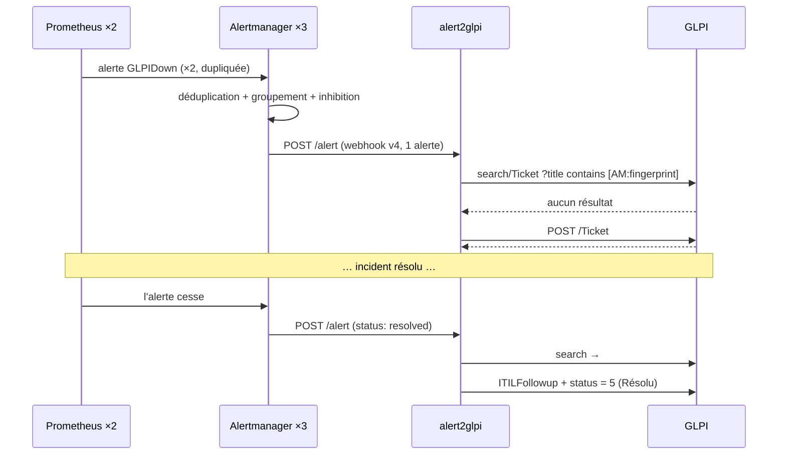

# alert2glpi — la boucle alerte → ticket

> Composant de la stack `monitoring`. Couvre `images/alert2glpi/` (Dockerfile, application,
> tests) et le service `alert2glpi`.
>
> Décision structurante : [ADR-0009 — Service maison alert2glpi](../adr/0009-alert2glpi.md).

## 1. Rôle dans la plateforme

C'est le composant qui **ferme la boucle d'incident** (exigence F5 du CDC) :



Une alerte qui ne devient pas un ticket est une alerte que personne ne possède. C'est ce qui rend
le monitoring « clair » au sens de l'énoncé : chaque alerte critique devient un ticket assigné et
traçable.

## 2. Pourquoi un service maison

| Alternative | Pourquoi écartée |
|---|---|
| Plugin GLPI de réception d'e-mails | dépend d'un serveur mail, **sans déduplication ni résolution automatique** |
| n8n / Node-RED | puissants, mais un composant de plus pour un mappage simple |
| Alerting Grafana vers GLPI | pas de récepteur GLPI natif, et cela créerait une seconde source d'alertes |

~350 lignes de Python, une dépendance HTTP, 22 tests unitaires.

## 3. La déduplication — le cœur du service

```python
title = f"[{severity}] {alertname} — {target} [AM:{fingerprint}]"
```

Alertmanager renvoie une alerte `firing` à chaque `repeat_interval` (4 h ici). Sans déduplication,
c'est **un nouveau ticket toutes les quatre heures** pour le même incident.

Le `fingerprint` est le hachage stable qu'Alertmanager calcule sur les étiquettes de l'alerte : la
même alerte donne toujours le même ticket, à travers les redémarrages des deux côtés.

**Pourquoi dans le titre et pas dans un champ personnalisé** : l'API de recherche GLPI sait
filtrer un titre avec un simple `contains`, sans plugin et sans modification de schéma. La
déduplication fonctionne donc sur un GLPI **standard**.

**Pourquoi pas sur le texte du résumé** : deux alertes réellement différentes peuvent partager un
résumé, et seraient fusionnées à tort. Le fingerprint ne le peut pas.

### La recherche ne porte que sur les tickets ouverts

```python
"criteria[1][field]": "12",          # statut
"criteria[1][searchtype]": "lessthan",
"criteria[1][value]": "5",           # 1-4 = nouveau, en cours, planifié, en attente
```

Un ticket déjà résolu ou clos ne doit **pas** être réutilisé : un incident récurrent rouvrirait
silencieusement un ticket archivé au lieu d'en lever un nouveau — et l'historique deviendrait
illisible.

## 4. Le contenu du ticket

Un ticket ouvert à 3 h du matin doit être exploitable **sans** ouvrir le dépôt :

```
[critical] GLPIDown — https://glpi.dockerwarts.lan/ [AM:a1b2c3d4e5f6a7b8]

GLPI indisponible

La sonde HTTP sur https://glpi.dockerwarts.lan/ échoue depuis 1 minute
(code attendu 200 avec « GLPI » dans le corps).
Vérifier les replicas glpi-web, puis db-proxy et Galera.

--- Étiquettes ---
alertname = GLPIDown
component = glpi
severity = critical
…
--- Horodatage ---
Début : 2026-09-07T10:00:00Z
--- Liens ---
Runbook   : …/docs/04-composants/glpi.md
Dashboard : https://grafana.dockerwarts.lan/d/dw-overview
Prometheus: http://prometheus:9090/graph?g0.expr=…
```

Priorité GLPI (échelle 1 très basse → 5 très haute) :

| `severity` | Priorité | Urgence | Impact |
|---|---|---|---|
| `critical` | 5 | 5 | 5 |
| `warning` | 3 | 3 | 3 |
| `info` | 2 | 2 | 2 |
| inconnue | 3 (défaut) | | |

Le titre est **tronqué à 255 caractères** : GLPI tronque silencieusement au-delà, ce qui
corromprait le fingerprint en fin de titre et casserait la déduplication **définitivement**. Un
test unitaire couvre ce cas.

## 5. La gestion de session GLPI

L'API REST de GLPI est à sessions : `initSession` renvoie un jeton que chaque appel suivant doit
porter, et les sessions sont une ressource limitée.

Une session est ouverte **par lot de webhook** et fermée dans un `finally` :

- **jamais une par alerte** : une rafale de 20 alertes ouvrirait 20 sessions ;
- **jamais une session longue** : elle expirerait silencieusement en plein incident.

Une session abandonnée reste en table et compte dans la limite de sessions concurrentes — c'est
pourquoi la fermeture est dans un `finally` et pourquoi `kill_session` ne lève jamais.

## 6. Modes de défaillance

| Situation | Comportement | Pourquoi |
|---|---|---|
| GLPI injoignable | **HTTP 503** | Alertmanager **réessaie** un 5xx. Renvoyer 200 **perdrait l'alerte**. 503 et non 500 : la panne est transitoire par nature (GLPI qui redémarre, base qui bascule) |
| Une alerte du lot échoue | les autres sont traitées, `errors` incrémenté | une alerte fautive ne doit pas faire perdre les autres, qui peuvent être plus graves |
| Alerte `resolved` sans ticket ouvert | succès, rien à faire | alert2glpi était peut-être arrêté au déclenchement, ou un humain a fermé le ticket. Ce n'est pas une erreur |
| Alerte sans `fingerprint` | ignorée, journalisée | sans clé de déduplication, créer un ticket en produirait un nouveau à chaque répétition, indéfiniment |
| Secret absent ou **vide** | **refus de démarrer** | un secret monté mais vide signifie que la génération a échoué ; démarrer produirait une boucle d'authentification ressemblant à un bug GLPI |

### `/healthz` n'appelle pas GLPI

Délibérément. Sinon une panne de GLPI redémarrerait alert2glpi en boucle, et les redémarrages
**détruiraient les compteurs en mémoire** exactement quand ils sont nécessaires. La disponibilité
de GLPI est mesurée par la sonde blackbox, à sa place.

## 7. Métriques

`/metrics` en texte Prometheus, écrit à la main : une bibliothèque cliente serait une dépendance
pour six compteurs, et cela garderait `/metrics` libre des ~40 séries process/GC par défaut que
personne ne regarde.

| Métrique | Type | Sens |
|---|---|---|
| `alert2glpi_tickets_created_total` | counter | tickets créés |
| `alert2glpi_tickets_resolved_total` | counter | tickets passés en Résolu |
| `alert2glpi_tickets_deduplicated_total` | counter | alertes pour lesquelles un ticket existait déjà |
| `alert2glpi_api_errors_total` | counter | erreurs de l'API GLPI |
| `alert2glpi_webhooks_received_total` | counter | webhooks reçus |
| `alert2glpi_last_success_timestamp` | gauge | dernier traitement complet réussi |

Le rapport `deduplicated / received` est la métrique intéressante : très élevé, il signale une
alerte qui brûle depuis longtemps sans être traitée.

## 8. Les 22 tests unitaires

L'API GLPI est simulée avec **respx**, qui intercepte au niveau du transport httpx. C'est
important : les tests exercent le **vrai** code client — les en-têtes qu'il envoie, le JSON qu'il
construit, la façon dont il lit les réponses — au lieu d'un bouchon écrit à la main qui ne
prouverait que le bouchon fonctionne.

| Groupe | Ce qui est prouvé |
|---|---|
| Rendu (6) | fingerprint dans le titre, priorité correcte, toutes les étiquettes et tous les liens dans le corps, troncature à 255 |
| Création (3) | ticket créé avec les bons champs, jeton de session envoyé sur **chaque** appel, session **toujours** fermée |
| Déduplication (3) | un second `firing` ne crée **rien** ; la recherche ne cible que les tickets ouverts ; un **206 Partial Content** est accepté (le traiter en erreur ferait silencieusement cesser la déduplication) |
| Résolution (2) | suivi ajouté + statut 5 ; une résolution sans ticket n'est pas une erreur |
| Défaillances (5) | 503 sur GLPI injoignable, un échec n'abrège pas le lot, alerte sans fingerprint ignorée, JSON invalide → 400, lot vide accepté |
| Secrets et endpoints (3) | `_FILE` prioritaire, secret vide fatal, `/metrics` valide, `/healthz` n'appelle pas GLPI |

## 9. Image

Construction en deux étapes : pip et le cache de roues ne survivent pas à la première.

| Choix | Raison |
|---|---|
| `USER 10001:10001` | compte dédié non privilégié, uid hors de la plage de l'hôte |
| `read_only: true` | l'image n'écrit rien — `PYTHONDONTWRITEBYTECODE` est posé précisément pour cela |
| `--workers 1` | les compteurs vivent dans la mémoire du processus ; deux workers en détiendraient chacun la moitié, et `/metrics` renverrait celle du worker interrogé |
| `--no-access-log` | Traefik et l'API GLPI journalisent déjà ; le log d'accès uvicorn triplerait le volume sans information nouvelle |

## 10. Configuration Swarm

| Élément | Valeur |
|---|---|
| Replicas | **1** (voir `--workers 1` ci-dessus) |
| Réseaux | `monitoring` (reçoit le webhook), `data` (joint glpi-web) |
| `GLPI_URL` | `http://glpi-web/apirest.php` — le nom de service interne, pas l'URL publique : aucune raison de sortir de l'overlay pour un appel interne |
| Secrets | `dw_glpi_app_token`, `dw_glpi_user_token` |

## 11. Sauvegarde

**Aucune.** Le service est sans état : les compteurs sont des métriques, les tickets sont dans
GLPI (sauvegardé par `backup-galera`). La reprise est un redéploiement.

## 12. Points d'attention

| Point | Détail |
|---|---|
| Un seul replica | volontaire, pour la cohérence des métriques. La déduplication resterait correcte à deux (elle interroge GLPI), mais `/metrics` serait faux |
| Fingerprint dans le titre | ne jamais reformater le titre sans conserver `[AM:…]` : cela casserait la déduplication de tous les tickets existants |
| Profil Technicien | ne pas passer le compte `alertmanager` en Super-Admin : un webhook compromis pourrait reconfigurer GLPI |
| 503 et non 200 | renvoyer 200 sur erreur ferait **perdre** l'alerte : Alertmanager ne réessaierait pas |
| Jetons | générés par `init-secrets.sh` et **injectés** dans GLPI par `glpi-init.sh`, pas l'inverse. Cela rend les deux scripts idempotents et sans ordre imposé |
