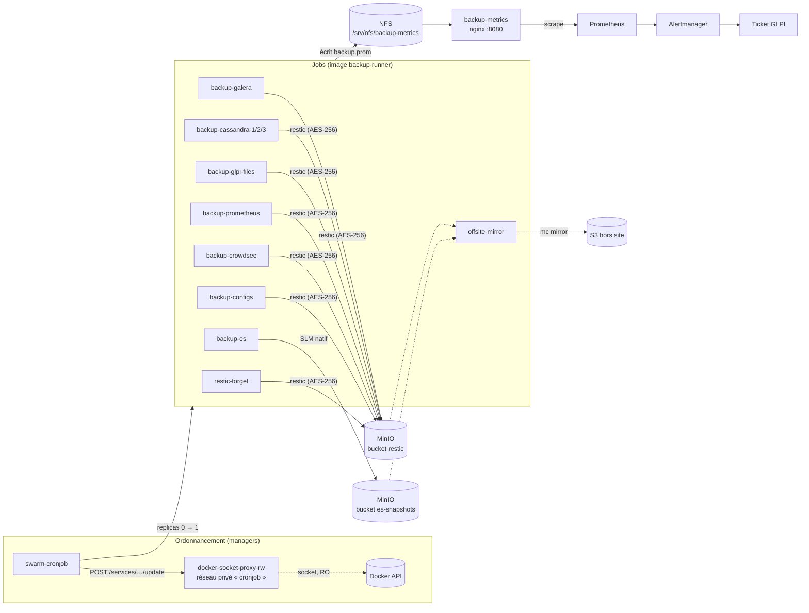

# Sauvegardes — swarm-cronjob, backup-runner, restic

> **Rôle** : exécuter, chiffrer, vérifier et faire vieillir les sauvegardes de la plateforme, et
> **prouver** qu'elles fonctionnent.
> **Références** : CDC §7.7, §9.1 à §9.4 ; ADR-0008.
> **Fichiers** : `stacks/backup.yml`, `images/backup-runner/Dockerfile`, `scripts/backup/*.sh`,
> `scripts/restore/*.sh`, `scripts/backup-now.sh`, `tests/dr/dr-drill.sh`,
> `config/backup/nginx.conf`, `config/prometheus/rules/backup.yml`.
> Le dépôt lui-même est documenté dans [`minio.md`](minio.md).

---

## 1. Le principe : une sauvegarde qui ne se surveille pas n'existe pas

Une sauvegarde qui s'arrête en silence est **pire** que pas de sauvegarde : elle produit une
confiance injustifiée. Tout ce qui suit découle de ce constat.

- Chaque job publie **quatre séries** (`backup_last_success_timestamp`, `backup_last_status`,
  `backup_last_duration_seconds`, `backup_last_size_bytes`), depuis un *trap* `EXIT` — donc même
  s'il est tué.
- Quatre alertes les surveillent : `BackupTooOld` (> 26 h), `BackupFailed` (état ≠ 0),
  `BackupNeverRan` (série absente depuis 48 h) et `BackupDurationAnomaly`.
- En cas d'**échec**, l'horodatage de succès n'est **pas** rafraîchi : il continue de désigner la
  dernière exécution qui a réellement fonctionné, ce que mesure `BackupTooOld`.
- `make dr-drill` **restaure réellement** chaque composant et compare avec la production.

## 2. Vue d'ensemble



## 3. La forme d'un job planifié dans Swarm

Swarm n'a pas d'objet *Job*. Un job est ici un service ordinaire avec `replicas: 0` et
`restart_policy: none` : rien ne tourne jusqu'à ce que swarm-cronjob le passe à 1 à la minute
prévue ; le conteneur s'exécute, sort, et Swarm ne le relance pas.

Trois conséquences, toutes délibérées :

| Choix | Raison |
|---|---|
| **Aucun `healthcheck`** sur un job | il est *censé* sortir ; Docker le déclarerait *unhealthy* pour avoir fait ce qu'on lui demandait. Sa supervision, c'est la métrique qu'il publie — un signal qui, lui, survit au conteneur. `scripts/validate-stacks.sh` connaît cette exception et ne l'accorde qu'aux services `replicas: 0` + `restart_policy: none`. |
| `restart_policy: condition: none` | avec `on-failure`, une sauvegarde en échec deviendrait une boucle de redémarrage martelant la base qu'elle tente de sauvegarder. |
| `swarm.cronjob.skip-running: "true"` sur **tous** les jobs | une sauvegarde qui déborde sur son créneau suivant ne doit pas être rejointe par une seconde copie d'elle-même, en concurrence sur la même base et le même verrou restic. |

Les expressions cron de swarm-cronjob comptent **six champs — les secondes d'abord** —, évaluées
en UTC (`TZ=UTC` sur l'ordonnanceur, parce que les horaires du CDC §9.1 sont donnés en UTC ;
utiliser le fuseau de la plateforme décalerait silencieusement chaque sauvegarde d'une heure
selon la saison, et le RPO avec).

### `docker-socket-proxy-rw` : la seule fenêtre en écriture sur l'API Docker

swarm-cronjob doit **modifier** des services (un `POST`), ce que le proxy en lecture seule de
`stacks/edge.yml` refuse par construction. Un second proxy existe donc pour ce seul
consommateur, clôturé de trois façons :

1. un **overlay privé** (`cronjob`, déclaré dans `stacks/backup.yml`, `internal`) auquel seul
   swarm-cronjob est attaché — rien sur `mgmt`, `data` ou `edge` ne peut même ouvrir une socket
   vers lui ;
2. la liste d'autorisation la plus étroite qui laisse encore fonctionner un ordonnanceur :
   `SERVICES`, `TASKS`, `POST`. Pas de `CONTAINERS`, pas d'`EXEC`, pas de `SECRETS`, pas de
   `SWARM` ;
3. `node.role == manager`, parce que c'est là que vit l'API Swarm.

Ce que `POST=1` accorde est réel et mérite d'être dit : qui atteint ce proxy peut mettre à jour
n'importe quel service, et une mise à jour de service peut monter la racine de l'hôte dans un
conteneur. C'est pour cela qu'**un seul** service l'atteint, sur un réseau que rien d'autre ne
rejoint.

## 4. L'image `backup-runner`

Une image pour tous les jobs (CDC §7.7). Ils sauvegardent des choses hétérogènes, mais font
ensuite tous la même chose : pousser vers restic, publier une métrique, sortir. Une image = une
version de restic, un format de métrique, un câblage d'identifiants, une chose à maintenir à
jour.

| Contenu | Pourquoi |
|---|---|
| `restic` | l'outil universel : chiffrement AES-256, déduplication, `forget/prune`, `check` |
| `mariadb-client` | `mariadb-dump` pour le job SQL |
| `curl` + `jq` | API Elasticsearch, API Prometheus, API Docker (via le proxy) |
| `mc` | client MinIO, pour le miroir hors site — **copié depuis l'image officielle `minio/mc`**, épinglée tag + digest, et non téléchargé depuis une URL que rien ne permet d'épingler par contenu |
| JRE + `nodetool` + `cqlsh` | extraits en multi-stage de l'image Cassandra **exacte** du cluster : un `nodetool` d'une autre version majeure échoue avec des erreurs déroutantes |

L'image tourne en `USER 10002:10002`, ne déclare **aucun `HEALTHCHECK`**, et les services la
lancent avec `read_only: true` + un `/tmp` en tmpfs : les fichiers d'identifiants temporaires
(nodetool, cqlsh) ne touchent jamais un disque.

Son contexte de build est la **racine du dépôt** — seul cas du projet —, parce qu'elle copie
`scripts/backup/*.sh` et que le CDC §10.1 place ces scripts sous `scripts/`. C'est précisément
pourquoi la racine porte un `.dockerignore` en *deny-by-default* : `secrets/`, `certs/` et `.env`
y vivent, et un contexte permissif les embarquerait dans une couche d'image poussée au registry.
Vérifié : le contexte de build ne contient que `scripts/backup/` (51 kio).

## 5. Le calendrier (CDC §9.1)

| Job | Cron (UTC) | Méthode | Épinglage | Rétention |
|---|---|---|---|---|
| `backup-es` | `0 0 1 * * *` | exécute la politique SLM `daily-snapshots`, **attend et vérifie** l'état `SUCCESS` | — | 30 j (SLM) |
| `backup-galera` | `0 0 2 * * *` | `mariadb-dump --all-databases` → `gzip` → `restic backup --stdin` | — | 7 j / 4 sem / 6 mois |
| `backup-glpi-files` | `0 30 2 * * *` | `restic backup /data` (4 exports NFS montés **en lecture seule**) | — | idem |
| `backup-cassandra-1/2/3` | `0 0 3 * * *` | `nodetool snapshot` (JMX) → `cqlsh DESCRIBE KEYSPACE` → `restic backup` → `clearsnapshot` | `node.labels.cassandra == N` | idem |
| `backup-prometheus` | `0 0 4 * * 0` | `POST /api/v1/admin/tsdb/snapshot` sur l'instance **locale** → restic | `node.labels.prometheus == a` | 4 sem |
| `backup-crowdsec` | `0 30 4 * * *` | `restic backup` du volume LAPI | `crowdsec_lapi == true` | 7 j |
| `backup-configs` | `0 0 5 * * *` | API Docker (RO) + état ILM/SLM ES → JSON → restic | — | 7 j / 4 sem |
| `maint-cassandra-repair` | `0 0 5 * * 0` | `nodetool repair -pr` séquentiel sur les 3 nœuds | — | — |
| `restic-forget` | `0 0 6 * * *` | `forget --keep-daily 7 --keep-weekly 4 --keep-monthly 6 --prune` ; `check` le dimanche | — | — |
| `offsite-mirror` | `0 0 * * * *` | `mc mirror --overwrite --remove` vers le S3 externe | — | selon le dépôt |

### Ce qui n'est **pas** sauvegardé, et pourquoi

| Non sauvegardé | Justification |
|---|---|
| Volumes Galera | réplication synchrone ; un nœud vide se reconstruit par SST. Ce qu'il faut, c'est un dump logique portable, pas une copie de `datadir`. |
| Volumes Elasticsearch | copier le répertoire d'un nœud vivant produit une archive **déchirée** : les segments Lucene sont écrits et fusionnés en continu. Les snapshots natifs sont cohérents par construction. |
| Données MinIO elles-mêmes | c'est le dépôt ; sa protection est le miroir hors site. |
| Grafana | l'état est en Galera, les tableaux de bord sont en git. |
| Kibana | les objets sauvegardés sont re-provisionnés par `es-init.sh`. |

## 6. Détails qui décident du succès d'une restauration

**Le dump SQL passe par un tube, jamais par un disque.** `mariadb-dump | gzip | restic --stdin` :
pas de fichier temporaire à nettoyer en cas d'échec, pas d'espace libre requis sur un nœud de
6 Gio, et le dump — qui contient toutes les empreintes de mots de passe de la plateforme — ne
touche aucun système de fichiers. `set -o pipefail` est ici **la** ligne critique : sans elle, un
`mariadb-dump` mort à mi-course produirait un gzip valide d'un dump **tronqué**, que restic
archiverait comme un succès. C'est la façon classique de découvrir, un an plus tard, que toutes
les sauvegardes contiennent une demi-base.

**Le snapshot Cassandra est nettoyé depuis un *trap*.** `nodetool snapshot` crée des **liens
durs** vers les SSTables : coût disque nul, mais ces liens empêchent le *compactor* de supprimer
les SSTables obsolètes. Oublier `clearsnapshot` est la manière classique de remplir un disque
Cassandra — le nœud meurt d'un volume plein des semaines plus tard. Le nettoyage est donc dans un
`trap EXIT`, exécuté quoi qu'il arrive.

**Le job Prometheus s'adresse à l'instance dont il lit le volume.** Résoudre le nom de service
tomberait sur la VIP Swarm et, une fois sur deux, créerait le snapshot sur l'autre nœud : ce job
archiverait alors un répertoire vide, avec succès, pendant des mois. Il interroge donc l'API
Docker (proxy en lecture seule) pour trouver l'adresse de la tâche présente **sur son propre
nœud**. Il supprime aussi le snapshot après archivage — Prometheus ne supprime jamais les siens,
et un snapshot oublié épingle des blocs que la rétention aurait dû libérer.

**`backup-es` traite `PARTIAL` comme un échec.** Un snapshot auquel il manque des *shards* n'est
pas une sauvegarde, et le CDC §9.4 promet un RPO de 24 h sur l'ensemble du cluster.

**`backup-configs` ne sauvegarde aucun secret.** L'API Docker exposée est celle en lecture seule :
`/configs` (qui renverrait le **contenu** de chaque config) et `/secrets` n'y sont pas ouverts.
Les **noms** des objets config et secret sont malgré tout capturés, depuis les définitions de
service qui les référencent — c'est ce dont une reconstruction a besoin ; le contenu revient de
git, les secrets du coffre.

**La rétention est appliquée par tag** (`--group-by tags`). Sans cela, restic considérerait tous
les snapshots ensemble et « les 7 derniers jours » pourrait très bien signifier sept snapshots
Cassandra et rien d'autre — les dumps SQL disparaîtraient en silence.

**`restic check --read-data-subset=5%` le dimanche.** `check` seul vérifie la structure (chaque
blob référencé existe) ; relire et re-hacher 5 % des données est ce qui détecte la **corruption
silencieuse** dans MinIO ou un objet tronqué. 5 % par semaine couvre le dépôt en environ cinq
mois pour une fraction de la bande passante d'une lecture complète.

**Le miroir hors site ne publie aucune métrique s'il n'est pas configuré.** Publier un succès
affirmerait qu'une copie hors site existe : c'est exactement le mensonge qu'un système de
sauvegarde ne doit jamais faire. Le job sort en 0 avec un avertissement explicite.

## 7. Le pont métriques : `backup-metrics`

Prometheus ne peut pas scraper un conteneur qui a fini. Le *pushgateway* a été écarté : une
métrique poussée survit au job qui l'a produite et ment indéfiniment. Les jobs écrivent donc un
fichier au format *textfile* sur le répertoire NFS partagé, et un nginx le sert sur une cible
stable et toujours présente.

Points de conception :

- **écriture atomique** : le fichier entier est réécrit dans un temporaire puis déplacé (`mv`,
  atomique sur NFSv4). Ce n'est pas un ajout : une série en double ferait rejeter tout le
  *scrape* par Prometheus (« duplicate series ») et **toutes** les métriques de sauvegarde
  disparaîtraient d'un coup ;
- les lignes des **autres** jobs sont recopiées telles quelles — trois jobs peuvent écrire depuis
  trois nœuds ;
- l'nginx monte l'export NFS **en lecture seule** (au niveau du montage, pas seulement du
  conteneur) : le processus qui publie les métriques ne peut pas les altérer ;
- si le fichier n'existe pas encore, nginx sert une exposition **vide en 200**, pas un 404. Un
  404 rendrait la cible `up == 0` et déclencherait `PrometheusTargetMissing` — un diagnostic de
  « panne de supervision » alors que la vérité est « aucune sauvegarde n'a encore tourné », ce
  que dit `BackupNeverRan` ;
- il écoute sur **8080** : le conteneur tourne en `65534:65534` avec `cap_drop: [ALL]` et ne peut
  donc pas se lier à un port privilégié.

## 8. Restaurations — `scripts/restore/`

| Script | Restaure | Méthode |
|---|---|---|
| `restore-galera.sh` | toutes les bases | `restic dump` → `gunzip` → client MariaDB, en un seul tube. `--fresh` re-bootstrappe un cluster vide avant l'import ; `--only-db X --as Y` extrait une base et la rejoue sous un autre nom (utilisé par le *drill*) |
| `restore-glpi-files.sh` | export NFS GLPI | arrêt de `glpi-web`/`glpi-cron`, `restic restore`, redémarrage depuis un *trap*. `--to DIR` restaure à côté, sans toucher à la production |
| `restore-cassandra.sh` | keyspace `datalake` | `restic restore` → schéma (`cqlsh -f`) → **`sstableloader`** |
| `restore-es.sh` | indices / data streams | `_restore` avec `rename_pattern` (`--rename`), ou en place après fermeture des indices |
| `restore-prometheus.sh` | TSDB instance A | retrait du label de placement, vidage, restore, remise du label |
| `restore-crowdsec.sh` | base LAPI | arrêt du LAPI, `restic restore`, redémarrage |
| `restore-all.sh` | plateforme entière | ordre imposé + `--from offsite` + validation par `make smoke` |

**Pourquoi `sstableloader` et non une copie de fichiers.** La restauration évidente — remettre
les SSTables dans `data/<ks>/<table>/` puis `nodetool refresh` — ne fonctionne que si l'anneau a
**la même topologie et les mêmes plages de tokens** qu'au moment du snapshot. Après un
remplacement de nœud, elle charge silencieusement des données que le nœud ne possède pas, et les
lignes deviennent invisibles. `sstableloader` fait passer chaque ligne par le chemin d'écriture
normal : elle est routée vers les nœuds qui la possèdent **aujourd'hui**, à RF=3. C'est plus
lent, et c'est la seule méthode correcte quoi qu'il soit arrivé à l'anneau.

**Pourquoi `--rename` par défaut sur Elasticsearch.** Une restauration en place ferme les
indices, écrase, rouvre : c'est la réponse à « on a perdu le cluster ». Une restauration
renommée répond à « la sauvegarde fonctionne-t-elle ? » et à « à quoi ressemblait ce document
mardi dernier ? » sans rien interrompre.

**Pourquoi retirer un label de nœud pour Prometheus.** `--replicas 1` laisserait Swarm choisir
quelle tâche arrêter — potentiellement l'instance B ; `--replicas 0` arrêterait les deux et
supprimerait l'intérêt même de la HA par duplication pendant l'opération qui a besoin que l'autre
instance continue de collecter. Retirer le label rend la tâche locale non planifiable, et
`max_replicas_per_node: 1` l'empêche de migrer vers node2 où B occupe déjà la seule autre place.
Le label est remis par un *trap*.

**Les identifiants pendant une restauration.** Il n'y a pas de conteneur `backup-runner` en cours
d'exécution dans lequel entrer — les jobs sont des services `replicas: 0`. `scripts/restore/
lib.sh` démarre donc un conteneur jetable avec les fichiers de `secrets/` (ceux que `make
secrets` a produits depuis le coffre) copiés dans un répertoire privé en 0700, monté sur
`/run/secrets` : exactement la disposition que les scripts attendent déjà. Le répertoire est
supprimé par un *trap*, même sur Ctrl-C. C'est aussi la raison pour laquelle `make secrets`
**précède** toute restauration dans la procédure de reconstruction (CDC §9.6).

## 9. `make backup-now` et `make dr-drill`

```bash
make backup-now                       # tous les jobs, dans l'ordre, avec rapport
scripts/backup-now.sh backup-galera   # un seul
scripts/backup-now.sh --list          # ce qui serait lancé
make dr-drill                         # restauration réelle + comparaison + nettoyage
tests/dr/dr-drill.sh --keep           # garde les copies restaurées pour inspection
```

`backup-now.sh` pilote le même mécanisme que swarm-cronjob (passer à 0, puis à 1, attendre) et
lit ensuite **l'état de sortie de la tâche** — le seul endroit où la vérité est enregistrée une
fois le conteneur disparu. Il relit enfin les métriques publiées **depuis le conteneur
Prometheus**, c'est-à-dire par le chemin exact que prend le *scrape* : un job peut sortir en 0
sans avoir publié (si `/metrics` n'était pas monté), et Prometheus ne verrait alors rien.

`dr-drill.sh` restaure Galera dans `glpi_restore`, Elasticsearch dans `restored-*`, Cassandra
dans `datalake_restore`, les fichiers GLPI dans un répertoire temporaire, compare chaque résultat
avec la production, vérifie l'intégrité du dépôt restic, publie le **RPO réellement constaté**
(lu dans les métriques, pas dans le calendrier) et nettoie tout depuis un *trap*.

## 10. Exploitation courante

```bash
# État des sauvegardes, vu par Prometheus
curl -s http://prometheus:9090/api/v1/query?query=time\(\)-backup_last_success_timestamp | jq

# Journaux du dernier passage d'un job
docker service logs --tail 100 backup_backup-galera

# Contenu du dépôt
scripts/restore/restore-all.sh --list

# Prune et vérification à la demande
scripts/backup-now.sh restic-forget
```

Tableau de bord Grafana : **`dw-backup`** (« Sauvegardes ») — âge, durée, taille et état de chaque
job.

## 11. Points de vigilance

- **`dw_restic_password` hors du cluster, dans un coffre.** Sans lui, le dépôt est du bruit
  chiffré. Idem pour `dw_minio_restic_key`/`secret`.
- **Sans `OFFSITE_S3_*`, la règle 3-2-1 n'est pas satisfaite** : perdre node3, c'est perdre
  toutes les sauvegardes. Le job le dit à chaque passage.
- **`mc mirror --remove` propage les suppressions.** C'est voulu (sinon la rétention ne
  s'applique qu'à une copie) et le risque est réel : le versioning du bucket `restic` et le
  versionnage ou le *object lock* du fournisseur externe sont ce qui reste en face.
- **Un `restic check` en échec veut dire : ne plus pruner.** Restaurer depuis le miroir hors
  site, puis voir `docs/07-PRA.md`.
- **`maint-cassandra-repair` n'est pas optionnel** : sans réparation hebdomadaire, une suppression
  non répliquée peut être **ressuscitée** après expiration de `gc_grace_seconds`. Des données
  supprimées qui réapparaissent sont la panne que ce job évite.
