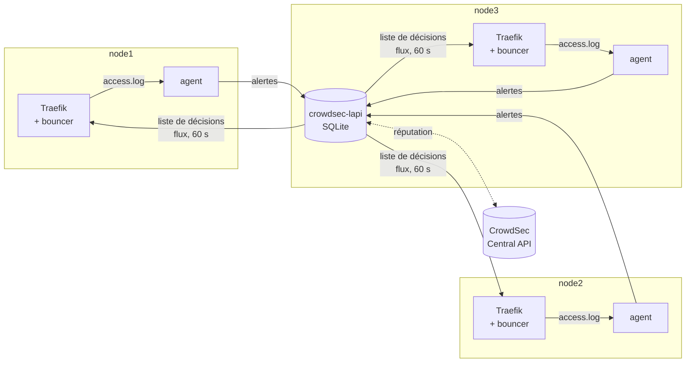

# CrowdSec — pare-feu applicatif (couche 3)

> Composant de la stack `edge`. Couvre `config/crowdsec/acquis.yaml`,
> `config/crowdsec/profiles.yaml`, les services `crowdsec-lapi` / `crowdsec-agent`, et le
> middleware `crowdsec` de `config/traefik/dynamic.yml`.
>
> Décision structurante : [ADR-0004 — Pare-feu en quatre couches, CrowdSec comme pare-feu applicatif](../adr/0004-pare-feu-quatre-couches-crowdsec.md).

## 1. Rôle dans la plateforme

L'énoncé demande un pare-feu « applicatif ou non » et évalue la pertinence du choix. CrowdSec est
la **réponse applicative** : c'est un IPS comportemental. Il ne cherche pas des signatures dans le
corps des requêtes (c'est le travail d'un WAF comme ModSecurity), il observe des **comportements**
dans les journaux — dix échecs d'authentification, une énumération de chemins, une requête ciblant
une CVE connue — et transforme ces observations en **décisions de bannissement** appliquées à
l'entrée.

Trois avantages concrets sur un WAF à signatures, dans ce contexte :

- pas de faux positifs sur les formulaires riches de GLPI et de Grafana, qui rendent un CRS OWASP
  inexploitable sans des semaines de réglage ;
- **réputation communautaire** : une IP qui attaque ailleurs est bloquée ici avant sa première
  requête ;
- la décision est **partagée entre les trois nœuds**, ce que `fail2ban` (mono-hôte) ne sait pas
  faire — d'où sa relégation à la seule protection SSH de l'hôte.

## 2. Architecture



Trois rôles bien séparés, et c'est cette séparation qui rend l'ensemble tolérant aux pannes :

| Rôle | Service | Ce qu'il fait |
|---|---|---|
| **Agent** | `crowdsec-agent` (global) | lit les journaux de **son** nœud, applique les parseurs et les scénarios, remonte des **alertes** |
| **LAPI** | `crowdsec-lapi` (1 replica, node3) | reçoit les alertes, applique `profiles.yaml`, produit des **décisions**, les sert aux bouncers |
| **Bouncer** | plugin dans Traefik (global) | interroge la LAPI, **applique** : `403` pour une IP bannie |

## 3. `config/crowdsec/acquis.yaml` — ce que les agents lisent

Trois sources, chacune avec une raison précise.

### 3.1 Journal d'accès Traefik (`type: traefik`)

La source principale. Chaque agent lit le fichier de **son propre nœud** — pas celui des autres :
avec Traefik en `mode: host` (ADR-0003), chaque nœud voit ses propres clients, et les trois vues
locales se rejoignent dans la LAPI. C'est ce qui rend le bannissement cohérent à l'échelle du
cluster : une IP détectée par l'agent de node2 est bloquée par les bouncers des trois nœuds.

Le fichier est un bind mount **en lecture seule** : un agent ne doit jamais pouvoir altérer les
preuves qu'il analyse.

La rotation en `copytruncate` (rôle Ansible `common`) préserve l'inode, donc l'agent ne perd
jamais sa position de lecture.

### 3.2 `/var/log/auth.log` (`type: syslog`)

`fail2ban` bannit déjà le SSH localement, mais par hôte et sans partage. Donner `auth.log` à
CrowdSec ajoute deux choses : la vue cluster, et le **croisement des couches** — une IP qui force
le SSH de node1 se retrouve bannie au niveau HTTP des trois nœuds.

### 3.3 `/var/log/kern.log` (`type: syslog`)

Le script pare-feu journalise un échantillon limité de ce qu'il rejette
(`dw-input-drop:`, `dw-docker-drop:`). La collection `crowdsecurity/linux` transforme ces lignes en
détections de balayage de ports, et alimente le signal « niveau hôte » du dashboard « Sécurité ».

## 4. `config/crowdsec/profiles.yaml` — la remédiation

CrowdSec sépare la **détection** (scénarios, chez les agents) de la **remédiation** (décisions,
chez la LAPI). Ce fichier est la seconde moitié. Il est parcouru de haut en bas et s'arrête au
premier profil qui correspond (`on_success: break`).

| Ordre | Profil | Déclencheur | Décision | Justification de la durée |
|---|---|---|---|---|
| 1 | `dockerwarts/whitelist` | source dans `192.168.56.*`, `10.20.*`, `172.20.*`, `127.*` | **aucune** | voir ci-dessous |
| 2 | `dockerwarts/bruteforce` | scénarios `bf`, `bruteforce`, `sshd` | ban **4 h** | sans ambiguïté : un utilisateur légitime n'échoue pas dix authentifications d'affilée |
| 3 | `dockerwarts/cve` | `http-cve` | ban **24 h** | aucune raison légitime ; le trafic est automatisé et reviendra |
| 4 | `dockerwarts/scan` | `http-probing`, `http-crawl`, `http-bad-user-agent`, `http-path-traversal` | ban **1 h** | parfois une erreur de configuration plutôt qu'une attaque : assez court pour s'auto-corriger |
| 5 | `dockerwarts/default` | toute autre remédiation demandée sur une IP | ban **2 h** | filet : une collection nouvellement installée produit une vraie décision au lieu d'être ignorée |

### Pourquoi la liste blanche est absolue et vient en premier

Le sous-réseau du cluster et le poste d'administration produisent **exactement** les motifs que
les scénarios recherchent : le smoke test parcourt toutes les URL en rafale, `make chaos` génère
des salves de 5xx, l'exportateur blackbox sonde toutes les 15 s. Sans ce profil, la plateforme
bannirait sa propre supervision — et, plus grave, l'opérateur, en pleine intervention.

Le profil n'a **pas** de bloc `decisions:` : l'alerte est bien enregistrée et visible dans
`cscli alerts list` et sur le dashboard, mais aucune action n'est prise. Une sonde qui se met à
mal se comporter reste donc **visible** au lieu d'être invisible.

Le middleware `crowdsec` de Traefik liste **aussi** `CLUSTER_CIDR` dans `clientTrustedIPs` :
double protection, parce que les deux mécanismes échouent différemment (un profil peut être mal
ordonné, une clé de bouncer peut expirer).

## 5. Le bouncer Traefik — mode `stream`

```yaml
crowdsecMode: stream
updateIntervalSeconds: 60
```

Deux modes existent :

| Mode | Fonctionnement | Conséquence |
|---|---|---|
| `live` | le plugin interroge la LAPI **à chaque requête** | ban instantané, mais une LAPI indisponible bloque ou laisse passer tout le trafic, et chaque requête coûte un aller-retour réseau |
| **`stream`** | le plugin télécharge la **liste complète** des décisions toutes les 60 s et la garde en mémoire | ban appliqué en moins d'une minute, **latence nulle** par requête, et la **protection survit à une panne de la LAPI** |

`stream` est le bon choix ici pour une raison structurelle : la LAPI est un **replica unique**
épinglé sur node3. Lors d'une perte de node3, Swarm la replanifie, ce qui prend 30 à 60 secondes.
En mode `live`, la protection s'effondrerait pendant cette fenêtre — précisément le moment où la
plateforme est fragile. En mode `stream`, les trois bouncers continuent d'appliquer la dernière
liste connue.

C'est l'application directe de la ligne « CrowdSec : protection maintenue » de la matrice de
défaillance du CDC §8.1.

## 6. Collections installées

| Collection | Ce qu'elle détecte |
|---|---|
| `crowdsecurity/traefik` | parseur du journal d'accès Traefik — prérequis de toutes les autres |
| `crowdsecurity/base-http-scenarios` | énumération de chemins, crawl agressif, agents utilisateurs de scanners, 404 en rafale |
| `crowdsecurity/http-cve` | requêtes ciblant des CVE publiées (Log4Shell, traversées de chemin, RCE connues) |
| `crowdsecurity/sshd` | force brute SSH depuis `auth.log` |
| `crowdsecurity/linux` | événements système, dont les rejets journalisés par le pare-feu |

Les collections sont installées par la variable d'environnement `COLLECTIONS` au démarrage :
elles font partie de la définition du service, pas d'une manipulation manuelle post-déploiement.

## 7. Secrets et enregistrement

| Secret | Usage |
|---|---|
| `dw_crowdsec_bouncer_key` | authentifie le plugin Traefik auprès de la LAPI. Pré-enregistré par `BOUNCER_KEY_traefik_FILE`, donc **aucun `cscli bouncers add` manuel** n'est nécessaire |
| `dw_crowdsec_agent_password` | authentifie les agents. Un identifiant partagé (`dockerwarts-agent`) plutôt qu'un par nœud : les agents sont interchangeables et un service global doit pouvoir démarrer sur un nœud neuf sans intervention |

C'est un point de conception : tout ce qui devrait être fait « à la main après le déploiement »
est une procédure oubliée le jour de la reprise après sinistre.

## 8. Supervision

| Élément | Détail |
|---|---|
| Endpoint | `:6060/metrics` sur la LAPI et sur chaque agent |
| Métriques clés | `cs_active_decisions`, `cs_alerts`, `cs_parser_hits_total`, `cs_bucket_overflowed_total`, `cs_lapi_route_requests_total` |
| Alerte | `CrowdSecLapiDown` — cible absente 2 min, **warning** (et non critical : les bouncers en mode `stream` protègent encore) |
| Dashboard | « Sécurité » : décisions actives, IP bannies, scénarios déclenchés, 401/403/404/429 Traefik, tentatives SSH |

La sévérité **warning** de `CrowdSecLapiDown` est délibérée et documente le mode `stream` : une
LAPI absente dégrade la mise à jour des décisions, elle ne supprime pas la protection. La mettre
en `critical` créerait un ticket d'astreinte pour une situation qui n'appelle pas d'action
immédiate.

## 9. Sauvegarde

| Élément | Sauvegardé | Méthode |
|---|---|---|
| `crowdsec_data` (SQLite : décisions, alertes) | **oui** | job `backup-crowdsec`, quotidien 04:30, restic, rétention 7 j |
| `crowdsec_config` | non | reconstruit par les variables `COLLECTIONS` au démarrage |
| `crowdsec_agent_data` (positions de lecture) | non | reconstruit ; au pire l'agent relit un fichier |

La rétention de 7 jours suffit : une décision de bannissement dure au plus 24 h, et la réputation
communautaire est re-téléchargée. Ce qui est réellement précieux, c'est l'**historique des
alertes** pour l'analyse post-incident — d'où la sauvegarde, malgré la faible criticité.

## 10. Tests d'acceptation (CDC §6.3)

### Bannissement manuel — critère 1.4

```bash
# Sur node3 (où tourne la LAPI) :
docker exec $(docker ps -q -f name=edge_crowdsec-lapi) \
  cscli decisions add -i 203.0.113.42 -d 10m -R manual-test

# Vérifier que la décision est servie aux bouncers :
docker exec $(docker ps -q -f name=edge_crowdsec-lapi) cscli decisions list

# Depuis 203.0.113.42 (ou en simulant la source), attendre jusqu'à 60 s
# (updateIntervalSeconds) puis :
curl -sS -o /dev/null -w '%{http_code}\n' https://whoami.dockerwarts.lan/
# → 403

# Nettoyage :
docker exec $(docker ps -q -f name=edge_crowdsec-lapi) \
  cscli decisions delete -i 203.0.113.42
```

> Depuis le poste d'administration, la requête ne sera **pas** bloquée : `ADMIN_CIDR` est en liste
> blanche (§4). C'est le comportement voulu ; le test doit être fait depuis une source hors du
> `CLUSTER_CIDR`, ou en retirant temporairement le profil `whitelist`.

### Force brute GLPI

```bash
# 10 échecs d'authentification depuis une source externe
for i in $(seq 1 12); do
  curl -sk -o /dev/null -X POST https://glpi.dockerwarts.lan/front/login.php \
    -d 'login_name=admin&login_password=wrong'
done

# L'alerte apparaît immédiatement…
docker exec $(docker ps -q -f name=edge_crowdsec-lapi) cscli alerts list
# …la décision suit le profil dockerwarts/bruteforce (4 h)
docker exec $(docker ps -q -f name=edge_crowdsec-lapi) cscli decisions list
```

## 11. Exploitation

### Débloquer une IP (faux positif)

```bash
docker exec $(docker ps -q -f name=edge_crowdsec-lapi) \
  cscli decisions delete -i <ip>
```

L'effet est visible en moins de 60 s (intervalle du mode `stream`). Pour l'immédiat, redémarrer
Traefik force un rechargement de la liste.

### Ajouter une IP en liste blanche définitive

Éditer `config/crowdsec/profiles.yaml` (profil `dockerwarts/whitelist`) puis `make deploy-edge` :
le hachage du config change, le service roule. Ne **jamais** modifier le fichier dans le
conteneur — il serait écrasé au prochain déploiement.

### Voir ce qu'un agent a compris d'une ligne

```bash
docker exec $(docker ps -q -f name=edge_crowdsec-agent) \
  cscli explain --file /var/log/traefik/access.log --type traefik --verbose
```

C'est l'outil de diagnostic principal : il montre quel parseur a traité la ligne et pourquoi un
scénario ne s'est pas déclenché.

## 12. Points d'attention

| Point | Détail |
|---|---|
| LAPI = replica unique | assumé. Le mode `stream` du bouncer est ce qui rend cette contrainte acceptable |
| SQLite | un seul écrivain : `update_config.order: stop-first` est **obligatoire** sur `crowdsec-lapi`. L'option MariaDB (base `crowdsec` sur Galera) est possible mais ajoute une dépendance au cluster SQL pour une fonction de sécurité — écartée |
| `DISABLE_ONLINE_API` | à `false` : la réputation communautaire demande un accès Internet sortant. Sans lui, CrowdSec fonctionne sur ses seuls scénarios locaux |
| Liste blanche | sans elle, la plateforme bannit sa propre supervision. C'est le premier réglage à vérifier si des sondes remontent des 403 |
| Délai de 60 s | inhérent au mode `stream`. Un ban n'est pas instantané ; c'est le prix de la résilience à une panne de la LAPI |
| Journal Traefik | si `accessLog.filters` devenait trop restrictif, CrowdSec cesserait de voir les 4xx et les scénarios ne se déclencheraient plus. Les filtres actuels conservent **tous** les 400-599 précisément pour cette raison |
