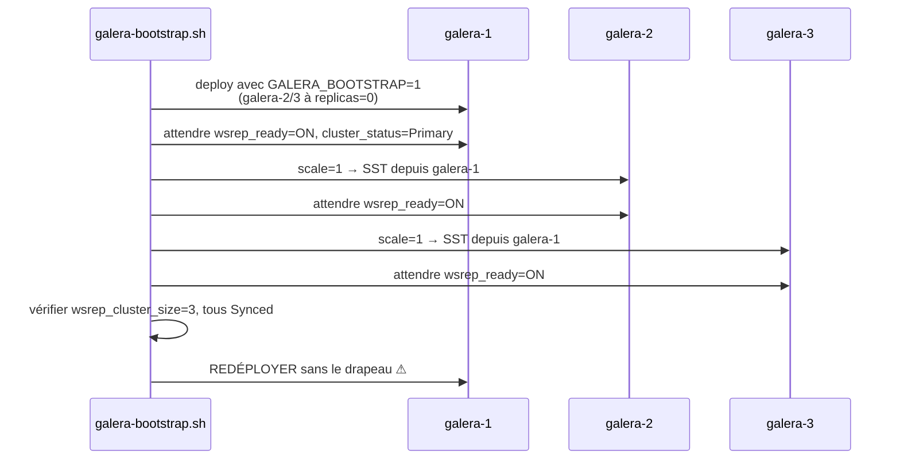

# MariaDB Galera + HAProxy — base SQL hautement disponible

> Composants de la stack `data`. Couvre `config/galera/{galera.cnf,init.sql,entrypoint.sh}`,
> `config/haproxy/haproxy.cfg`, les services `galera-1/2/3` et `db-proxy`, et les scripts
> `galera-bootstrap.sh` / `galera-recover.sh`.
>
> Décision structurante : [ADR-0005 — MariaDB Galera + HAProxy writer unique](../adr/0005-mariadb-galera-haproxy.md).

## 1. Rôle dans la plateforme

Deux applications ont besoin d'une base MySQL/MariaDB :

| Consommateur | Base | Pourquoi c'est critique |
|---|---|---|
| **GLPI** (2 replicas) | `glpi` | tickets, inventaire, utilisateurs — le cœur métier de la plateforme |
| **Grafana** (2 replicas) | `grafana` | c'est **ce qui rend Grafana réellement HA** : sessions, dashboards et état d'alerte partagés entre les deux replicas. Avec SQLite local, chaque replica aurait son propre état et l'utilisateur serait déconnecté à chaque bascule |

L'exigence N2 du CDC impose **RPO = 0** : aucune perte de données validées à la perte d'un nœud.
C'est ce qui écarte la réplication asynchrone et impose Galera.

## 2. Pourquoi Galera plutôt qu'un primaire/réplica

| Solution | RPO | Bascule | Verdict |
|---|---|---|---|
| Primaire + réplica **asynchrone** | > 0 — les transactions non répliquées sont perdues | manuelle ou via Orchestrator | ✗ viole N2 |
| Primaire + réplica **semi-synchrone** | ~0 mais dégradé en cas de timeout | complexe | ✗ garantie conditionnelle |
| **Galera** (synchrone, certification) | **0** | automatique, quorum 2/3 | ✓ retenu |
| PostgreSQL + Patroni | 0 | automatique | ✗ GLPI exige MySQL/MariaDB |

Galera certifie chaque transaction auprès de **tous** les nœuds avant d'acquitter le client :
une écriture validée existe sur trois machines. Le quorum est de 2 sur 3 — le cluster survit à la
perte d'un nœud et **refuse les écritures** s'il en perd deux, ce qui est le comportement
correct : accepter des écritures sans quorum couperait les données en deux.

## 3. Le point central : HAProxy impose un writer unique

Galera est multi-maître : les trois nœuds *accepteraient* les écritures. C'est précisément le
piège.

Deux transactions concurrentes modifiant les mêmes lignes depuis deux nœuds différents échouent la
**certification** : la seconde est annulée avec une erreur de deadlock
(`WSREP: conflict state ...`). GLPI ne réessaie pas — l'utilisateur voit un enregistrement échouer
au hasard, de façon irreproductible.

D'où **HAProxy en writer unique** :

```
                    ┌──────────────┐
   GLPI ×2   ───►   │  db-proxy    │  ──►  galera-1   (actif)
   Grafana ×2 ───►  │  (2 replicas)│  ┈┈►  galera-2   (backup)
                    └──────────────┘  ┈┈►  galera-3   (backup)
```

- `galera-1` est le seul serveur **actif** ; `galera-2` et `galera-3` portent le mot-clé `backup`.
- HAProxy n'utilise un serveur `backup` que si **tous** les serveurs non-backup sont tombés, et
  les prend **dans l'ordre de déclaration**. Le writer après une panne est donc **déterministe**
  et **identique sur les deux replicas** de db-proxy — deux replicas qui éliraient des writers
  différents recréeraient exactement les conflits que ce montage supprime.
- `option allbackups` est **volontairement absent** : il répartirait la charge entre galera-2 et
  galera-3 après la chute de galera-1, c'est-à-dire du multi-maître à nouveau.

On ne perd rien en disponibilité : la bascule est automatique et mesurée en dessous de 5 s
(`inter 2s`, `fall 2`).

## 4. `config/galera/galera.cnf` — section par section

### 4.1 Les quatre réglages non négociables

| Réglage | Valeur | Conséquence si absent |
|---|---|---|
| `binlog_format` | `ROW` | Galera réplique des images de lignes. En `STATEMENT`, `NOW()`, `UUID()` ou un auto-increment seraient rejoués différemment sur chaque nœud |
| `default_storage_engine` | `InnoDB` | seul InnoDB est transactionnel, donc réplicable. Une table MyISAM n'existerait que sur un nœud |
| `innodb_autoinc_lock_mode` | `2` (interleaved) | modes 0 et 1 prennent un verrou de table pour l'auto-increment, que Galera ne sait pas certifier |
| `innodb_doublewrite` | `1` | c'est ce qui rend une page déchirée récupérable après une perte brutale de nœud — exactement le scénario de `make chaos` |

### 4.2 Identité et transfert d'état

```ini
wsrep_cluster_address = gcomm://galera-1,galera-2,galera-3
wsrep_node_name       = ${WSREP_NODE_NAME}
wsrep_sst_method      = mariabackup
```

Les membres sont désignés par leur **nom de service Swarm**, pas par une IP : le DNS interne de
Swarm résout chaque nom vers l'IP virtuelle du service, stable à travers les replanifications.

`mariabackup` comme méthode de SST est un choix de disponibilité :

| Méthode | Effet sur le donneur |
|---|---|
| `rsync` | **bloque** le donneur pendant toute la copie (des minutes en lecture seule) |
| `mysqldump` | logique, bien plus lent, bloquant aussi |
| **`mariabackup`** | transfert **physique non bloquant** — le donneur continue de servir GLPI |

`gcache.size=512M` privilégie l'**IST** (incrémental) sur le SST (complet) : un nœud absent
quelques minutes — redémarrage, replanification, le cas courant — rattrape en secondes au lieu de
minutes.

### 4.3 Le choix qui surprend : `innodb_flush_log_at_trx_commit = 0`

```ini
innodb_flush_log_at_trx_commit = 0
sync_binlog                    = 0
```

Sur un serveur isolé, ce serait une faute : un crash perdrait jusqu'à une seconde de
transactions. **Ici, c'est le contraire.**

La durabilité vient de la **réplication synchrone**, pas du disque local : une transaction validée
existe sur trois machines avant que le client soit acquitté. Ajouter un `fsync` par commit
diviserait le débit par deux pour une garantie que le cluster fournit déjà.

Le compromis est **explicitement inversé en mode mono-nœud** : `entrypoint.sh` détecte
`GALERA_SINGLE_NODE=1` (`make single`) et remet les deux réglages à `1`, parce qu'à un seul membre
la réplication ne protège plus rien.

### 4.4 `wsrep_sync_wait = 1`

Lectures causales : un `SELECT` émis juste après un `INSERT` voit cet `INSERT`, même si les deux
atterrissent sur des nœuds différents. Coûte un peu de latence, supprime toute une classe de bugs
« je viens d'enregistrer et ce n'est pas là ». HAProxy route déjà tout vers un seul nœud, donc
cela ne joue vraiment que pendant une bascule — le moment où le bug apparaîtrait.

### 4.5 Divers

| Réglage | Raison |
|---|---|
| `character_set_server = utf8mb4` | et **pas** `utf8`, qui est un sous-ensemble 3 octets tronquant les emoji et certains caractères accentués des titres de tickets |
| `skip_name_resolve = ON` | pas de résolution inverse à la connexion : latence en moins, et les droits ne dépendent plus du DNS. C'est pourquoi les comptes sont créés sur `'%'` |
| `innodb_flush_method = O_DIRECT` | évite le double cache (buffer pool + page cache), ce qui compte sur un nœud de 6 Go partagé avec Cassandra et Elasticsearch |
| `long_query_time = 2` | aligné sur le seuil de l'alerte `GLPISlow` : une page lente et une requête lente deviennent corrélables |

## 5. `config/galera/entrypoint.sh` — le wrapper

MariaDB **n'expanse pas** les variables d'environnement dans un fichier `.cnf`, et l'image
officielle exécute `/docker-entrypoint-initdb.d/*.sql` tel quel. Le wrapper comble ces deux
manques, en gardant tous les identifiants dans des secrets Docker.

Ce qu'il fait, dans l'ordre :

1. **lit les secrets** (`*_FILE`). Une valeur absente **ou vide** est fatale : sans ce garde-fou,
   un secret mal monté produirait `IDENTIFIED BY ''`, c'est-à-dire un compte **sans mot de passe**
   accessible à tout conteneur du réseau `data` ;
2. **rend `galera.cnf`** avec le nom et l'adresse du nœud, et le mot de passe SST ;
3. **rend `init.sql`** avec les mots de passe applicatifs (galera-1 uniquement) ;
4. applique le profil mono-nœud si demandé ;
5. ajoute `--wsrep-new-cluster` si `GALERA_BOOTSTRAP=1` ;
6. **`exec`** vers l'entrypoint de l'image.

Trois détails d'implémentation méritent d'être signalés, parce qu'ils corrigent des pièges réels
et non théoriques :

| Piège | Correction |
|---|---|
| `sed` traite `/`, `&` et `\` comme des métacaractères de remplacement : un mot de passe en contenant serait silencieusement altéré | substitution en `awk` avec `index`/`substr`, qui traite la valeur comme du texte opaque |
| `awk -v val=…` interprète **aussi** les échappements : un mot de passe contenant `\a` arriverait comme une sonnerie | la valeur passe par l'environnement et est lue avec `ENVIRON[]`, qui n'échappe rien |
| `die` appelé dans un `$( )` ne tue que le sous-shell : le script continuerait avec une valeur vide | chaque secret est lu dans une **variable** d'abord ; `set -e` propage alors l'échec |

Le rendu échoue aussi bruyamment si un `${PLACEHOLDER}` subsiste, plutôt que de créer un compte
dont le mot de passe serait cette chaîne littérale.

Enfin, `exec` n'est pas cosmétique : sans lui le wrapper resterait PID 1, absorberait le SIGTERM
de Swarm, et chaque mise à jour finirait en SIGKILL après le délai de grâce — donc en **SST
complet** au redémarrage suivant.

## 6. `config/galera/init.sql` — comptes et droits

Exécuté **une seule fois**, sur galera-1, au tout premier démarrage ; Galera propage le résultat
aux deux autres par leur SST initial.

| Compte | Droits | Justification |
|---|---|---|
| `glpi` | `ALL` sur `glpi.*` | GLPI crée et modifie ses propres tables à l'installation et aux montées de version |
| `grafana` | `ALL` sur `grafana.*` | idem, migrations de schéma au démarrage |
| `haproxy` | **aucun** (`USAGE`), **sans mot de passe** | voir ci-dessous |
| `exporter` | `PROCESS`, `REPLICATION CLIENT`, `SLAVE MONITOR`, `SELECT` sur `performance_schema` | lit des compteurs, jamais des données. Limité à 5 connexions : une tempête de scrape ne doit pas épuiser `max_connections` et verrouiller GLPI hors de sa base |
| `backup` | lecture + `LOCK TABLES`, `RELOAD`, `SHOW VIEW`, `EVENT`, `TRIGGER` | strictement ce qu'exige `mariadb-dump --single-transaction --routines --events --all-databases`. **Aucun droit d'écriture** : un job de sauvegarde compromis ne doit pas pouvoir altérer la production |
| `sst` | droits mariabackup, sur `'localhost'` uniquement | mariabackup s'exécute toujours sur le donneur lui-même : ce compte n'a jamais besoin d'être joignable par le réseau |

### Le compte `haproxy` sans mot de passe

C'est délibéré et documenté par HAProxy. `option mysql-check user haproxy` ouvre une connexion,
termine la poignée de main et se déconnecte — il n'exécute **aucune requête**.

- `USAGE` ne donne accès à **rien** : ce compte ne peut pas lire une seule ligne.
- Le contrôle de santé ne doit pas dépendre d'un secret. Sinon, la rotation de ce secret casserait
  silencieusement la détection de bascule de **toute la couche SQL** — une panne qui ne se
  manifesterait qu'au pire moment.

Le fichier se termine par le nettoyage des défauts MySQL historiques : compte anonyme, base
`test`, et `root` confiné à `localhost` (l'administration passe par `docker exec`).

## 7. `config/haproxy/haproxy.cfg`

| Section | Réglage | Raison |
|---|---|---|
| `global` | `log stdout format raw` | collecté comme n'importe quel log de conteneur ; un socket syslog imposerait un bind mount pour rien |
| | `maxconn 2000` | HAProxy refuse au-delà, au lieu de laisser une tempête de connexions atteindre la base |
| `defaults` | `mode tcp` | le protocole MySQL est binaire et à état ; HAProxy transmet des octets |
| | `timeout client/server 600s` | **volontairement long** : GLPI exécute quelques requêtes de maintenance lentes et un `mariadb-dump` complet dure des minutes. Un timeout court couperait la sauvegarde nocturne en deux, silencieusement |
| | `timeout connect 5s` | le réseau est un overlay local ; plus court détecte un nœud mort plus vite |
| `listen mariadb` | `option mysql-check user haproxy` | poignée de main MySQL réelle. Un simple `check` TCP acheminerait le trafic vers un nœud en cours de SST, qui accepte la connexion et refuse l'authentification |
| | `rise 3` | trois succès avant réintégration : un nœud qui sort d'un SST a besoin d'un instant |
| | `fall 2` | deux échecs pour l'évincer : rapide, parce qu'un writer en panne bloque l'application |
| | `on-marked-down shutdown-sessions` | **essentiel** : tue les sessions encore accrochées au nœud mort au lieu de les laisser pendre jusqu'à `timeout server`. Sans cela, la perte d'un nœud figerait GLPI pendant dix minutes |
| `frontend stats` | `prometheus-exporter` natif | intégré à HAProxy depuis la 2.0 : pas d'exporter tiers à déployer et à maintenir |
| | pas d'authentification | le réseau `monitoring` est `internal` et aucun port n'est publié ; un mot de passe ici n'ajouterait qu'un secret à faire tourner |

## 8. Bootstrap — `scripts/galera-bootstrap.sh`

Un cluster Galera **ne se forme pas spontanément**. Chaque membre a les trois autres dans son
`wsrep_cluster_address` : au démarrage à froid, les trois essaient de *rejoindre* un cluster qui
n'existe pas, et attendent indéfiniment.

Exactement un nœud doit être démarré avec `--wsrep-new-cluster`. Ce drapeau est dangereux :
appliqué à deux nœuds en même temps, il crée **deux clusters indépendants** qui se croient tous
deux légitimes — un split-brain qu'aucune réparation ultérieure ne résout proprement.



**L'étape 5 est celle qu'on oublie.** Sans elle, `galera-1` conserve `--wsrep-new-cluster` dans sa
définition de service pour toujours : à la prochaine replanification — redémarrage de nœud, mise à
jour progressive — il démarrerait silencieusement un **cluster vide tout neuf** pendant que les
deux autres portent les vraies données.

Les membres 2 et 3 rejoignent **séquentiellement**, pas en parallèle : deux SST simultanés depuis
le même donneur se disputeraient son disque et son réseau et prendraient bien plus longtemps.

Le script est idempotent : si le cluster est déjà formé, il le dit et sort en 0. S'il trouve un
cluster **partiel**, il refuse — ce n'est pas son rôle.

## 9. Reprise — `scripts/galera-recover.sh`

### Quand l'utiliser, et surtout quand ne pas

**À utiliser** quand les trois membres sont tombés en même temps : coupure d'alimentation, fenêtre
de maintenance ratée, `docker stack rm data` malencontreux.

**À ne pas utiliser** tant qu'un composant Primary survit (un ou deux membres vivants). Redémarrer
simplement le membre manquant le fait rejoindre par IST ou SST ; lancer ce script à la place
forkerait un nouveau cluster depuis des données périmées et perdrait tout ce qui a été écrit
depuis. **Le script le vérifie et refuse.**

### Pourquoi ce n'est pas « les redémarrer tous »

À l'arrêt propre, Galera écrit `safe_to_bootstrap: 1` dans le `grastate.dat` du **dernier** nœud
arrêté — celui qui détient nécessairement toutes les transactions. Après un crash, personne n'a le
drapeau et tous ont `safe_to_bootstrap: 0`.

Démarrer le mauvais nœud en premier **perd silencieusement** toutes les transactions que les
autres avaient et pas lui. Le bon membre est celui dont le `seqno` est le **plus élevé**, et c'est
ce que le script automatise :

1. il refuse si un conteneur Galera tourne encore ;
2. il lit `grastate.dat` de chaque membre via un conteneur jetable épinglé sur le bon nœud
   (le volume est local, il faut y aller) ;
3. il choisit : `safe_to_bootstrap: 1` d'abord, sinon le `seqno` maximal ;
4. si aucun n'est exploitable (`seqno: -1` partout, les trois ont crashé), il **s'arrête** et
   donne la commande `mariadbd --wsrep-recover` à lancer sur chaque nœud, puis `--force <membre>` ;
5. il pose `safe_to_bootstrap: 1` sur le membre retenu, le démarre seul avec le drapeau, rejoint
   les deux autres, **puis retire le drapeau**.

`--dry-run` fait le diagnostic sans rien changer : c'est ce qu'on lance en premier, en incident.

## 10. Supervision

| Élément | Détail |
|---|---|
| Exporter | `prom/mysqld-exporter` en multi-cible (`/probe?target=galera-N:3306`), plus l'exporter Prometheus natif de HAProxy sur `:8404` |
| Métriques clés | `mysql_global_status_wsrep_cluster_size`, `wsrep_local_state` (4 = Synced), `wsrep_flow_control_paused`, `wsrep_local_recv_queue`, `mysql_global_status_threads_connected`, `haproxy_server_status` |
| Alertes | `GaleraClusterSizeLt3` (< 3 pendant 2 min, warning ; critical si < 2), `GaleraNotSynced` (`wsrep_local_state != 4`, critical), `MariaDBDown` (critical) |
| Dashboard | « MariaDB Galera » : taille du cluster, état local, flow control, QPS, connexions, InnoDB |

`wsrep_flow_control_paused` mérite une mention : c'est la fraction de temps pendant laquelle le
cluster a **freiné les écritures** parce qu'un nœud n'arrivait pas à suivre. C'est le signal
avancé d'un nœud en difficulté, bien avant qu'il ne tombe.

## 11. Sauvegarde et restauration

| Élément | Sauvegardé | Méthode |
|---|---|---|
| Données (`glpi`, `grafana`) | **oui** | `backup-galera`, 02:00, `mariadb-dump --single-transaction` → gzip → `restic backup --stdin` |
| Volumes `galera_data_N` | **non** | justifié : Galera reconstruit un membre par SST. Sauvegarder un répertoire de données InnoDB vivant produirait une archive incohérente et non restaurable |

`--single-transaction` prend un instantané cohérent sans verrouiller les tables InnoDB : la
sauvegarde n'interrompt pas GLPI.

Restauration : `scripts/restore/restore-galera.sh`, avec l'option `--fresh` pour re-bootstrapper
un cluster vide avant l'import (scénario de perte totale).

## 12. Points d'attention

| Point | Détail |
|---|---|
| `--wsrep-new-cluster` sur deux membres | split-brain irréversible. C'est la raison d'être des deux scripts dédiés |
| Arrêt brutal | `stop_grace_period: 60s`. Un nœud tué plutôt qu'arrêté laisse un `grastate.dat` sale et impose un SST complet au redémarrage |
| `order: stop-first` | obligatoire sur un membre stateful : deux instances ne doivent jamais tenir le même répertoire de données |
| Quorum | à 2 nœuds perdus, le cluster refuse les écritures. C'est **correct** — la procédure est dans `docs/07-PRA.md` |
| Écriture multi-maître | ne jamais contourner `db-proxy` pour écrire directement sur galera-2 ou galera-3 |
| `haproxy` sans mot de passe | ne pas « corriger » : c'est un choix documenté (§6) |
| Mode mono-nœud | `make single` remet `innodb_flush_log_at_trx_commit=1` : ne pas le retirer, la réplication ne protège plus rien |
