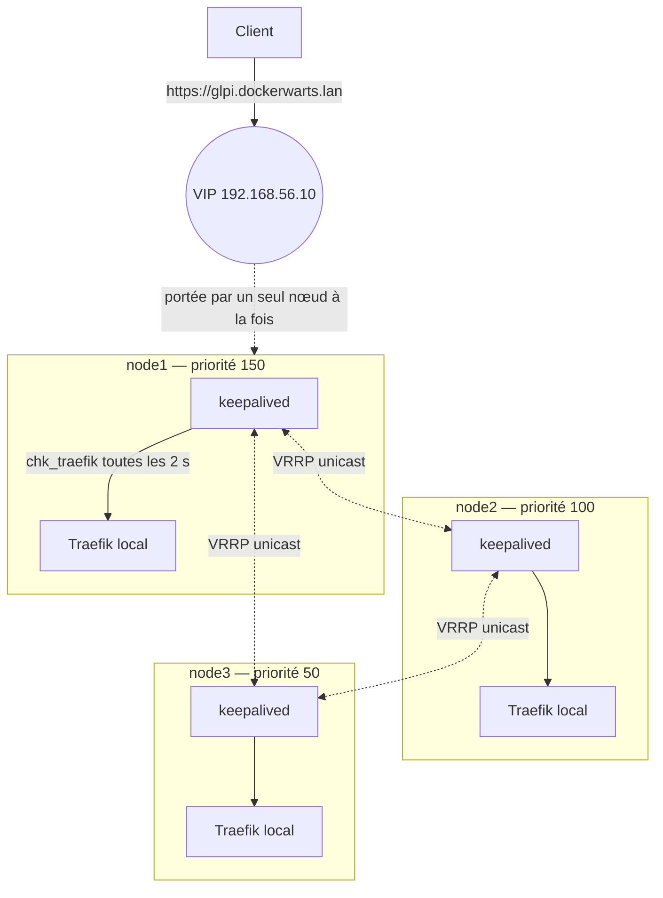

# Keepalived — VIP flottante et point d'entrée unique

> Composant **hôte** (non dockerisé). Couvre le rôle Ansible `keepalived`,
> `ansible/roles/keepalived/templates/keepalived.conf.j2` et le script `chk_traefik`.
>
> Décision structurante : [ADR-0003 — Traefik global en mode host + Keepalived sur l'hôte](../adr/0003-traefik-host-mode-keepalived.md).

## 1. Rôle dans la plateforme

Traefik tourne sur les trois nœuds, mais un utilisateur ne connaît **qu'une** adresse. Keepalived
fournit cette adresse : une **IP virtuelle (VIP)** `192.168.56.10`, portée à tout instant par
exactement un nœud, et déplacée automatiquement en moins de 5 secondes quand ce nœud tombe ou
quand son Traefik cesse de répondre.

C'est le composant qui satisfait l'exigence N1 du CDC : *RTO < 5 s pour le point d'entrée*.



## 2. Pourquoi sur l'hôte et pas dans un conteneur

Le CDC aurait pu conteneuriser Keepalived (`network_mode: host`, `cap_add: NET_ADMIN`). L'ADR-0003
l'écarte pour deux raisons :

1. **Circularité.** Keepalived surveille Traefik, qui tourne dans Docker. Mettre Keepalived dans
   Docker ferait dépendre le mécanisme de bascule du composant qu'il doit justement surveiller :
   un démon Docker en difficulté emporterait à la fois Traefik *et* le mécanisme censé le
   contourner.
2. **Privilèges.** Un conteneur `NET_ADMIN` en `network_mode: host` manipule les interfaces de
   l'hôte : c'est un conteneur privilégié de fait, ce qui contredit le durcissement du CDC §6.4.

Keepalived rejoint donc le pare-feu et le serveur NFS dans la catégorie assumée des **fonctions
d'hôte**.

## 3. `keepalived.conf` — section par section

### 3.1 `global_defs`

```
router_id {{ inventory_hostname }}
enable_script_security
script_user root
vrrp_version 3
```

- `router_id` : le nom du nœud, ce qui rend `journalctl -u keepalived` lisible.
- `enable_script_security` : Keepalived 2.x **refuse** d'exécuter un script situé dans un
  répertoire inscriptible par un autre utilisateur. Le script est en `/usr/local/sbin` (`0755`,
  propriétaire root), ce qui satisfait la contrainte. Sans cette combinaison, le check est
  silencieusement ignoré et la bascule ne se produit jamais — panne classique et difficile à voir.
- `vrrp_version 3` : VRRPv3, plus récent et compatible IPv6 le jour venu.

### 3.2 `vrrp_script chk_traefik` — le cœur du dispositif

```
script  "/usr/local/sbin/chk_traefik"
interval 2
timeout  1
fall     2
rise     2
weight   -60
```

Le script est minimal :

```bash
exec curl --silent --fail --max-time 1 --output /dev/null http://127.0.0.1/ping
```

| Paramètre | Valeur | Explication |
|---|---|---|
| `interval` | 2 s | fréquence du contrôle |
| `timeout` | 1 s | plus court que l'intervalle : un contrôle ne peut jamais chevaucher le suivant |
| `fall` | 2 | deux échecs consécutifs (≈ 4 s) avant de considérer Traefik en panne — évite de céder la VIP sur un hoquet |
| `rise` | 2 | deux succès avant de le considérer rétabli |
| `weight` | **−60** | pénalité de priorité tant que le script échoue |

**Pourquoi précisément −60.** Les priorités sont 150 / 100 / 50, espacées de 50. Pour que la
bascule fonctionne, la pénalité doit être :

- **strictement supérieure à 50**, sinon node1 pénalisé (150 − 50 = 100) est *à égalité* avec
  node2 et garde la VIP : un nœud sans Traefik continuerait à absorber tout le trafic ;
- **strictement inférieure à 100**, sinon node1 pénalisé tomberait sous node3 (150 − 100 = 50) et
  la VIP sauterait deux crans, ce qui est inutilement brutal.

−60 satisfait les deux : node1 pénalisé passe à 90 (< 100, node2 prend), node2 pénalisé passe à 40
(< 50, node3 prend). Toute modification des priorités impose de recalculer ce poids.

**Pourquoi `/ping` et pas `docker ps`.** Le contrôle doit répondre à la seule question qui compte
pour un utilisateur : *ce nœud peut-il servir une requête HTTP ?* Un Traefik dont le conteneur
tourne mais dont le routage est cassé passerait un `docker ps` et échouerait `/ping`. Le contrôle
teste le service, pas son enveloppe.

### 3.3 `vrrp_instance VI_1`

| Directive | Valeur | Raison |
|---|---|---|
| `state` | `MASTER` sur node1, `BACKUP` ailleurs | état initial ; VRRP renégocie de toute façon dès le premier advertisement |
| `interface` | `enp0s8` (`dw_cluster_interface`) | la carte host-only VirtualBox. **À changer sur du cloud** |
| `virtual_router_id` | `51` | identifie le groupe VRRP ; doit être identique sur les trois nœuds et unique sur le segment |
| `priority` | 150 / 100 / 50 | voir §3.2 |
| `advert_int` | `1` s | un nœud disparu est détecté après 3 advertisements manqués, soit ~3 s |
| `preempt_delay` | `5` s | node1 reprend la VIP quand il redevient sain, après 5 s de stabilité (pas de `nopreempt` : le CDC §7.1 veut le retour au nœud prioritaire) |
| `authentication` | `PASS` + `dw_keepalived_password` | empêche un hôte du segment de s'annoncer comme membre du groupe |
| `unicast_src_ip` / `unicast_peer` | IP du cluster | **unicast et non multicast** — voir ci-dessous |
| `virtual_ipaddress` | `192.168.56.10/24 dev enp0s8` | la VIP |
| `track_script` | `chk_traefik` | lie le script à l'instance |
| `notify_*` | `logger -t keepalived` | trace chaque transition dans le journal |

**Unicast plutôt que multicast.** Le multicast VRRP (224.0.0.18) est capricieux sur les réseaux
host-only VirtualBox et **interdit sur la quasi-totalité des clouds**. L'unicast fonctionne
partout et rend la configuration explicite : chaque nœud sait qui sont ses pairs. La règle
pare-feu multicast reste ouverte pour permettre un retour au multicast sans re-provisionner.

**Les `notify_*` ne sont pas cosmétiques** : `tests/chaos/kill-node.sh` mesure la durée de bascule
en corrélant l'horodatage du `MASTER on nodeX` dans `journalctl` avec la reprise des réponses HTTP.
C'est la source des chiffres de `docs/06-haute-disponibilite.md`.

## 4. Prérequis système

| Prérequis | Fourni par | Pourquoi |
|---|---|---|
| `net.ipv4.ip_nonlocal_bind=1` | rôle `common` | permet de préparer un socket sur la VIP avant de la posséder |
| VRRP (proto 112) autorisé depuis `CLUSTER_CIDR` | rôle `firewall` | sans cette règle, `INPUT DROP` bloque les advertisements et **les trois nœuds se croient MASTER** (split-brain : trois hôtes avec la même IP) |
| Traefik écoutant sur `127.0.0.1:80` | `mode: host` (ADR-0003) | sans quoi `chk_traefik` échoue partout |

## 5. Ordre d'application

Le rôle `keepalived` est **le dernier** de `site.yml`. Son contrôle interroge Traefik, qui n'est
déployé qu'à `make deploy-edge`. Tant qu'aucun Traefik ne tourne, les trois nœuds échouent le
contrôle de façon identique, la pénalité s'applique partout, l'ordre relatif est préservé et
node1 (priorité la plus haute) garde la VIP. Le comportement est donc correct pendant toute la
fenêtre entre `make provision` et `make deploy-edge`.

## 6. Supervision

| Élément | Détail |
|---|---|
| Sonde | blackbox `icmp` sur la VIP, toutes les 15 s |
| Alerte | `VipUnreachable` — sonde ICMP en échec 30 s, **critical** |
| Dashboard | « Disponibilité & certificats » : joignabilité de la VIP, et « Vue d'ensemble » : quel nœud la porte |
| Journal | `journalctl -u keepalived` — transitions MASTER/BACKUP/FAULT, collectées par l'input `systemd` de Fluent Bit |

Keepalived n'a pas d'exporter Prometheus dédié. C'est un choix : la seule question qui compte est
*la VIP répond-elle ?*, et la sonde blackbox y répond mieux qu'une métrique interne — elle teste
le service de bout en bout, du point de vue de l'utilisateur.

## 7. Sauvegarde

**Aucune.** La configuration est générée par Ansible depuis `group_vars/all.yml` et l'inventaire.
La reprise est un `ansible-playbook site.yml --tags keepalived`.

## 8. Exploitation

### Voir qui porte la VIP

```bash
for n in node1 node2 node3; do
  vagrant ssh "$n" -c "ip -4 -brief addr show enp0s8 | grep -q 192.168.56.10 && echo '$n: VIP' || echo '$n: —'"
done
```

### Forcer la bascule (maintenance planifiée)

```bash
# Sur le nœud portant la VIP : arrêter le Traefik local suffit, chk_traefik
# échoue et la VIP part proprement en ~4 s.
vagrant ssh node1 -c 'sudo docker stop $(docker ps -q -f name=edge_traefik)'
# Retour :
vagrant ssh node1 -c 'sudo systemctl restart docker'
```

Ne **jamais** arrêter `keepalived` pour basculer : cela retire le nœud du groupe VRRP sans
prévenir les pairs et allonge la bascule au timeout d'advertisement.

### Diagnostic d'un split-brain (plusieurs nœuds MASTER)

```bash
# 1. Le pare-feu bloque-t-il VRRP ?
sudo iptables -S DW-INPUT | grep vrrp
# 2. Les pairs sont-ils correctement déclarés ?
sudo grep -A5 unicast_peer /etc/keepalived/keepalived.conf
# 3. Le mot de passe est-il identique partout ?
sudo grep auth_pass /etc/keepalived/keepalived.conf
```

Un `auth_pass` divergent est la cause la plus fréquente : les nœuds ignorent alors mutuellement
leurs advertisements et se croient tous seuls.

## 9. Points d'attention

| Point | Détail |
|---|---|
| `dw_cluster_interface` | `enp0s8` en VirtualBox. Sur du cloud, mettre l'interface portant l'IP privée, sinon Keepalived ne démarre pas du tout |
| `virtual_router_id` | doit être unique sur le segment L2. Deux plateformes Dockerwarts sur le même réseau avec `51` interféreraient |
| `dw_keepalived_password` | **pas** un secret Docker (annexe A du CDC) : il configure un service d'hôte. À surcharger via l'inventaire ou Ansible Vault |
| Poids `−60` | lié aux priorités 150/100/50. Changer les priorités impose de recalculer (§3.2) |
| VIP et NFS | la VIP ne déplace **pas** l'export NFS : c'est un SPOF distinct (ADR-0006) avec sa propre procédure |
