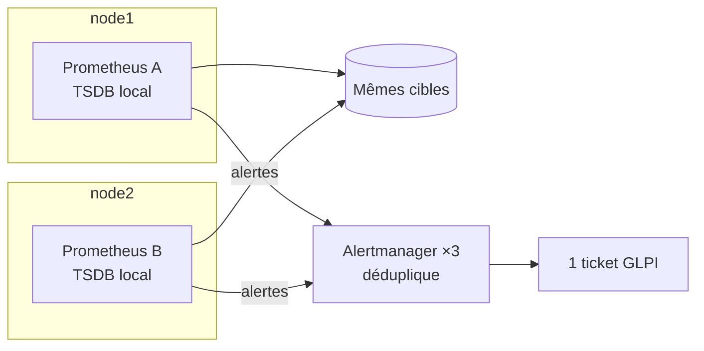

# Prometheus — collecte des métriques et évaluation des alertes

> Composant de la stack `monitoring`. Couvre `config/prometheus/prometheus.yml`,
> `config/prometheus/rules/*.yml`, `config/prometheus/tests/alerts_test.yml` et le service
> `prometheus`.

## 1. Rôle dans la plateforme

Prometheus collecte les métriques de **tout** (exigence F4 du CDC) et évalue les 48 règles
d'alerte. Il est la moitié « détection » de la boucle d'incident ; Alertmanager et alert2glpi en
sont la moitié « action ».

## 2. Le modèle HA : deux instances identiques



Deux tâches exécutent la **même configuration**, scrappent les **mêmes cibles**, chacune sur son
**volume local**. Pas de clustering, pas de stockage partagé.

| | |
|---|---|
| **Pourquoi ce modèle** | c'est le patron officiellement recommandé, et le plus simple qui survive à la perte d'un nœud. Aucune coordination ⇒ rien à réparer |
| **Les alertes en double ?** | Alertmanager les déduplique : il groupe sur les étiquettes de l'alerte, pas sur l'émetteur. L'opérateur voit une alerte, alert2glpi ouvre un ticket |
| **Le coût, énoncé** | les deux TSDB divergent légèrement (décalage de scrape) : un graphique peut différer d'un échantillon entre deux rafraîchissements. C'est accepté |
| **L'alternative écartée** | Thanos ou Cortex : tout un système distribué pour un laboratoire de 3 nœuds |

L'alerte `PrometheusReplicaMissing` existe précisément parce que la perte d'une instance est
**invisible pour l'utilisateur** : sans elle, personne ne s'en apercevrait avant que la seconde ne
tombe aussi.

Les deux replicas sont épinglés sur les nœuds portant `prometheus=a` et `prometheus=b` : leurs
données sont des volumes **locaux**, une replanification ailleurs repartirait d'une base vide.

## 3. `prometheus.yml` — section par section

### 3.1 `global`

| Réglage | Valeur | Raison |
|---|---|---|
| `scrape_interval` | 15 s | assez fin pour détecter une panne de 30 s dans les sondes blackbox, assez grossier pour que ~60 cibles coûtent peu sur trois petites VM |
| `scrape_timeout` | 10 s | **strictement inférieur** à l'intervalle, sinon une cible lente empilerait les scrapes |
| `external_labels.replica` | `${HOSTNAME}` | c'est ce qui permet à Alertmanager de distinguer les deux instances, et à un dashboard de les comparer |

### 3.2 `alerting` — le détail qui fait tout fonctionner

```yaml
dns_sd_configs:
  - names: ["tasks.alertmanager"]
    type: A
    port: 9093
```

`tasks.alertmanager` est le nom DNS Swarm qui renvoie les enregistrements A de **toutes** les
tâches du service. Les deux Prometheus envoient donc leurs alertes aux **trois** Alertmanager —
c'est ce qui permet à leur cluster gossip de dédupliquer et de survivre à la perte de l'un d'eux.

Utiliser le nom simple `alertmanager` résoudrait vers l'IP virtuelle du service et répartirait
vers **une seule** instance, ce qui anéantirait tout le dispositif.

### 3.3 La découverte Swarm — la convention qui évite d'éditer ce fichier

```yaml
relabel_configs:
  - source_labels: [__meta_dockerswarm_service_label_prometheus_job]
    regex: .+
    action: keep
```

Chaque service qui expose des métriques déclare trois labels :

```yaml
labels:
  prometheus.job: "traefik"
  prometheus.port: "8082"
  prometheus.path: "/metrics"    # optionnel
```

Un nouvel exporter n'exige donc **aucune** modification de `prometheus.yml` : poser les labels sur
son service suffit. C'est tout l'intérêt de la convention.

Quatre règles de relabeling méritent une explication :

| Règle | Ce qu'elle évite |
|---|---|
| `keep` sur `prometheus_job` | sans elle, Prometheus tenterait de scrapper **chaque conteneur** du cluster sur un port inventé |
| `keep` sur `desired_state == running` | une tâche en `shutdown` ou `rejected` n'écoute rien : elle produirait un `up == 0` permanent, et donc une alerte `PrometheusTargetMissing` qui ne s'éteindrait jamais |
| `instance` = nom de **tâche** | scrapper l'IP virtuelle du service atterrirait sur un replica au hasard à chaque fois, rendant tout graphique par instance dénué de sens |
| `node` = hostname Swarm | c'est l'étiquette sur laquelle la règle d'inhibition `NodeDown` fait sa jointure pour taire toutes les alertes d'un nœud mort |

Les jobs `node` et `cadvisor` sont **séparés** de `swarm-tasks` pour une raison précise : leurs
métriques décrivent l'**hôte**, pas le conteneur. Leur `instance` doit donc être le nœud, sinon
chaque redémarrage ressemblerait à une machine neuve et casserait tout l'historique.

### 3.4 Maîtrise de la cardinalité — cAdvisor

cAdvisor est de loin l'exporter le plus coûteux : des dizaines de séries par conteneur, beaucoup
par système de fichiers ou par interface réseau.

```yaml
metric_relabel_configs:
  - source_labels: [__name__]
    regex: "container_(cpu_usage_seconds_total|memory_usage_bytes|…)"
    action: keep
```

Ne garder que ce que les dashboards et les règles utilisent **divise le nombre de séries par
environ dix** sur ce cluster. Sur trois VM de 6 Go partagées avec Cassandra et Elasticsearch, ce
n'est pas un détail.

### 3.5 Blackbox — les seules mesures « vues de l'extérieur »

Tout le reste mesure la plateforme **de l'intérieur**. Les sondes blackbox passent par la VIP, en
TLS, exactement comme un navigateur. Ce sont les seules qui détecteraient :

- un routeur Traefik cassé (les conteneurs sont sains, l'URL renvoie 404) ;
- un certificat expiré (rien ne s'arrête, mais plus personne ne peut se connecter) ;
- une VIP qui n'a pas basculé (les trois nœuds vont bien, l'adresse ne répond pas).

GLPI a son propre module (`http_2xx_glpi`) qui exige `GLPI` dans le corps : une page de
maintenance et une page d'erreur Traefik répondent toutes deux 200.

## 4. Les 48 règles d'alerte

Réparties en trois fichiers par domaine : `infrastructure.yml` (24), `datastores.yml` (19),
`backup.yml` (5). Le tableau complet est dans [`docs/05-monitoring.md`](../05-monitoring.md).

### Conventions d'annotation

Chaque règle porte quatre annotations, consommées par alert2glpi pour construire le ticket :

| Annotation | Devient |
|---|---|
| `summary` | le titre du ticket |
| `description` | le corps, **avec les valeurs qui ont déclenché** l'alerte |
| `runbook` | un lien cliquable vers `docs/08-exploitation.md` |
| `dashboard` | un lien cliquable vers le dashboard Grafana concerné |

Un ticket ouvert à 3 h du matin doit être exploitable **sans** ouvrir le dépôt : d'où les liens.

### Trois seuils qui méritent une justification

| Alerte | Seuil | Pourquoi précisément celui-là |
|---|---|---|
| `ESClusterYellow` | **10 min** | `yellow` est l'état **normal et transitoire** pendant une replanification. Alerter à 1 min créerait un ticket à chaque mise à jour progressive |
| `BackupTooOld` | **26 h** | les jobs quotidiens tournent à heure fixe ; une fenêtre stricte de 24 h se déclencherait chaque jour dans les minutes précédant l'exécution suivante. Les deux heures de marge absorbent un démarrage tardif sans masquer une nuit réellement manquée |
| `CrowdSecLapiDown` | **warning**, pas critical | le bouncer Traefik est en mode `stream` avec un cache local : la protection **reste active**. En critical, cela créerait un ticket d'astreinte pour une situation n'appelant aucune action immédiate |

### Les règles de « supervision de la supervision »

Quatre règles surveillent la chaîne elle-même : `PrometheusReplicaMissing`,
`PrometheusConfigReloadFailed`, `AlertmanagerClusterDegraded`,
`AlertmanagerNotificationsFailing`.

La dernière est la plus importante du fichier : si les notifications échouent, **des alertes
existent mais personne n'est prévenu** — le pire mode de défaillance possible d'une pile de
supervision.

## 5. Les tests unitaires des règles — `promtool test rules`

`promtool check rules` prouve seulement qu'une règle **se parse**. Le mode d'échec classique
d'une pile d'alerting est une règle qui se parse, semble correcte, et **ne se déclenche jamais** :
une faute de frappe dans un sélecteur, une division qui donne `NaN`, un `for:` plus long que
l'incident. C'est silencieux, et cela se découvre pendant l'incident.

`config/prometheus/tests/alerts_test.yml` injecte des séries synthétiques dans les **vraies**
règles et vérifie **les deux sens** :

| Test | Ce qu'il prouve |
|---|---|
| `NodeDown` à 1 min 15 puis 2 min 30 | le `for: 1m` retient bien l'alerte, puis la laisse passer |
| Galera 3 → 2 → 1 | la frontière de quorum est exacte : warning à 2, **critical à 1** |
| `ESClusterYellow` à 8 min | **ne se déclenche PAS** — c'est tout l'intérêt du seuil de 10 min |
| `BackupTooOld` à 25 h | **ne se déclenche PAS** — la régression que le seuil de 24 h provoquerait |
| `TraefikHigh5xx` sans trafic | **ne se déclenche PAS** — le piège de la division par zéro qui donne `NaN` |
| `CertificateExpiringSoon` | l'arithmétique `(expiry - time()) / 86400` est correcte |

Le second sens compte autant que le premier : **une alerte qui se déclenche tout le temps finit
mise en sourdine par l'opérateur**, et ne protège alors plus rien.

Les 15 tests s'exécutent dans `make lint` et dans la CI.

## 6. Configuration Swarm

| Élément | Valeur | Raison |
|---|---|---|
| Utilisateur | `65534:65534` | non root, comme l'image le prévoit |
| `--storage.tsdb.retention` | 30 j **et** 10 Go | la première borne atteinte gagne. La taille seule laisserait un mois calme conserver un an ; la durée seule laisserait une semaine chargée remplir le disque |
| `--web.enable-admin-api` | activé | requis par le job `backup-prometheus`, qui prend un instantané TSDB |
| `--web.enable-lifecycle` | activé | permet `POST /-/reload` : un changement de configuration s'applique sans perdre l'état en mémoire |
| `order` | **`stop-first`** | TSDB local : jamais deux écrivains sur un même volume |
| Exposition | `admin-chain@file` | allowlist + **basic-auth** : Prometheus n'a **aucune** authentification propre et son interface expose toutes les métriques de la plateforme |

## 7. Sauvegarde

| Élément | Sauvegardé | Méthode |
|---|---|---|
| TSDB de l'instance A | **oui**, hebdomadaire | `POST /api/v1/admin/tsdb/snapshot` puis restic. Rétention 4 semaines |
| TSDB de l'instance B | non | c'est une copie de A : les deux scrappent les mêmes cibles |
| Configuration et règles | non | elles sont en git, ce qui est une meilleure sauvegarde |

Le RPO des métriques est de 7 jours (CDC §9.4) et c'est assumé : perdre une semaine
d'historique de métriques est gênant, jamais bloquant. La configuration, elle, a un RPO de 0
grâce à git.

## 8. Points d'attention

| Point | Détail |
|---|---|
| Épinglage des replicas | les volumes sont locaux. Retirer la contrainte `node.labels.prometheus != ""` ferait repartir une instance d'une base vide à la première replanification |
| `tasks.alertmanager` | ne jamais remplacer par `alertmanager` : les alertes n'iraient plus qu'à une seule instance |
| Cardinalité | tout nouvel exporter doit être vérifié : `count({__name__=~".+"})` avant et après |
| Divergence des deux TSDB | normale et documentée. Un écart d'un échantillon entre deux rafraîchissements n'est pas un bug |
| `${DOMAIN}` dans les règles | les annotations `dashboard` contiennent `${DOMAIN}` : les règles passent par le rendu (`scripts/lib/render.sh`) avant d'être montées |
