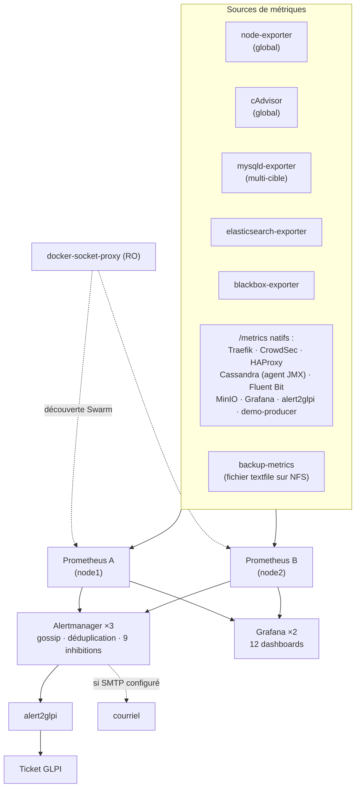
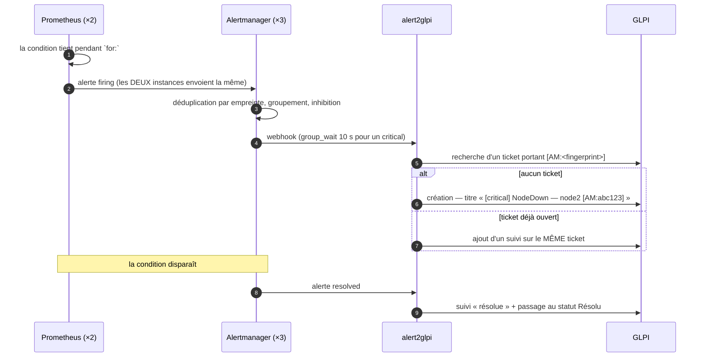

# Supervision

> **Objet** : ce qui est mesuré, comment on le regarde, ce qui déclenche une
> alerte, et comment une alerte devient un ticket GLPI.
> **Références** : CDC §7.6, §12 ; [ADR-0009](adr/0009-alert2glpi.md).
> Détail par composant : [`04-composants/prometheus.md`](04-composants/prometheus.md),
> [`alertmanager.md`](04-composants/alertmanager.md),
> [`grafana.md`](04-composants/grafana.md),
> [`alert2glpi.md`](04-composants/alert2glpi.md).

---

## 1. Architecture



**Deux Prometheus identiques qui ne se parlent pas.** C'est la forme de HA la
plus simple qui fonctionne : rien à synchroniser, rien qui puisse diverger,
aucune élection à déboguer un dimanche. Le prix est la duplication du stockage ;
le gain est qu'une instance perdue ne coûte **rien**. La déduplication des
notifications est faite en aval par le cluster Alertmanager, dont c'est
précisément le métier.

**La découverte est une convention, pas une liste.** Un service devient une
cible en portant trois labels — `prometheus.job`, `prometheus.port`, et
éventuellement `prometheus.path`. Il n'y a aucune liste de cibles à maintenir :
ajouter un service supervisé, c'est ajouter trois lignes à sa définition. Le
détail du *relabeling* est dans
[`04-composants/prometheus.md`](04-composants/prometheus.md#3-prometheusyml--section-par-section).

## 2. Ce qui est mesuré

| Domaine | Source | Métriques clés |
|---|---|---|
| Hôtes | node-exporter | CPU, mémoire, disque par point de montage, charge, dérive d'horloge |
| Conteneurs | cAdvisor | CPU, mémoire *working set* vs limite, redémarrages, E/S |
| Démon Docker | `metrics-addr` | état du démon, opérations |
| Point d'entrée | Traefik | requêtes par routeur et par code, latences, TLS |
| Sécurité | CrowdSec | décisions actives, alertes par scénario |
| MariaDB | mysqld-exporter | `wsrep_cluster_size`, `wsrep_local_state`, *flow control*, connexions |
| Writer SQL | HAProxy | état des serveurs, sessions, bascules |
| Cassandra | agent JMX **embarqué** | latences lecture/écriture, compactions en attente, hints, indisponibilités |
| Elasticsearch | elasticsearch-exporter | santé du cluster, shards, *heap* JVM, ILM, SLM |
| Logs | Fluent Bit | enregistrements entrés/sortis, erreurs, retard |
| Disponibilité externe | blackbox-exporter | code HTTP, contenu attendu, **expiration du certificat**, ICMP, TCP |
| Sauvegardes | `backup-metrics` (textfile) | âge, état, durée, taille par job |
| Datalake | demo-producer | débit, **erreurs d'écriture**, latences |
| La supervision elle-même | Prometheus, Alertmanager | cibles manquantes, rechargement de config, notifications en échec, membres du cluster |

Cassandra n'a **pas** d'exporter séparé : l'agent JMX Prometheus est embarqué
dans l'image maison (`images/cassandra/`). Un exporter externe aurait exigé
d'ouvrir JMX sur le réseau pour chaque nœud — trois services de plus et une
surface d'attaque nouvelle.

La supervision se surveille elle-même. `PrometheusTargetMissing`,
`PrometheusConfigReloadFailed` et `AlertmanagerNotificationsFailing` existent
parce que le pire mode de panne d'un système de supervision est **le silence** :
tout paraît calme, et rien ne mesure plus rien.

## 3. Les 12 tableaux de bord

Générés par `scripts/lib/gen-dashboards.py`, pas écrits à la main. Le générateur
garantit des UID stables (cités par les annotations `dashboard:` des alertes,
donc par les tickets GLPI), une grille sans chevauchement, et des sources de
données qui existent réellement.

**Vérifié : 12 tableaux, 155 panneaux, 51 sections, 0 chevauchement, 0 UID
orphelin**, par `scripts/lib/check-grafana.py` — avec deux tests négatifs
prouvant que le vérificateur attrape une régression.

| # | Tableau | UID | Ce qu'il répond |
|---|---|---|---|
| 01 | Vue d'ensemble | `dw-overview` | « est-ce que tout va bien ? » — une ligne par service, l'âge de la dernière sauvegarde, les alertes actives |
| 02 | Nœuds | `dw-nodes` | CPU, mémoire, disque et réseau des trois nœuds |
| 03 | Conteneurs | `dw-containers` | quel conteneur consomme quoi, et à quelle distance de sa limite |
| 04 | Traefik | `dw-traefik` | trafic par routeur, codes de retour, latences p50/p95/p99 |
| 05 | Sécurité | `dw-security` | décisions CrowdSec, scénarios déclenchés, expiration des certificats |
| 06 | Elasticsearch | `dw-elasticsearch` | santé, shards, *heap*, indexation, état ILM/SLM |
| 07 | Cassandra | `dw-cassandra` | latences, compactions en attente, hints, indisponibilités |
| 08 | Galera | `dw-galera` | taille du cluster, état local, *flow control*, certification |
| 09 | Disponibilité | `dw-availability` | sondes blackbox par URL, disponibilité mesurée de l'extérieur |
| 10 | Sauvegardes | `dw-backup` | âge, durée, taille et état de chaque job |
| 11 | Logs | `dw-logs` | volumétrie, taux d'erreur, répartition par source |
| 12 | Datalake | `dw-datalake` | débit, **erreurs `demo-producer`**, latences d'écriture |

> 🖥️ **Captures d'écran.** Le CDC §12 demande une capture de chaque tableau de
> bord. Elles n'ont pas pu être produites dans la session de développement : la
> politique d'egress y interdit le téléchargement des blobs d'images, donc aucun
> conteneur ne démarre (voir [`PROGRESS.md`](PROGRESS.md)). À produire sur les VM,
> dans `docs/images/` :
>
> ```bash
> make deploy-demo          # sans charge, la moitié des panneaux est vide
> # puis, dans le navigateur, pour chaque UID de la table ci-dessus :
> #   https://grafana.dockerwarts.lan/d/<uid>   → capture → docs/images/<uid>.png
> ```
>
> Ce qui est vérifiable sans capture l'a été : que chaque panneau a une cible,
> que chaque source de données référencée est provisionnée, et que le JSON
> correspond au générateur.

## 4. Les 48 règles d'alerte

Trois fichiers, dix groupes. `for:` est la durée pendant laquelle la condition
doit tenir avant que l'alerte ne se déclenche — c'est ce qui distingue un
incident d'un soubresaut, et c'est pourquoi aucune valeur n'y est à zéro.

#### Hôtes (`nodes`)

| Alerte | Condition | `for` | Sévérité | Action attendue |
|---|---|---|---|---|
| `NodeDown` | `up{job="node"} == 0` | 1m | 🔴 critical | Nœud {{ $labels.node }} injoignable |
| `NodeDiskFillingUp` | `( node_filesystem_avail_bytes{job="node",fstype!~"tmpfs\|overlay\|squashfs\|ra…` | 10m | 🟠 warning | Espace disque faible sur {{ $labels.node }} ({{ $labels.mountpoint }}) |
| `NodeDiskFull` | `( node_filesystem_avail_bytes{job="node",fstype!~"tmpfs\|overlay\|squashfs\|ra…` | 5m | 🔴 critical | Disque presque plein sur {{ $labels.node }} ({{ $labels.mountpoint }}) |
| `NodeMemoryPressure` | `( node_memory_MemAvailable_bytes{job="node"} / node_memory_MemTotal_bytes{j…` | 5m | 🟠 warning | Mémoire disponible faible sur {{ $labels.node }} |
| `NodeHighLoad` | `node_load5{job="node"} > 2 * count by (node, instance, job) (node_cpu_secon…` | 10m | 🟠 warning | Charge élevée sur {{ $labels.node }} |
| `NodeClockSkew` | `abs(node_timex_offset_seconds{job="node"}) > 0.5` | 10m | 🟠 warning | Dérive d'horloge sur {{ $labels.node }} |

#### Swarm et conteneurs (`swarm`)

| Alerte | Condition | `for` | Sévérité | Action attendue |
|---|---|---|---|---|
| `SwarmServiceReplicasMismatch` | `( count by (container_label_com_docker_swarm_service_name) ( container_last…` | 2m | 🟠 warning | Service {{ $labels.container_label_com_docker_swarm_service_name }} sans tâche |
| `ContainerRestarting` | `changes(container_start_time_seconds{container_label_com_docker_swarm_servi…` | 5m | 🟠 warning | Conteneur en redémarrage: {{ $labels.container_label_com_docker_swarm_service_name }} |
| `ContainerMemoryNearLimit` | `( container_memory_working_set_bytes{container_label_com_docker_swarm_servi…` | 10m | 🟠 warning | {{ $labels.container_label_com_docker_swarm_service_name }} proche de sa limite mémoire |

#### Point d'entrée (`edge`)

| Alerte | Condition | `for` | Sévérité | Action attendue |
|---|---|---|---|---|
| `VipUnreachable` | `probe_success{job="blackbox-icmp"} == 0` | 30s | 🔴 critical | VIP {{ $labels.instance }} injoignable |
| `TraefikDown` | `up{job="traefik"} == 0` | 1m | 🔴 critical | Traefik absent sur {{ $labels.node }} |
| `TraefikHigh5xx` | `( sum by (node) (rate(traefik_entrypoint_requests_total{code=~"5..",entrypo…` | 5m | 🟠 warning | Plus de 5 % de 5xx sur Traefik ({{ $labels.node }}) |
| `CertificateExpiringSoon` | `(probe_ssl_earliest_cert_expiry{job=~"blackbox-http\|blackbox-glpi"} - time(…` | 1h | 🟠 warning | Certificat TLS bientôt expiré ({{ $labels.instance }}) |
| `CrowdSecLapiDown` | `up{job="crowdsec"} == 0` | 2m | 🟠 warning | CrowdSec LAPI injoignable |

#### Disponibilité des services (`availability`)

| Alerte | Condition | `for` | Sévérité | Action attendue |
|---|---|---|---|---|
| `GLPIDown` | `probe_success{job="blackbox-glpi"} == 0` | 1m | 🔴 critical | GLPI indisponible |
| `GLPISlow` | `histogram_quantile( 0.95, sum by (le) (rate(traefik_service_request_duratio…` | 10m | 🟠 warning | GLPI lent (p95 > 2 s) |
| `GrafanaDown` | `probe_success{job="blackbox-http",instance=~".*grafana.*"} == 0` | 1m | 🔴 critical | Grafana indisponible |
| `KibanaDown` | `probe_success{job="blackbox-http",instance=~".*kibana.*"} == 0` | 5m | 🟠 warning | Kibana indisponible |
| `MinIODown` | `probe_success{job="blackbox-http",instance=~".*minio.*"} == 0` | 5m | 🟠 warning | MinIO indisponible |

#### La supervision elle-même (`monitoring-self`)

| Alerte | Condition | `for` | Sévérité | Action attendue |
|---|---|---|---|---|
| `PrometheusTargetMissing` | `up == 0` | 5m | 🟠 warning | Cible Prometheus absente: {{ $labels.job }} / {{ $labels.instance }} |
| `AlertmanagerClusterDegraded` | `alertmanager_cluster_members < 3` | 5m | 🟠 warning | Cluster Alertmanager dégradé ({{ $value }} membres) |
| `PrometheusReplicaMissing` | `count(up{job="prometheus"} == 1) < 2` | 10m | 🟠 warning | Une seule instance Prometheus active |
| `PrometheusConfigReloadFailed` | `prometheus_config_last_reload_successful == 0` | 5m | 🔴 critical | Rechargement de configuration Prometheus en échec |
| `AlertmanagerNotificationsFailing` | `rate(alertmanager_notifications_failed_total[5m]) > 0` | 5m | 🔴 critical | Alertmanager n'arrive pas à notifier ({{ $labels.integration }}) |

#### MariaDB Galera (`galera`)

| Alerte | Condition | `for` | Sévérité | Action attendue |
|---|---|---|---|---|
| `MariaDBDown` | `mysql_up{job="mysqld"} == 0` | 1m | 🔴 critical | Membre Galera {{ $labels.instance }} injoignable |
| `GaleraClusterSizeLt3` | `mysql_global_status_wsrep_cluster_size < 3` | 2m | 🟠 warning | Cluster Galera à {{ $value }} membres |
| `GaleraQuorumLost` | `mysql_global_status_wsrep_cluster_size < 2` | 1m | 🔴 critical | Quorum Galera perdu ({{ $value }} membre) |
| `GaleraNotSynced` | `mysql_global_status_wsrep_local_state != 4` | 5m | 🔴 critical | {{ $labels.instance }} n'est pas synchronisé (état {{ $value }}) |
| `GaleraFlowControlPaused` | `mysql_global_status_wsrep_flow_control_paused > 0.1` | 10m | 🟠 warning | Galera freine les écritures ({{ $value \| printf "%.0f" }} %) |
| `HAProxyNoWriter` | `sum by (proxy) (haproxy_server_status{proxy="mariadb"}) == 0` | 1m | 🔴 critical | Aucun backend Galera disponible dans HAProxy |

#### Cassandra (`cassandra`)

| Alerte | Condition | `for` | Sévérité | Action attendue |
|---|---|---|---|---|
| `CassandraNodeDown` | `up{job="cassandra"} == 0` | 2m | 🔴 critical | Nœud Cassandra {{ $labels.instance }} injoignable |
| `CassandraQuorumAtRisk` | `count(up{job="cassandra"} == 1) < 2` | 1m | 🔴 critical | Quorum Cassandra en danger ({{ $value }} nœud disponible) |
| `CassandraPendingCompactions` | `cassandra_compaction_PendingTasks > 100` | 15m | 🟠 warning | {{ $value }} compactions en attente sur {{ $labels.instance }} |
| `CassandraHintsAccumulating` | `cassandra_storage_TotalHints > 10000` | 15m | 🟠 warning | Hints en accumulation sur {{ $labels.instance }} |
| `CassandraConsistencyFailures` | `rate(cassandra_client_request_Unavailables_total[5m]) > 0` | 5m | 🔴 critical | Cassandra ne satisfait plus LOCAL_QUORUM ({{ $labels.operation }}) |
| `CassandraDiskUsage` | `( node_filesystem_avail_bytes{job="node",mountpoint="/"} / node_filesystem_…` | 15m | 🟠 warning | Espace disque limité sur un nœud Cassandra ({{ $labels.node }}) |

#### Elasticsearch (`elasticsearch`)

| Alerte | Condition | `for` | Sévérité | Action attendue |
|---|---|---|---|---|
| `ESClusterRed` | `elasticsearch_cluster_health_status{color="red"} == 1` | 1m | 🔴 critical | Cluster Elasticsearch ROUGE |
| `ESClusterYellow` | `elasticsearch_cluster_health_status{color="yellow"} == 1` | 10m | 🟠 warning | Cluster Elasticsearch jaune depuis 10 minutes |
| `ESDiskWatermark` | `( 1 - ( elasticsearch_filesystem_data_available_bytes / elasticsearch_files…` | 10m | 🟠 warning | Elasticsearch au-dessus du watermark haut ({{ $labels.name }}) |
| `ESJVMHeapHigh` | `( elasticsearch_jvm_memory_used_bytes{area="heap"} / elasticsearch_jvm_memo…` | 15m | 🟠 warning | Heap JVM Elasticsearch élevé ({{ $labels.name }}) |
| `ESSnapshotFailed` | `elasticsearch_slm_stats_snapshots_failed_total - elasticsearch_slm_stats_sn…` | 5m | 🟠 warning | Snapshot Elasticsearch en échec |

#### Collecte de logs (`logging`)

| Alerte | Condition | `for` | Sévérité | Action attendue |
|---|---|---|---|---|
| `FluentBitOutputErrors` | `rate(fluentbit_output_errors_total[5m]) > 0` | 5m | 🟠 warning | Fluent Bit en erreur de sortie sur {{ $labels.node }} |
| `FluentBitBacklogGrowing` | `( sum by (node) (rate(fluentbit_input_records_total[10m])) - sum by (node) …` | 15m | 🟠 warning | Retard de collecte des logs sur {{ $labels.node }} |

#### Sauvegardes (`backup`)

| Alerte | Condition | `for` | Sévérité | Action attendue |
|---|---|---|---|---|
| `BackupTooOld` | `(time() - backup_last_success_timestamp) > 26 * 3600` | 10m | 🟠 warning | Sauvegarde {{ $labels.job }} trop ancienne |
| `BackupFailed` | `backup_last_status != 0` | 5m | 🔴 critical | Échec de la sauvegarde {{ $labels.job }} |
| `BackupNeverRan` | `absent(backup_last_success_timestamp)` | 48h | 🟠 warning | Aucune métrique de sauvegarde publiée |
| `BackupDurationAnomaly` | `backup_last_duration_seconds > 3 * avg_over_time(backup_last_duration_secon…` | 10m | 🟠 warning | Sauvegarde {{ $labels.job }} anormalement longue |
| `MinIOCapacityLow` | `( minio_node_drive_free_bytes / minio_node_drive_total_bytes ) * 100 < 20` | 30m | 🟠 warning | Espace MinIO faible ({{ $value \| printf "%.1f" }} % libre) |

### Comment les seuils ont été choisis

Trois idées, et elles se voient dans le tableau :

1. **Ce qui est grave se déclenche vite, ce qui est ennuyeux attend.**
   `GaleraQuorumLost` en 1 min, `BackupTooOld` en 10 min sur un seuil de 26 h.
2. **Un seuil doit laisser le temps d'agir.** `NodeDiskFillingUp` (avertissement)
   précède `NodeDiskFull` (critique) : le premier existe pour qu'on n'atteigne
   jamais le second.
3. **`yellow` n'est pas `red`.** `ESClusterYellow` attend 10 min, parce qu'un
   cluster passe légitimement en `yellow` pendant une réallocation ;
   `ESClusterRed` se déclenche en 1 min, parce que `red` veut dire qu'un shard
   primaire manque.

**15 tests unitaires** (`config/prometheus/tests/alerts_test.yml`, joués par
`promtool test rules`) vérifient qu'une règle se déclenche quand elle doit, et
**pas avant**. L'un d'eux a d'ailleurs révélé une erreur de bord :
`PrometheusReplicaMissing` était évaluée exactement à la limite de son `for:`.

## 5. Inhibition : un incident, un ticket

Sans inhibition, la perte d'un nœud produit une alerte par service qu'il
hébergeait : quinze tickets pour un seul incident, et l'important noyé dedans.

**Neuf règles d'inhibition** dans `config/alertmanager/alertmanager.yml`, dont la
principale :

```yaml
- source_matchers: [alertname = "NodeDown"]
  target_matchers: [severity =~ "warning|critical"]
  equal: ["node"]
```

`equal: ["node"]` est le cœur : seules les alertes **portant le même nœud** sont
tues. Sans cette clause, un nœud perdu ferait taire les alertes de toute la
plateforme — l'inhibition deviendrait un aveuglement.

Les autres suivent la même logique de causalité : `MariaDBDown` inhibe
`GaleraNotSynced`, `ESClusterRed` inhibe `ESClusterYellow`, `TraefikDown` inhibe
les sondes blackbox du même nœud, un `critical` inhibe le `warning` de même nom.

## 6. De l'alerte au ticket



**La déduplication porte sur l'empreinte Alertmanager**, glissée dans le titre du
ticket. C'est ce qui fait qu'une alerte qui oscille (*flapping*) ré-ouvre **le
même** ticket au lieu d'en créer un toutes les cinq minutes — le mode de panne
qui rend un système de ticketing automatique inutilisable en une nuit.

Correspondance des sévérités : `critical` → priorité GLPI 5 (très haute),
`warning` → 3 (moyenne). Chaque ticket porte le lien vers le tableau de bord
concerné et vers le *runbook*, tirés des annotations de la règle.

**22 tests unitaires** couvrent `alert2glpi`, avec l'API GLPI simulée au niveau
transport : création, déduplication, ajout de suivi, résolution, et les cas
d'erreur (GLPI indisponible, jeton invalide, réponse inattendue).

> 🖥️ **Démonstration de bout en bout.** À produire sur les VM, avec captures
> dans `docs/images/` :
>
> ```bash
> # 1. provoquer la panne
> docker service scale apps_glpi-web=0
> # 2. ~90 s plus tard (for: 1m + group_wait: 10s) : l'alerte est active
> curl -s --cacert certs/ca.crt -u admin:$(cat secrets/dw_traefik_admin_password.txt) \
>   https://alertmanager.dockerwarts.lan/api/v2/alerts | jq -r '.[].labels.alertname'
> #    → GLPIDown          [capture : docs/images/alertmanager-glpidown.png]
> # 3. dans GLPI : un ticket « [critical] GLPIDown — … [AM:…] », priorité 5
> #                          [capture : docs/images/ticket-glpidown.png]
> # 4. rétablir
> docker service scale apps_glpi-web=2
> # 5. le MÊME ticket passe au statut « Résolu », avec un suivi
> docker service logs --tail 20 monitoring_alert2glpi   # → « ticket #N marked as solved »
> #                          [capture : docs/images/ticket-resolu.png]
> ```

## 7. Notifications

| Canal | Quand | Configuration |
|---|---|---|
| **Ticket GLPI** | toujours | `alert2glpi`, receveur par défaut |
| Courriel | si `SMTP_HOST` est renseigné | route et receveur **supprimés du fichier rendu** quand SMTP est vide |

Cette suppression n'est pas une élégance : Alertmanager **refuse de démarrer**
sur un `email_configs` dont le champ `to` est vide. `scripts/lib/render-alertmanager.py`
retire donc la route et le receveur plutôt que de les laisser vides —
`amtool check-config` est vert dans les **deux** cas, et c'est vérifié à chaque
validation.

## 8. Exploitation courante

```bash
# Les alertes actives, par sévérité
curl -s --cacert certs/ca.crt -u admin:$(cat secrets/dw_traefik_admin_password.txt) \
  https://alertmanager.dockerwarts.lan/api/v2/alerts \
  | jq -r '.[] | "\(.labels.severity)\t\(.labels.alertname)\t\(.labels.node // "-")"' | sort

# Les cibles qui ne répondent pas
curl -s --cacert certs/ca.crt -u admin:$(cat secrets/dw_traefik_admin_password.txt) \
  'https://prometheus.dockerwarts.lan/api/v1/query?query=up==0' | jq -r '.data.result[].metric.job'

# Silencer pendant une maintenance planifiée
docker exec $(docker ps -q -f name=monitoring_alertmanager) \
  amtool silence add node=node2 --duration=2h --comment "maintenance noyau" \
  --alertmanager.url=http://localhost:9093

# Rejouer les contrôles hors ligne (identiques à ceux de la CI)
make lint-prom
```

## 9. Points de vigilance

- **Une cible qui disparaît ne déclenche pas d'alerte sur sa propre absence** —
  d'où `PrometheusTargetMissing` et `BackupNeverRan`, qui surveillent le
  *silence* plutôt que l'erreur.
- **Les deux Prometheus ne partagent pas leur historique.** Après le
  remplacement d'un nœud, l'instance neuve démarre avec une TSDB vide : les
  graphes antérieurs restent sur l'autre. C'est le comportement voulu, pas une
  panne.
- **Un tableau de bord modifié dans l'interface n'est pas modifié en git.** Le
  provisioning est en lecture seule ; passer par `gen-dashboards.py`.
- **`group_wait` retarde volontairement la première notification** (10 s pour un
  `critical`) : c'est ce qui laisse Alertmanager regrouper une panne de nœud en
  un seul ticket plutôt qu'en quinze.
