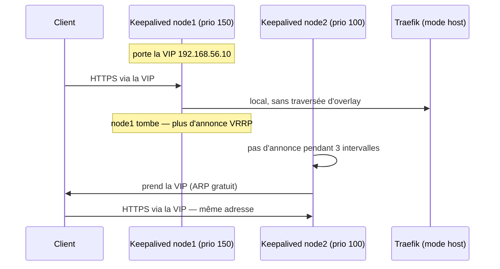

# Haute disponibilité — mécanismes, tests et résultats

> **Objet** : ce que la plateforme promet en matière de disponibilité, comment
> chaque promesse est obtenue, et **ce qui a été mesuré**.
> **Références** : CDC §8 ; ADR-0001 (Swarm), ADR-0003 (Traefik + Keepalived),
> ADR-0005 (Galera + HAProxy), ADR-0006 (SPOF NFS assumé), ADR-0008 (SPOF MinIO).

---

## 1. Le principe

La haute disponibilité de cette plateforme repose sur **trois nœuds égaux** et
sur un choix constant : préférer un mécanisme qui tolère la perte d'un membre à
un mécanisme qui bascule. Un quorum de 2 sur 3 continue de servir pendant
l'incident ; une bascule, elle, a toujours une durée, et cette durée est de
l'indisponibilité.

Là où une bascule est inévitable — le point d'entrée réseau ne peut être qu'à un
seul endroit à la fois — elle est mesurée, pas estimée (§4).

Deux points singuliers sont des **SPOF assumés**, documentés comme tels et
couverts par le PRA plutôt que par de la redondance : l'export NFS des fichiers
GLPI (ADR-0006) et le dépôt de sauvegarde MinIO (ADR-0008). Les nommer est plus
honnête que de prétendre qu'ils n'existent pas.

## 2. Matrice de défaillance (CDC §8.1)

| Composant | Mécanisme HA | Perte d'un nœud | Perte d'un conteneur |
|---|---|---|---|
| Point d'entrée (VIP) | Keepalived VRRP + `chk_traefik` | bascule < 5 s | VIP retirée du nœud si Traefik KO |
| Traefik | `global`, sans état | 2 instances restantes | redémarrage automatique |
| CrowdSec | agents globaux, bouncer en cache `stream`, LAPI replanifiée | protection maintenue | idem |
| GLPI web | 2 replicas sticky, 1 par nœud | 1 restant, reschedule ~30 s | idem |
| GLPI cron | 1 replica flottant | reschedule ~30 s | idem |
| MariaDB | Galera 3 nœuds synchrone + HAProxy writer unique | quorum 2/3, **RPO 0**, bascule writer < 5 s | rejoint par IST ou SST |
| Cassandra | RF=3, `LOCAL_QUORUM` | lectures/écritures OK, hints puis repair | idem |
| Elasticsearch | 3 masters éligibles, 1 replica par shard | `yellow` → `green`, **RPO 0** | idem |
| Prometheus | 2 instances identiques (HA par duplication) | 1 restante | redémarrage, données locales conservées |
| Alertmanager | cluster gossip ×3 | 2 restants, déduplication conservée | idem |
| Grafana | 2 replicas, état en Galera | 1 restant | idem |
| Kibana, db-proxy, alert2glpi, swarm-cronjob, exporters | sans état, reschedule Swarm | RTO 30–60 s | idem |
| Plan de contrôle Swarm | 3 managers Raft | quorum 2/3 | — |
| Fluent Bit | `global`, buffer disque | logs du nœud perdu arrêtés, aucun autre impact | reprise depuis la base de position |
| **NFS (fichiers GLPI)** | **SPOF assumé** | GLPI dégradé (pièces jointes) — procédure PRA, RTO 30 min | — |
| **MinIO** | **SPOF assumé** (dépôt de sauvegarde) | sauvegardes suspendues ; miroir hors site intact | — |

### Pourquoi « HA par duplication » pour Prometheus

Deux instances identiques scrutent les mêmes cibles et ne se parlent pas. Il n'y
a rien à synchroniser, rien qui puisse diverger, et aucun mécanisme d'élection à
déboguer à 3 h du matin. Le prix est la duplication du stockage ; le gain est
qu'une instance perdue ne coûte **rien** — l'autre a déjà toutes les données.
La déduplication des notifications est faite en aval, par le cluster
Alertmanager.

### Pourquoi un writer unique pour Galera

Galera est multi-maître, mais écrire sur les trois nœuds provoque des
*deadlocks* de certification que l'application voit comme des erreurs aléatoires.
HAProxy dirige donc **toutes** les écritures vers `galera-1`, avec `galera-2` et
`galera-3` déclarés `backup` dans un ordre déterministe (ADR-0005). La
disponibilité est conservée — la bascule est automatique — et la classe de bug la
plus pénible disparaît.

## 3. Le point d'entrée : ce qui bascule et en combien de temps



Deux détails décident du résultat :

- **Traefik en `mode: host`** (ADR-0003) et non par le maillage de routage
  Swarm. Le maillage fait du SNAT : l'IP du client réelle serait remplacée par
  une passerelle `10.20.x.x`, CrowdSec bannirait le maillage au lieu de
  l'attaquant, et les journaux d'accès seraient inutilisables.
- **`vrrp_script chk_traefik`, `weight -60`** : un nœud dont le Traefik local ne
  répond plus à `/ping` perd 60 points de priorité. Avec un espacement de 50
  points entre les nœuds (150/100/50), 60 est le plus petit poids qui garantit
  la cession de la VIP, et il reste inférieur à 100 pour ne pas provoquer de
  cascade. L'arithmétique est détaillée dans
  [`04-composants/keepalived.md`](04-composants/keepalived.md).

## 4. Tests HA — `make chaos`

### 4.1 Comment la mesure est faite

Ce que l'on mesure est **l'indisponibilité réelle à travers la VIP**, pas une
estimation tirée des journaux :

- une sonde `curl` interroge `whoami` via la VIP **toutes les 0,2 s** pendant
  tout le scénario. À 1 Hz, une bascule de 4,6 s et une de 5,4 s seraient
  indiscernables — or la promesse est « < 5 s » ;
- la valeur retenue est **la plus longue série d'échecs consécutifs**, pas leur
  total : deux coupures d'une seconde ne font pas une coupure de deux secondes,
  et les additionner serait un mensonge, fût-il prudent ;
- `whoami` et non GLPI : sans état, sans base derrière, il répond en
  millisecondes. Ce que l'on mesure est la disponibilité du **point d'entrée**,
  qu'une application lente polluerait de sa propre latence ;
- la plateforme doit être revenue à l'état nominal **entre deux scénarios** —
  sinon le scénario *n+1* mesure les séquelles du scénario *n*.

### 4.2 Les scénarios, du plus doux au plus brutal

L'ordre n'est pas cosmétique : une panne diagnostiquée sur le plus petit
scénario qui la révèle est une panne comprise.

| # | Scénario | Script | Ce qu'il éprouve |
|---|---|---|---|
| 1 | Perte d'une tâche `glpi-web` | `kill-service.sh` | reschedule Swarm, cookie sticky |
| 2 | Perte d'une tâche `traefik` | `kill-service.sh` | le point d'entrée lui-même |
| 3 | Perte d'une tâche `galera-2` | `kill-service.sh` | retour d'un membre **avec état** (IST, pas SST) |
| 4 | Mise à jour glissante `glpi-web` | `kill-service.sh --force-update` | `update_config: start-first` — ce que fait *chaque* déploiement |
| 5 | Drain planifié de `node2` | `drain-node.sh` | arrêt **propre** des bases : quorum à 2, ES `yellow`, retour sans SST |
| 6 | Perte brutale de `node2` | `kill-node.sh` | bascule VIP, chaîne d'alerte → ticket GLPI |
| 7 | Perte brutale de `node3` | `kill-node.sh` | perte de MinIO **et** du LAPI CrowdSec |
| 8 | Perte brutale de `node1` | `kill-node.sh` | le **SPOF NFS** : GLPI doit rester servi, dégradé |

`node1` passe en dernier délibérément : sa perte dégrade GLPI, et le placer plus
tôt ferait mesurer à tous les scénarios suivants une plateforme dont les pièces
jointes sont cassées.

### 4.3 Ce que le scénario `node1` doit montrer

GLPI doit **continuer à servir des pages** — la base est répliquée, et le replica
web du nœud survivant suffit. Ce qui doit cesser de fonctionner, ce sont les
pièces jointes. Le montage NFS en `soft` (et non `hard`) est ce qui transforme
« le processus se fige indéfiniment en sommeil ininterruptible » en « l'E/S
échoue en ~15 s » : dégradé plutôt que gelé (ADR-0006).

Le script vérifie ce comportement explicitement plutôt que de laisser un test de
fumée vert le masquer, et consigne le RTO de la bascule NFS (30 min, procédure
dans [`07-PRA.md`](07-PRA.md)).

### 4.4 Charge de fond

`demo-producer` (CDC §8.2 n°5) écrit en continu dans Cassandra et Elasticsearch
pendant toute la campagne. Son compteur `demo_producer_errors_total` **doit
rester à zéro** : c'est l'affirmation la plus nette que la plateforme puisse
produire — la production ne s'est pas interrompue pendant qu'on tuait un nœud.

Il doit être déployé **avant** la campagne (`make deploy-demo`). S'il ne l'est
pas, `run-all.sh` ne déclare pas le critère satisfait : il le déclare **non
mesuré**, et le rapport le dit.

## 5. Résultats mesurés

> 🖥️ **Cette section est remplie par l'exécution de `make chaos` sur les trois
> VM.** La campagne produit `reports/chaos-<date>.md` contenant exactement le
> tableau ci-dessous, rempli ; il est recopié ici.
>
> Elle n'a pas pu être exécutée dans la session de développement : la politique
> d'egress y interdit le téléchargement des blobs d'images, donc aucun conteneur
> ne peut démarrer, et Vagrant/VirtualBox n'y sont pas disponibles (voir
> [`PROGRESS.md`](PROGRESS.md), « Environnement de la session »).
>
> Ce qui a été vérifié hors VM : la logique de mesure elle-même (calcul de la
> plus longue série d'échecs, validé sur des séries connues), la validité de
> tous les scripts (`shellcheck`), et la cohérence des stacks déployées.

| Scénario | Commande | Comportement attendu | Observé | Indispo. mesurée | Ticket GLPI | Résultat |
|---|---|---|---|---|---|---|
| Perte d'une tâche — `apps_glpi-web` | `kill-service.sh apps_glpi-web` | reschedule, service servi en continu | — | — | — | 🖥️ |
| Perte d'une tâche — `edge_traefik` | `kill-service.sh edge_traefik` | 2 instances restantes, VIP conservée | — | — | — | 🖥️ |
| Perte d'une tâche — `data_galera-2` | `kill-service.sh data_galera-2` | retour par IST, `wsrep_cluster_size` revient à 3 | — | — | — | 🖥️ |
| Mise à jour glissante — `apps_glpi-web` | `kill-service.sh apps_glpi-web --force-update` | `start-first` : aucune coupure | — | — | — | 🖥️ |
| Drain planifié — `node2` | `drain-node.sh node2` | quorum à 2, ES `yellow`, retour sans SST | — | — | — | 🖥️ |
| Perte brutale — `node2` | `kill-node.sh node2` | bascule VIP < 5 s, ticket `NodeDown` créé | — | — | — | 🖥️ |
| Perte brutale — `node3` | `kill-node.sh node3` | sauvegardes suspendues, protection CrowdSec maintenue | — | — | — | 🖥️ |
| Perte brutale — `node1` | `kill-node.sh node1` | GLPI servi et dégradé (pièces jointes), RTO NFS 30 min | — | — | — | 🖥️ |
| Charge de fond | `demo_producer_errors_total` | **0** sur toute la campagne | — | — | — | 🖥️ |

### Comment remplir ce tableau

```bash
make deploy-demo          # la charge de fond DOIT tourner pendant la campagne
make chaos                # ~30 min, depuis le poste d'administration (Vagrant requis)
cat reports/chaos-*.md    # le tableau est déjà au bon format : le recopier ci-dessus
```

Depuis un nœud (sans Vagrant), les scénarios 1 à 5 restent exécutables :

```bash
tests/chaos/run-all.sh --no-node-kill
```

## 6. Mode mono-nœud — ce qu'il ne teste pas

`make single` déploie les mêmes définitions sur un Swarm à un nœud (CDC §3.2).
C'est un mode de développement, et il **n'est pas** une petite production :

- Galera tourne seul : pas de quorum, pas de réplication synchrone ;
- Cassandra est en RF=1 : perdre le volume, c'est perdre les données ;
- Elasticsearch reste `yellow` pour toujours — un shard replica ne peut pas être
  alloué sur le nœud qui porte le primaire. C'est l'état **correct** ici, pas un
  problème à corriger ;
- Keepalived, la VIP et la bascule n'existent pas.

`make smoke` ne connaît rien de tout cela et signalera des échecs (3 nœuds
Swarm, Galera à 3, ES `green`) : il a raison, ces contrôles décrivent la
topologie de production.

Deux propriétés de `docker stack config` rendent ce mode moins trivial qu'il n'y
paraît, et toutes deux ont été constatées sur la sortie fusionnée :

1. **les contraintes de placement d'un override sont ajoutées, jamais
   remplacées** — `constraints: []` ne change rien, et une contrainte
   satisfaisable vient simplement s'ajouter à `node.labels.cassandra == 1` ;
2. **un fichier d'override ajoute ses services à toutes les stacks** avec
   lesquelles il est fusionné, ce qui injecterait `minio` (sans image) dans la
   stack `data`.

`scripts/lib/single-node.py` corrige les deux, et `scripts/validate-stacks.sh`
valide **le fichier réellement déployé**, pas la fusion : un test négatif
confirme qu'il détecte une contrainte survivante.

## 7. Ce qui n'est pas couvert, et l'est sciemment

| Non couvert | Pourquoi | Où c'est traité |
|---|---|---|
| Perte de 2 nœuds sur 3 | plus de quorum Raft ni Galera : la plateforme s'arrête | procédure `--force-new-cluster`, [`07-PRA.md`](07-PRA.md) |
| Perte du site | un seul datacentre dans le périmètre | miroir hors site + reconstruction, [`07-PRA.md`](07-PRA.md) §9.6 |
| Partition réseau (split-brain) | réseau hôte unique en laboratoire | quorum Raft et certification Galera l'empêchent par construction |
| Corruption logique | ce n'est pas de la disponibilité | restauration datée, [`07-PRA.md`](07-PRA.md) |

## 8. Pour aller plus loin

- Stockage réellement distribué (Ceph, GlusterFS) à la place du SPOF NFS ;
- MinIO en mode distribué ou S3 managé, à la place du SPOF de node3 ;
- second site : CCR Elasticsearch, Cassandra multi-DC, Galera géo-répliqué ;
- deux VIP (une par service critique) pour éviter que toute la charge suive un
  seul nœud après une bascule.
