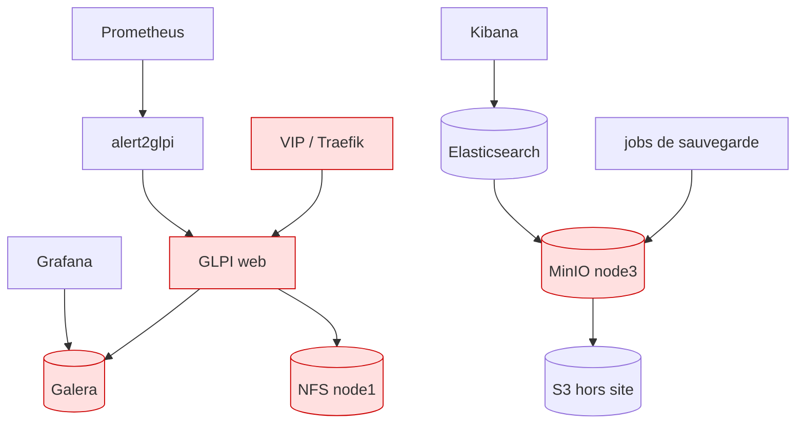

# Plan de reprise d'activité (PRA)

> **Objet** : ce qu'on fait quand quelque chose casse — du conteneur qui meurt à
> la perte des trois machines.
> **Références** : CDC §9 ; [ADR-0006](adr/0006-nfs-spof-assume.md),
> [ADR-0008](adr/0008-minio-restic-sauvegardes.md).
> Mécanique des sauvegardes : [`04-composants/backup.md`](04-composants/backup.md).

---

## 1. Périmètre, définitions, déclenchement

### 1.1 Périmètre

La plateforme Dockerwarts N°1 : trois nœuds, six stacks, quatre magasins de
données, et les données qu'ils portent. Hors périmètre : le poste
d'administration, l'hyperviseur, le réseau physique.

### 1.2 Définitions

| Terme | Définition | Ce que ça veut dire ici |
|---|---|---|
| **RPO** *(Recovery Point Objective)* | quantité de données qu'on accepte de perdre | 24 h pour le cluster complet ; **0** pour la perte d'un seul nœud |
| **RTO** *(Recovery Time Objective)* | durée d'indisponibilité qu'on accepte | de « moins de 5 s » (VIP) à 4 h (reconstruction totale) |
| **PDMA** | perte de données maximale admissible | synonyme francophone du RPO |
| **Sinistre** | événement qui met une fonction hors service au-delà de son RTO | déclenche ce plan |
| **Dégradé** | la fonction rend un service partiel | ex. GLPI sans pièces jointes : **pas** un sinistre |

### 1.3 Rôles et contacts (fictifs)

| Rôle | Qui | Responsabilité | Contact |
|---|---|---|---|
| Astreinte niveau 1 | équipe exploitation | reçoit les tickets, applique les procédures §5 | `exploitation@dockerwarts.lan` |
| Responsable plateforme | M. Rusard | déclenche le plan, arbitre les pertes de données | `mrusard@dockerwarts.lan` |
| Détenteur du coffre | Mme McGonagall | conserve `secrets/` et `certs/ca.key` **hors du cluster** | `mmcgonagall@dockerwarts.lan` |
| Responsable sécurité | M. Maugrey | pilote le scénario de compromission (§5.7) | `amaugrey@dockerwarts.lan` |

### 1.4 Déclenchement

| Situation | Qui décide | Action |
|---|---|---|
| Un service dégradé, RTO non menacé | astreinte N1 | procédure §5.1, pas de déclenchement |
| Un nœud perdu | astreinte N1 | §5.2 ou §5.3, information du responsable |
| Perte de données confirmée | **responsable plateforme** | déclenchement, §5.5 ou §5.6 |
| Compromission suspectée | **responsable sécurité** | déclenchement immédiat, §5.7 — isoler d'abord |
| Perte des trois nœuds | responsable plateforme | §5.8 et §6 |

**Premier réflexe, avant toute action : ne pas détruire les preuves.** Un
`docker service rm` efface les journaux du conteneur. Sauf en cas de
compromission (où l'isolement prime), collecter d'abord :

```bash
make status > /tmp/incident-status.txt
docker service ps <service> --no-trunc >> /tmp/incident-status.txt
docker service logs --tail 500 <service> > /tmp/incident-logs.txt
```

## 2. Inventaire des actifs

| Actif | Classe | Dépend de | RPO | RTO | Sauvegarde |
|---|---|---|---|---|---|
| Base GLPI (Galera) | **critique** | Galera, db-proxy | 24 h | 1 h | dump logique quotidien → restic |
| Fichiers GLPI (NFS) | **critique** | node1 | 24 h | 1 h | restic quotidien |
| GLPI web/cron | critique | base + fichiers | — | 30 s | sans état |
| Point d'entrée (VIP, Traefik) | **critique** | Keepalived | — | < 5 s | config en git |
| Datalake Cassandra | important | 3 nœuds | 24 h | 2 h | `nodetool snapshot` → restic, par nœud |
| Logs Elasticsearch | important | 3 nœuds | 24 h | 2 h | snapshots natifs (SLM) → MinIO |
| Supervision (Prometheus) | important | — | 7 j | 30 min | TSDB hebdomadaire ; **config en git** |
| Décisions CrowdSec | important | node3 | 24 h | 15 min | restic quotidien |
| Dépôt MinIO | **critique** *(pour la reprise)* | node3 | 1 h | 1 h | miroir hors site horaire |
| Registre d'images | secondaire | node3 | — | 15 min | reconstruit par `make build` |
| Grafana | secondaire | Galera | — | 15 min | état en Galera, dashboards en git |
| Kibana | secondaire | Elasticsearch | — | 15 min | objets re-provisionnés par `es-init.sh` |



Le graphe se lit dans les deux sens : **Galera est en bas** — presque tout en
dépend, et c'est pourquoi il est restauré en premier (§6).

## 3. Objectifs RPO / RTO

| Composant | RPO — perte d'un nœud | RPO — perte totale | RTO — perte d'un nœud | RTO — perte totale |
|---|---|---|---|---|
| Point d'entrée / Traefik | — | — | **< 5 s** | 15 min (après Ansible) |
| GLPI — base | **0** | 24 h | 30 s | 1 h |
| GLPI — fichiers (NFS) | 24 h (si node1) | 24 h | 30 min | 1 h |
| Cassandra | **0** | 24 h | **0** | 2 h |
| Elasticsearch | **0** | 24 h | 1 min | 2 h |
| Supervision | 0 | 7 j (métriques), **0** (config) | 1 min | 30 min |
| CrowdSec | 0 | 24 h (décisions) | 1 min | 15 min |
| **Cluster complet** | — | **24 h** | — | **4 h** |

### Pourquoi ces chiffres

**RPO 0 sur la perte d'un nœud** n'est pas une promesse optimiste : c'est une
propriété de la réplication synchrone. Galera certifie chaque transaction sur le
quorum avant de l'acquitter, Cassandra écrit en `LOCAL_QUORUM`, Elasticsearch
maintient un replica par shard. Une transaction acquittée est, par construction,
sur au moins deux machines.

**RPO 24 h sur la perte totale** est la conséquence directe du calendrier de
sauvegarde (§4) : quotidien. Le réduire supposerait du PITR — binlogs MariaDB,
incrémentaux Cassandra — listé en §8.

**RTO 4 h sur la reconstruction complète** se décompose ainsi : Ansible ~15 min,
déploiement des stacks ~15 min, restauration Galera ~10 min, Cassandra ~1 h
(`sstableloader` est lent, et c'est le prix de sa justesse), Elasticsearch
~30 min, validation ~15 min. Le reste est de la marge, parce qu'un incident réel
n'est jamais la somme de ses étapes nominales.

**RPO 7 j sur les métriques** est un choix : l'historique de supervision est la
seule chose de la plateforme dont personne n'est bloqué. Ce qui prend réellement
du temps à reconstruire — les règles, les tableaux de bord — est en git, donc
son RPO est **0**.

## 4. Stratégie de sauvegarde

Détail complet dans [`04-composants/backup.md`](04-composants/backup.md). Ce que
le PRA doit retenir :

### 4.1 3-2-1

| Copie | Où | Fraîcheur |
|---|---|---|
| 1 — données vivantes | les trois nœuds, répliquées | temps réel |
| 2 — dépôt restic + snapshots ES | MinIO sur node3 | ≤ 24 h |
| 3 — **hors site** | S3 externe (`OFFSITE_S3_*`) | ≤ 1 h |

> **Sans `OFFSITE_S3_*`, la règle n'est pas satisfaite** et perdre node3 perd
> toutes les sauvegardes. Le job `offsite-mirror` le signale à chaque passage et
> **ne publie aucune métrique de succès** : afficher un succès affirmerait
> qu'une copie hors site existe.

### 4.2 Calendrier (UTC)

| Job | Heure | Rétention |
|---|---|---|
| `backup-es` (SLM + vérification) | 01:00 | 30 j |
| `backup-galera` | 02:00 | 7 j / 4 sem / 6 mois |
| `backup-glpi-files` | 02:30 | idem |
| `backup-cassandra-1/2/3` | 03:00 | idem |
| `backup-prometheus` | dim. 04:00 | 4 sem |
| `backup-crowdsec` | 04:30 | 7 j |
| `backup-configs` (état du cluster) | 05:00 | 7 j / 4 sem |
| `maint-cassandra-repair` | dim. 05:00 | — |
| `restic-forget` (+ `check` le dim.) | 06:00 | — |
| `offsite-mirror` | toutes les heures | selon le dépôt |

### 4.3 Chiffrement et clés

restic chiffre en **AES-256**. La clé est `dw_restic_password`.

> **Sans elle, le dépôt est du bruit.** Elle ne peut pas être « retrouvée », ni
> régénérée, ni contournée. Elle doit être dans un coffre **hors du cluster**,
> avec `dw_minio_restic_key` / `_secret` et `certs/ca.key`.
> `scripts/init-secrets.sh` le rappelle à chaque exécution.

### 4.4 Vérification automatique

Une sauvegarde qui s'arrête en silence est pire que pas de sauvegarde : elle
produit une confiance injustifiée. Quatre mécanismes s'y opposent :

| Mécanisme | Ce qu'il attrape |
|---|---|
| `backup_last_status` + `BackupFailed` | un job qui a échoué |
| `backup_last_success_timestamp` + `BackupTooOld` (> 26 h) | un job qui ne tourne plus |
| `BackupNeverRan` (série absente 48 h) | une stack de sauvegarde jamais déployée — un trou qu'aucune autre alerte ne peut voir |
| `restic check --read-data-subset=5%` (dim.) | la corruption silencieuse dans MinIO |

En cas d'échec, l'horodatage de succès n'est **pas** rafraîchi : il continue de
désigner la dernière exécution qui a réellement fonctionné.

## 5. Scénarios de sinistre

Chaque scénario : symptôme, commandes exactes, durée estimée, validation.

---

### 5.1 Panne d'un conteneur ou d'un service

**Symptôme** — ticket `ContainerRestarting` ou `<X>Down` ; `make status` montre
un service à `0/2`.
**Durée** — automatique, ~30 s.

```bash
docker service ps <service> --no-trunc      # POURQUOI la tâche ne démarre pas
docker service logs --tail 100 <service>
# Si Swarm ne replanifie pas (contrainte insatisfaite, image absente) :
docker service update --force <service>
```

**Validation** — `make smoke`.

**Ne pas** `docker service rm` puis redéployer : les journaux disparaissent avec
le service, et avec eux la cause.

---

### 5.2 Panne temporaire d'un nœud (redémarrage, maintenance)

**Symptôme** — ticket `NodeDown` ; les autres alertes du même nœud sont inhibées.
**Durée** — bascule VIP < 5 s ; retour du nœud ~5 min.

```bash
# Maintenance PLANIFIÉE : sortir le nœud proprement
docker node update --availability drain node2
# … intervention …
docker node update --availability active node2

# Retour après une panne
vagrant up node2
docker node ls                       # Ready
docker service ls                    # tout revenu à son compte de replicas
```

**Validation** — `make smoke`, plus les trois clusters :

```bash
docker exec $(docker ps -q -f name=data_galera-1) sh -c \
  'mariadb -u root -p"$(cat /run/secrets/dw_mariadb_root_password)" -e \
   "SHOW STATUS LIKE '"'"'wsrep_cluster_size'"'"';"'      # → 3
docker exec $(docker ps -q -f name=data_cassandra-1) nodetool status   # → 3 UN
```

Un nœud absent moins de trois heures est rattrapé par les *hints* Cassandra et
par un IST Galera : aucune action.

---

### 5.3 Perte définitive d'un nœud et remplacement

**Symptôme** — le matériel ne revient pas. `docker node ls` affiche `Down`
durablement.
**Durée** — 45 à 90 min selon le volume à resynchroniser.

```bash
# 1. Retirer le nœud mort du Swarm (le quorum passe à 2 sur 2 : ne pas traîner)
docker node rm --force node2

# 2. Recréer la VM et l'intégrer
vagrant destroy -f node2 && vagrant up node2
ansible-playbook -i ansible/inventory/hosts.yml ansible/playbooks/node-replace.yml --limit node2

# 3. Vérifier les labels de placement — sans eux, rien ne se replanifie
docker node inspect node2 --format '{{.Spec.Labels}}'
#    attendu : cassandra=2 es=2 galera=2 prometheus=b

# 4. Les services épinglés repartent seuls. Les suivre :
docker service ps data_galera-2 --no-trunc
```

**Ce qui se passe dans chaque magasin :**

| Magasin | Mécanisme | Durée | À surveiller |
|---|---|---|---|
| Galera | **SST** complet depuis un donneur (le volume est vide) | 10–30 min | le donneur est en `Donor/Desynced` : ne pas le redémarrer |
| Cassandra | **`replace_address`** — le nouveau nœud reprend les tokens de l'ancien | 30–60 min | `nodetool netstats` ; sans `replace_address`, il rejoint avec de NOUVEAUX tokens et l'anneau est incohérent |
| Elasticsearch | réallocation automatique des shards | 10–30 min | `_cluster/health` : `yellow` → `green` |
| Prometheus | TSDB **vide**, l'historique reste sur l'autre instance | immédiat | comportement voulu |

**Validation** — `make smoke` (les 3 clusters à leur nominal) et
`tests/chaos/drain-node.sh node2` pour confirmer que le nœud neuf se comporte
comme les autres.

---

### 5.4 Perte du nœud NFS (node1)

**Symptôme** — GLPI sert les pages mais échoue sur toute pièce jointe.
C'est le **SPOF assumé** de l'[ADR-0006](adr/0006-nfs-spof-assume.md).
**Durée** — RTO 30 min. **RPO** : la dernière sauvegarde `backup-glpi-files`.

Le montage est en `soft` (et non `hard`) : l'E/S **échoue en ~15 s** au lieu de
figer le processus en sommeil ininterruptible. Dégradé plutôt que gelé — c'est
ce qui rend ce scénario tenable.

```bash
# 1. Choisir le nouveau porteur (node2), y créer et exporter l'arborescence
sed -i 's/^nfs_server:.*/nfs_server: node2/' ansible/inventory/hosts.yml   # groupe nfs_server
ansible-playbook -i ansible/inventory/hosts.yml ansible/playbooks/site.yml --limit node2 --tags nfs

# 2. Restaurer les fichiers GLPI sur le nouvel export
NFS_SERVER=192.168.56.12 scripts/restore/restore-glpi-files.sh

# 3. Pointer la plateforme vers lui
sed -i 's/^NFS_SERVER=.*/NFS_SERVER=192.168.56.12/' .env

# 4. Redéployer les stacks qui montent du NFS
make deploy-apps deploy-backup
```

**Validation** — se connecter à GLPI, ouvrir un ticket existant **avec pièce
jointe**, et en téléverser une nouvelle.

---

### 5.5 Perte du nœud MinIO (node3)

**Symptôme** — tickets `BackupFailed` sur tous les jobs. La production n'est
**pas** affectée : aucun service applicatif ne dépend de MinIO.
**Durée** — 30 à 60 min selon le volume à rapatrier.

```bash
# 1. Déplacer le label (ou remplacer node3 comme en §5.3)
docker node update --label-add minio=true node2
docker node update --label-rm minio node3      # si le nœud existe encore
make deploy-backup                             # MinIO se replanifie, volume VIDE

# 2. Le réinitialiser (buckets, politiques, comptes)
scripts/minio-init.sh

# 3. Rapatrier depuis le hors site — le SEUL endroit où les sauvegardes existent
scripts/restore/restore-all.sh --from offsite --list   # d'abord regarder
#    puis, pour ne faire que la resynchronisation des buckets :
#    (restore-all --from offsite enchaîne ensuite les restaurations ;
#     pour ne rapatrier QUE les buckets, interrompre après l'étape de mirror)

# 4. Vérifier que le dépôt est lisible
scripts/restore/restore-all.sh --list
```

> **Sans copie hors site, les sauvegardes sont perdues.** Il n'existe aucune
> procédure de récupération : c'est le risque que `OFFSITE_S3_*` couvre, et la
> raison pour laquelle le job crie quand il n'est pas configuré.

**Validation** — `make backup-now` : tous les jobs en succès, métriques
republiées.

---

### 5.6 Corruption logique (suppression accidentelle)

**Symptôme** — les données sont parties, mais l'infrastructure va bien. La
réplication a fidèlement répliqué la suppression sur les trois nœuds.
**Durée** — 15 min à 2 h selon le magasin. **Ne pas paniquer, ne rien écrire.**

```bash
# 0. TOUJOURS commencer par regarder ce qui est disponible
scripts/restore/restore-all.sh --list
```

| Cas | Procédure | Non destructif ? |
|---|---|---|
| Tickets GLPI supprimés | `scripts/restore/restore-galera.sh --only-db glpi --as glpi_secours <snapshot>` puis `INSERT … SELECT` des lignes voulues | **oui** — la production n'est pas touchée |
| Base GLPI entière | `scripts/restore/restore-galera.sh <snapshot>` | non — remplace tout |
| Index ES supprimé | `scripts/restore/restore-es.sh --rename <snapshot>` puis bascule d'alias | **oui** — restaure en `restored-*` |
| Table Cassandra | `scripts/restore/restore-cassandra.sh 1 --keyspace datalake_secours <snapshot>` | **oui** |
| Fichiers GLPI | `scripts/restore/restore-glpi-files.sh --to /tmp/verif <snapshot>` puis copie ciblée | **oui** |

**La forme non destructive est presque toujours la bonne.** Elle permet de
comparer avant de remplacer, et une restauration complète pour récupérer trois
tickets perd tout ce qui a été créé depuis la sauvegarde.

**Validation** — compter les lignes récupérées, et vérifier qu'aucune donnée
postérieure à l'incident n'a disparu.

---

### 5.7 Compromission / rançongiciel

**Symptôme** — activité anormale, fichiers chiffrés, compte inconnu, alertes
CrowdSec massives.
**Durée** — heures à jours. **L'isolement passe avant tout le reste.**

```bash
# --- ÉTAPE 1 : ISOLER (immédiat, avant toute analyse) ---
# Couper l'accès public sur les trois nœuds, sans arrêter le cluster
for n in node1 node2 node3; do
  vagrant ssh $n -c "sudo iptables -I DW-INPUT 1 -p tcp -m multiport --dports 80,443 -j DROP"
done
# NE PAS éteindre les nœuds : la mémoire et les journaux sont des preuves.

# --- ÉTAPE 2 : CONSTATER ---
docker exec $(docker ps -q -f name=edge_crowdsec-lapi) cscli alerts list --limit 50
# Les logs sont dans Elasticsearch, hors de portée d'un attaquant qui n'aurait
# eu qu'un conteneur : c'est précisément à cela que sert la centralisation.
#   Kibana → data view `dw-traefik`, filtrer sur l'IP source
docker service ls                 # un service inconnu ? un montage inattendu ?
scripts/restore/restore-all.sh --list   # le dépôt est-il intact ?

# --- ÉTAPE 3 : RÉVOQUER ET FAIRE TOURNER TOUS LES SECRETS ---
mv secrets secrets.compromis-$(date +%Y%m%d)
scripts/init-secrets.sh            # 41 secrets neufs
scripts/gen-certs.sh --force       # nouvelle CA et nouveau wildcard

# --- ÉTAPE 4 : RECONSTRUIRE DEPUIS UNE SOURCE SÛRE ---
# git (le code) + le coffre (l'ANCIEN mot de passe restic, pour lire le dépôt)
# Voir §6. Restaurer depuis une date ANTÉRIEURE à la compromission.
```

**Ce qui protège le dépôt de sauvegarde**, et ses limites :

| Mesure | Ce qu'elle couvre | Ce qu'elle ne couvre pas |
|---|---|---|
| Versioning du bucket `restic` | une suppression : les objets deviennent des versions antérieures | un attaquant ayant les droits root MinIO |
| Compte `mirror` en **lecture seule** | le job de miroir ne peut pas écraser la source | — |
| Miroir hors site | la perte de node3 | `mc mirror --remove` **propage les suppressions** : le versionnage ou l'*object lock* du fournisseur externe est la dernière ligne |
| Réseaux `internal` | l'exfiltration depuis `data` : aucune route sortante | — |

> **`--remove` sur le miroir est un choix assumé** : sans lui, la rétention ne
> s'applique qu'à une copie et le hors site grossit sans fin. Le contrepoids est
> le versionnage, des deux côtés.

**Validation** — `make smoke`, `make dr-drill`, et une revue des journaux ES sur
toute la fenêtre de compromission.

---

### 5.8 Perte de quorum Swarm (2 managers sur 3)

**Symptôme** — `docker node ls` répond « context deadline exceeded ». Les
conteneurs **continuent de tourner** ; c'est le plan de contrôle qui est mort.
**Durée** — 15 min.

```bash
# Sur le SEUL manager survivant :
docker swarm init --force-new-cluster
docker node ls                      # les autres sont Down
docker node rm --force node2 node3

# Puis reconstruire les nœuds perdus (§5.3), un par un, jamais les deux à la fois
```

`--force-new-cluster` reconstruit un Raft à un membre à partir de l'état local.
Les services et les stacks sont préservés ; les secrets et configs aussi.

---

### 5.9 Arrêt total de Galera

**Symptôme** — les trois nœuds sont éteints ou refusent de démarrer. Aucun ne
sait s'il détient l'état le plus récent, donc aucun ne se déclare primaire :
c'est une **protection**, pas une panne.
**Durée** — 15 à 30 min.

```bash
scripts/galera-recover.sh --dry-run     # d'abord : QUEL nœud est le plus avancé ?
```

Le script lit `grastate.dat` sur les trois volumes, retient celui portant
`safe_to_bootstrap: 1`, ou à défaut le `seqno` le plus élevé, et **refuse de
s'exécuter contre un cluster vivant**.

```bash
scripts/galera-recover.sh --force       # bootstrappe le nœud retenu
docker exec $(docker ps -q -f name=data_galera-1) sh -c \
  'mariadb -u root -p"$(cat /run/secrets/dw_mariadb_root_password)" -e \
   "SHOW STATUS LIKE '"'"'wsrep_cluster_size'"'"';"'
```

**Ne jamais bootstrapper « le premier qui démarre »** : c'est ainsi qu'on
publie l'état le plus ancien comme vérité et qu'on perd les transactions des
deux autres.

---

### 5.10 Cluster Elasticsearch rouge

**Symptôme** — ticket `ESClusterRed` : un shard **primaire** est indisponible.

```bash
ES=$(docker ps -q -f name=data_es-1)
docker exec $ES sh -c 'curl -s -u elastic:$(cat /run/secrets/dw_es_elastic_password) \
  localhost:9200/_cluster/allocation/explain?pretty'
```

| Cause | Action |
|---|---|
| Un nœud absent | §5.2 / §5.3 — les shards se réallouent seuls |
| Disque au *watermark* | libérer de la place, ou baisser la rétention ILM |
| Shard réellement perdu | `scripts/restore/restore-es.sh --rename <snapshot>` puis bascule d'alias |

`yellow` **n'est pas** `red` : `yellow` signifie qu'un *replica* n'est pas
alloué, ce qui est normal pendant une réallocation et permanent sur un nœud
unique.

---

### 5.11 Cassandra sans quorum

**Symptôme** — ticket `CassandraConsistencyFailures` : moins de 2 nœuds sur 3.

```bash
docker exec $(docker ps -q -f name=data_cassandra-1) nodetool status
```

| Cause | Action |
|---|---|
| Un nœud arrêté | §5.2 — les *hints* rattrapent (fenêtre de 3 h) |
| Absent > 3 h | après le retour : `nodetool repair -pr` sur chaque nœud |
| Nœud perdu | §5.3 avec `replace_address` |
| Données perdues | `scripts/restore/restore-cassandra.sh <n>` — `sstableloader` route chaque ligne vers les nœuds qui la possèdent **aujourd'hui** |

> **`maint-cassandra-repair` n'est pas optionnel.** Sans réparation
> hebdomadaire, une suppression non répliquée peut être **ressuscitée** après
> expiration de `gc_grace_seconds`. Des données supprimées qui réapparaissent
> sont la panne que ce job évite.

## 6. Reprise complète et ordre de redémarrage


L'ordre n'est pas négociable : GLPI ne s'installe pas sans base, Prometheus ne
découvre rien sans applications, et **rien ne se restaure sans les secrets**.

```bash
# 1. Code et paramètres
git clone <dépôt> && cd dockerwarts
cp .env.example .env && $EDITOR .env
cp ansible/inventory/hosts.yml.example ansible/inventory/hosts.yml

# 2. Hôtes et Swarm                                            (~15 min)
make vms provision

# 3. Secrets DEPUIS LE COFFRE, puis certificats                (~5 min)
#    Restaurer secrets/ et certs/ca.key AVANT cette commande :
#    init-secrets.sh ne régénère que ce qui manque.
make secrets certs

# 4. Images maison                                             (~10 min)
make build

# 5. Reverse proxy et clusters de données VIDES                (~15 min)
make deploy-edge deploy-data

# 6. Restauration                                              (~2 h)
scripts/restore/restore-all.sh --from offsite
#    sans le hors site (MinIO intact) :  scripts/restore/restore-all.sh

# 7. Applications, supervision, sauvegardes                    (~10 min)
make deploy-apps deploy-monitoring deploy-backup

# 8. Validation                                                (~15 min)
make smoke
```

### Checklist de validation

| # | Contrôle | Commande | Attendu |
|---|---|---|---|
| 1 | Swarm | `docker node ls` | 3 Ready, 1 Leader |
| 2 | VIP | `ping -c3 192.168.56.10` | répond |
| 3 | TLS | `make smoke` | certificat validé par la CA |
| 4 | Galera | `wsrep_cluster_size` | 3 |
| 5 | Cassandra | `nodetool status` | 3 UN |
| 6 | Elasticsearch | `_cluster/health` | `green` |
| 7 | GLPI | `https://glpi.…/status.php` | `GLPI_OK` |
| 8 | Données GLPI | nombre de tickets | cohérent avec l'avant-sinistre |
| 9 | Supervision | cibles `up` | 100 %, aucune alerte `critical` |
| 10 | Tableaux de bord | `dw-overview` | tout au vert |
| 11 | Sauvegardes | `make backup-now` | tous les jobs en succès |
| 12 | **Ticket de test** | créer un ticket avec pièce jointe | créé, visible, pièce jointe téléchargeable |

Le point 12 est le seul qui vérifie la chaîne **entière** — Traefik, session
sticky, base, NFS — d'un seul geste.

## 7. Tests du PRA

### 7.1 Ce qui est testé, et comment

| Test | Commande | Fréquence | Ce qu'il prouve |
|---|---|---|---|
| Exercice de reprise | `make dr-drill` | **mensuelle** | les sauvegardes sont **restaurables** — restauration réelle à côté de la production, comparaison, nettoyage |
| Campagne HA | `make chaos` | trimestrielle, et à chaque changement d'infrastructure | la plateforme survit à la perte d'un nœud |
| Fumée | `make smoke` | à chaque déploiement | la plateforme sert |
| Isolation réseau | `tests/smoke/network-isolation.sh` | trimestrielle | la segmentation tient sur le cluster vivant |
| Intégrité du dépôt | `restic check --read-data-subset=5%` | **hebdomadaire, automatique** | pas de corruption silencieuse |
| Reconstruction complète | §6, sur un environnement jetable | annuelle | le plan lui-même fonctionne |

`make dr-drill` restaure Galera dans `glpi_restore`, Elasticsearch en
`restored-*`, Cassandra dans `datalake_restore`, les fichiers GLPI dans un
répertoire temporaire ; compare chaque résultat avec la production ; publie le
**RPO réellement constaté** (lu dans les métriques, pas dans le calendrier) ; et
nettoie tout depuis un *trap*.

### 7.2 Journal de tests

> **Ce qui a réellement été exécuté pendant le développement**, et ce qui reste
> à exécuter sur les VM. La session de développement ne pouvait pas démarrer de
> conteneur (politique d'egress : blobs d'images refusés) ni utiliser Vagrant —
> voir [`PROGRESS.md`](PROGRESS.md), « Environnement de la session ».

| Date | Test | Portée | Résultat |
|---|---|---|---|
| 2026-09-07 | Pare-feu appliqué pour de vrai | `DW-INPUT` + `DOCKER-USER`, 2 exécutions | ✅ conforme, **idempotence prouvée** par comparaison d'empreintes ; variantes node1/node3 correctes |
| 2026-09-07 | Réseaux overlay | 5 réseaux créés sur un Swarm local | ✅ `data` `internal` + chiffré ; les autres conformes au CDC §5.4 |
| 2026-09-07 | Certificats | CA, wildcard, transport ES | ✅ `openssl verify` OK, paire clé↔certificat cohérente, SAN complet |
| 2026-09-07 | Rendu de configuration Galera | mots de passe contenant `/ & \ $` + 4 cas négatifs | ✅ rendu exact ; les 4 cas négatifs abortent avant tout rendu |
| 2026-09-07 | Règles d'alerte | 48 règles, 15 tests unitaires `promtool` | ✅ verts ; un bug de bord détecté et corrigé |
| 2026-09-07 | Alertmanager | `amtool check-config`, SMTP absent **et** présent | ✅ verts dans les deux cas |
| 2026-09-07 | `alert2glpi` | 22 tests unitaires (API GLPI simulée) | ✅ verts |
| 2026-09-07 | Tableaux de bord | 155 panneaux, 12 tableaux | ✅ 0 chevauchement, 0 UID orphelin ; **2 tests négatifs** |
| 2026-09-07 | Bibliothèque de métriques de sauvegarde | 13 assertions sur `metric_write` | ✅ dont : horodatage de succès **gelé** en cas d'échec, aucune série dupliquée ; fichier validé par `promtool check metrics` |
| 2026-09-07 | Extraction d'une base du dump `--all-databases` | première base et base du milieu | ✅ bornée des deux côtés, aucune fuite entre bases |
| 2026-09-07 | Contexte de build `backup-runner` | contexte matérialisé et inspecté | ✅ `scripts/backup/` seul, 51 kio ; ni `secrets/`, ni `certs/`, ni `.env` |
| 2026-09-07 | Mode mono-nœud | 6 stacks filtrées | ✅ déployables, sans contrainte de placement résiduelle ; **test négatif** |
| 2026-09-07 | Mesure d'indisponibilité (chaos) | 5 séries connues, dont la série vide | ✅ plus longue série d'échecs correctement calculée |
| 2026-09-07 | `demo-producer` | 10 tests unitaires | ✅ verts |
| **à faire** | `make dr-drill` | restauration réelle des 4 magasins | 🖥️ voir la commande ci-dessous |
| **à faire** | `make chaos` | 8 scénarios, indisponibilité mesurée | 🖥️ [`06-haute-disponibilite.md`](06-haute-disponibilite.md) §5 |
| **à faire** | Reconstruction complète | §6 de bout en bout | 🖥️ sur un environnement jetable |

```bash
# À exécuter sur les VM, et à recopier ici :
make backup-now          # d'abord : il faut des sauvegardes à restaurer
make dr-drill            # → reports/dr-drill-<date>.md
```

### 7.3 Ce qu'un exercice doit produire

Un rapport daté, avec pour chaque étape : la durée mesurée, le résultat de la
comparaison avec la production, et le **RPO constaté**. `make dr-drill` produit
exactement ce format ; le recopier dans le tableau ci-dessus.

Un exercice qui « s'est bien passé » sans rapport n'a pas eu lieu.

## 8. Améliorations futures

| Amélioration | Ce qu'elle apporte | Ce qu'elle coûte |
|---|---|---|
| **PITR MariaDB** (binlogs sauvegardés en continu) | RPO de 24 h → quelques minutes | stockage, complexité de la restauration |
| **Incrémentaux Cassandra** | idem pour le datalake | volume, et une restauration en plusieurs étapes |
| **Stockage distribué** (Ceph, GlusterFS) | supprime le SPOF NFS | un cluster de plus à administrer, et des nœuds plus gros |
| **MinIO distribué ou S3 managé** | supprime le SPOF de node3 | 4 nœuds minimum pour l'*erasure coding* |
| **Second site** : ES CCR, Cassandra multi-DC, Galera géo | survit à la perte du datacentre | latence, coût réseau, complexité de la certification Galera |
| **Object lock** sur le S3 hors site | rend les sauvegardes immuables face à un rançongiciel | dépend du fournisseur ; à activer dès qu'il le permet |
| **Restauration automatisée de bout en bout** en CI | le PRA testé à chaque changement | un environnement jetable permanent |

L'ordre de priorité recommandé : **object lock hors site** (peu coûteux, gain
important face au rançongiciel), puis **PITR MariaDB** (c'est GLPI qui porte les
données que les utilisateurs remarqueraient), puis le reste.
